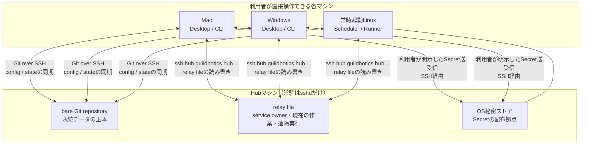
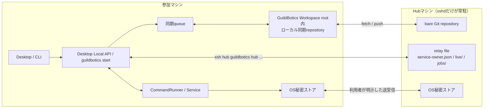
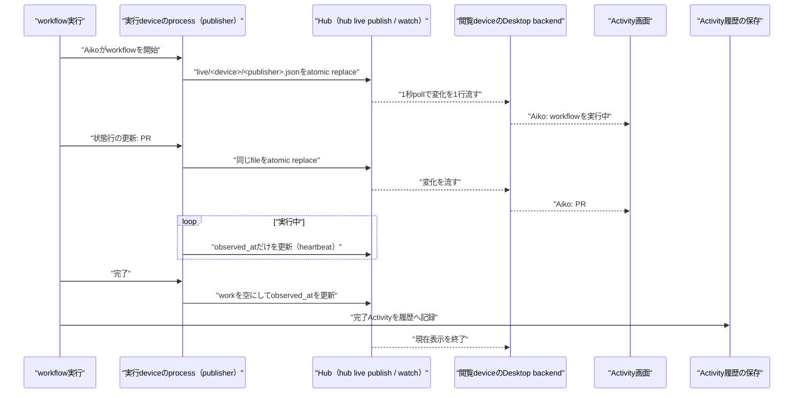
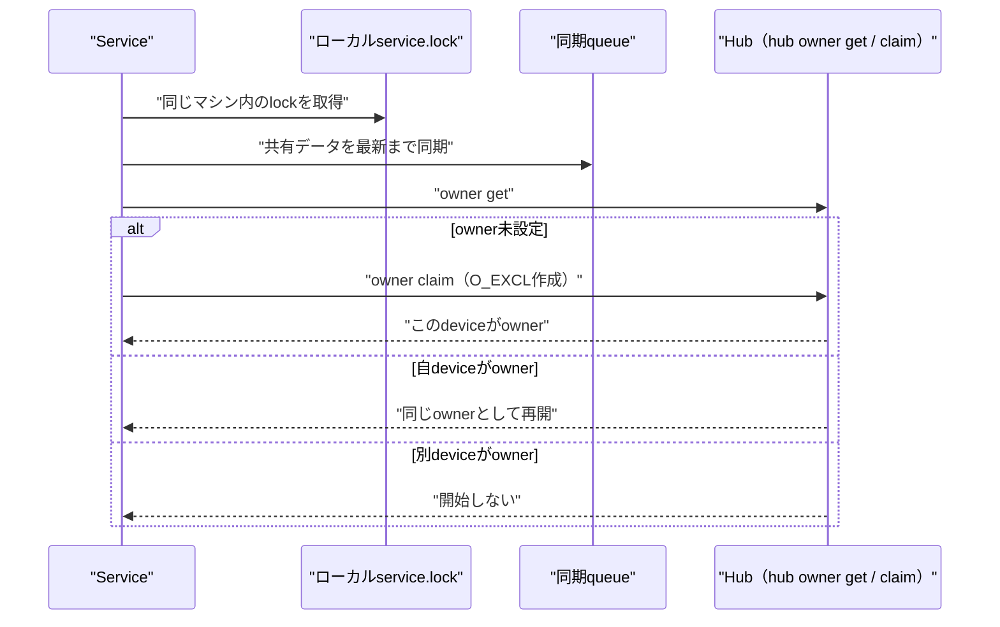
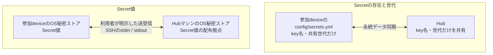
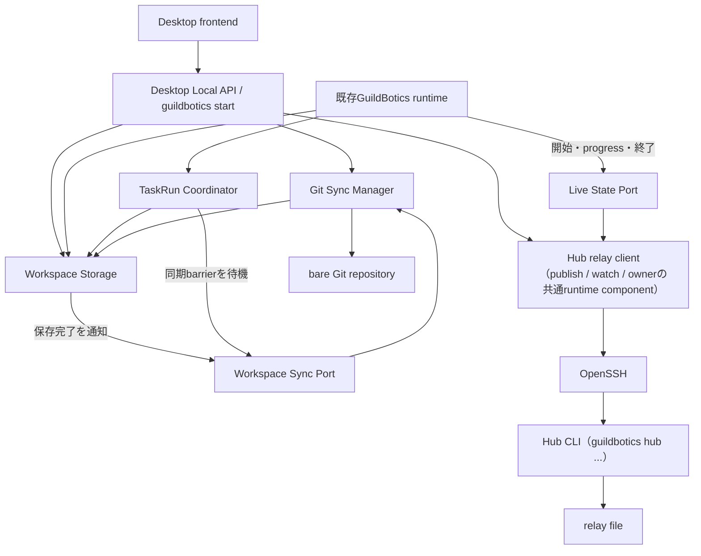
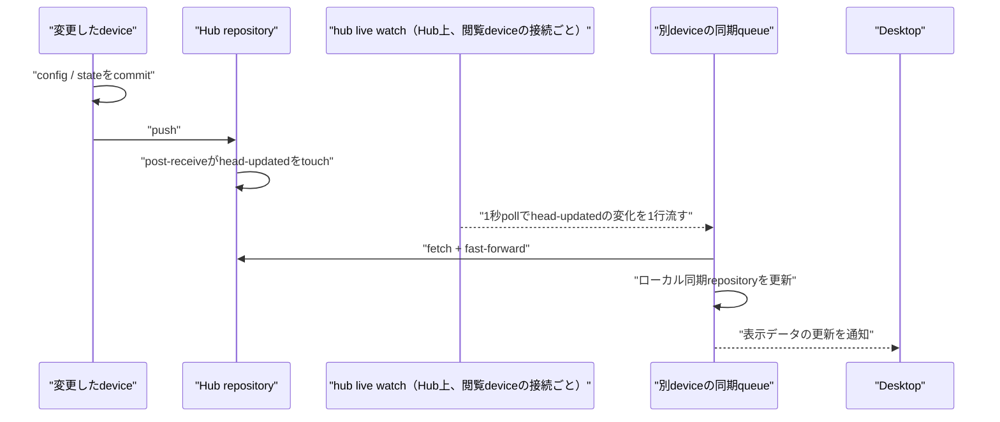
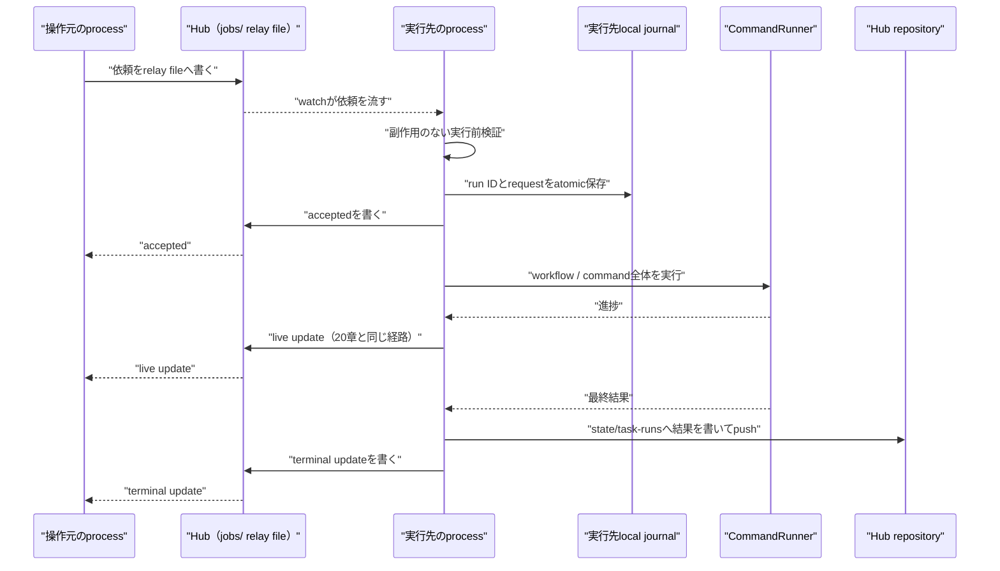
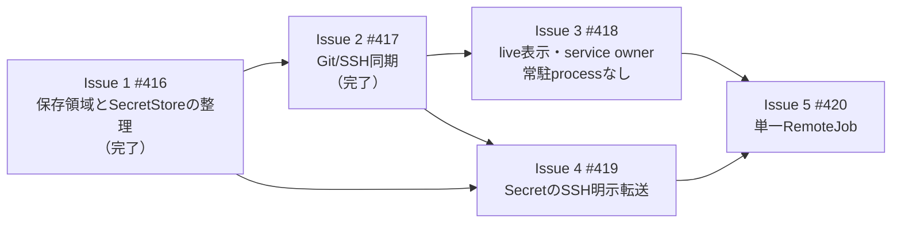

# ワークスペース同期

複数マシン（例: Mac / Windows / Linux）で、同じ GuildBotics 環境を安全かつ自然に利用するための設計・実装計画。

中心となる判断は次のとおりである。

- Config、memory、Conversation、Activityなどの**永続データ**は、専用のbare Git repositoryを正本としてSSH経由で同期する
- serviceの実行device、現在の作業のリアルタイム表示、遠隔実行の配送などの**運用上の調整**は、Hubマシン上の**ファイル**を中継点にする。Hubマシンで常時動くprocessはsshdだけであり、各deviceはsshd経由で`guildbotics hub ...`コマンドを単発または接続中だけ起動してそのファイルを読み書きする
- 各マシンに常駐processは置かない。Git同期、現在の作業の公開、遠隔実行の受け付けは、そのマシンで動いているGuildBoticsのprocess（Desktop backend、`guildbotics start`、member CLI）が自分で行う
- Hub上のファイルは共有データの正本を持たない。Hubが失われても、任意の参加マシンにあるGit cloneから共有データを復旧できる
- 参加マシンはすべて同じ利用者が所有し、利用者が各マシンを現地で確認・操作できる。serviceの引き継ぎはこの前提で明示的に行う
- 通信の認証と暗号化にはSSHを使う



本書は4部構成である。

- 第0部: 要求 — 欲しい機能と前提となる利用環境
- 第1部: 外部仕様 — 利用者が見る動作と運用
- 第2部: アーキテクチャ — 責務境界、保存形式、通信契約、障害時動作
- 第3部: 実装計画 — Issue分割、完了条件、テスト、最小性の境界

Issue 1（#416）とIssue 2（#417）は実装済みであり、該当する章は実装に合わせてある。Issue 3以降は未実装で、
Issue 3は当初「常駐するDevice AgentとCoordinator」で設計していたが、成果を「いつ必要か」で見直した結果、
常駐processでなければ実現できないものが無いと判断し、Hub上のファイルと`sync.lock`による直列化へ置き換えた
（判断の根拠は[3.2](#32-常駐processを置かない理由)）。

---

# 第0部: 要求

## 欲しい機能

- 一人の利用者が複数のマシンで同一の GuildBotics ワークスペース環境を利用できること
- 複数マシン間でワークフロー設定やメンバーのメモリ（文書）を共有できること
- 複数マシン間でシークレットを共有できること（再入力の手間をなくすこと）
- 複数マシン間でActivity履歴やworkflow実行結果などの永続的な稼働情報を共有できること
- 複数マシンで使用した場合にも現在のGuildBoticsの機能からサービスレベルダウンしないこと。具体的にいうと、別マシン上でワークフローを実行中も、アクティビティ画面で現在実行中の処理をリアルタイムに確認できること
- 重複処理を避けるため、サービス実行はどれか一つのマシン上でしか動作できないように制限をかけること
- 特定のワークフロー/コマンドを特定のマシンを指定して起動することができること

## 前提となる利用環境

- 利用者は一人で全マシンの管理者権限を持ち、管理者アカウントでログインして操作が可能である
- 利用者は各マシンの稼働状況を目視確認できる

---

# 第1部: 外部仕様

## 0. 解決したいこと

本計画が解決する大枠の要件は次の8点である。

### 0.1 Workspace設定とmemoryを共有する

project、member、intelligence、Custom CommandなどのWorkspace設定と、personal / team memoryをマシン間で共有する。
Macで更新した内容をWindowsや常時起動Linuxでも利用でき、利用者がどのマシンの状態が新しいかを推測しなくてよい状態を作る。

同じ設定を複数のマシンでほぼ同時に変更してしまった場合も、利用者に手作業での競合解決を求めない。
先に共有が完了した変更だけが採用され、それより古い状態を元に行われたもう一方の変更は反映されず、全マシンが自動的に同じ内容へ揃う。

反映されなかった変更は消えない。変更を行ったマシンへ退避された形で残り、必要な場合は変更元マシン上の所定の
Git CLI手順でだけ内容を確認・書き出しできる。専用の閲覧画面は設けない。
変更が反映されなかったことは、対象path、変更元マシン、時刻、退避の識別子（`rejection_id`）とともにActivity履歴に記録され、
Activity画面と、変更元マシンの設定 → 同期の「退避された変更」から確認できる。それ以上のことはせず、確認や解決の操作を求めて利用者の作業を止めることはしない。

### 0.2 Activity履歴と現在の作業を共有する

PR、Issue、memory操作、rate limit、workflow実行結果など、特定マシンに閉じないActivity履歴を共有する。
serviceを実行中のマシンで発生した履歴も、手元のMacやWindowsのActivity画面から確認できるようにする。

履歴だけでなく、serviceを実行中のマシンでmemberが現在何をしているかもリアルタイムに表示する。
例えばAikoがPRを確認している場合、別マシンのActivity画面でもmember名の下に
`PR #123を確認しています`と表示される。この表示は永続データの同期の完了を待たずに届ける。

### 0.3 実行場所を予測可能にする

CLIやDesktopから通常どおりworkflow / commandを実行した場合は、指示を出したマシン上で実行する。
Hubや、serviceを実行中の別マシンが存在することを理由に、実行場所を暗黙に変えない。

Windows固有処理や、常時起動しているマシンでの長時間処理など、実行場所に意味がある場合は、特定のマシンを指定して
workflow / command全体を実行できるようにする。指定先が利用できない場合も、別マシンへ自動的に切り替えない。

### 0.4 serviceを重複なく運用する

この文書でいう「service」は、Desktopの「サービス実行」画面またはCLIの`guildbotics start`で起動する常駐実行
（巡回実行・定期実行・イベント起動）を指す。serviceは、同じWorkspaceについて同時に1台のマシンだけで動作させる。
serviceを実行するマシンは常時起動である必要はなく、利用者が選んだ1台であればよい。
serviceを実行するマシンを変更するときは、利用者が旧マシンの停止を直接確認したうえで、別マシンへ即時に引き継げるようにする。

参加マシンはすべて同じ利用者が所有し、利用者は各マシンの稼働状況を現地で容易に確認・操作できることを前提とする。
この前提を活かし、停止を自動推測する期限付きleaseや、期限切れ待ちによる自動引き継ぎは作らない。

service起動workflowが途中で異常終了した場合は「中断」として記録する。中断で未完了になった仕事は、ローカル実行の中断時と
同じく、チケットの巡回や未処理eventの再配送といった各入力源の通常機構が拾い直す。利用者への確認は挟まない。
引き継ぎ先で再実行しないのは完了済みの仕事だけであり、それは実行記録の共有によって保証する。

### 0.5 Hub不通時もローカル利用を継続する

Hubへ接続できなくても、そのマシンに取得済みの設定、memory、Activityは参照でき、利用者が開始したローカル操作は可能な範囲で継続できる。
Hub不通中の変更はそのマシンに記録して保持し、再接続後に自動的に共有する。

serviceもHub不通だけでは停止しない。実行中のservice起動workflowは完走させ、結果はそのマシンに保持して再接続後に共有する。
ただし、新しいservice起動workflowは開始の記録をHubへ共有できるまで始めず、Hub不通中にserviceを新しく起動することもできない。
serviceが即時に停止するのは、実行deviceが別マシンへ引き継がれたことを検出した場合だけとする。

### 0.6 Secretを各マシンへ安全に配布する

GitHub / Slack tokenやAPI keyなどの値は、各マシンのOS秘密ストアだけへ保存する。
HubマシンのOS秘密ストアを配布拠点とし、利用者の明示操作で値をSSH経由で送受信する。

マシン間で共有するのはkey名と世代（値の新旧を判定するための番号）だけであり、Secret値そのものや値のhashは共有しない。
不足や更新を自動検知して表示する。新しいマシンでは、初回同期に続けて一度「まとめて取得」を実行すれば、
Hubマシンから必要な値を一括受信し、そのマシンのOS秘密ストアへ自動登録する。値の再入力、fileへの書き出し、
clipboard経由の転記は要求しない。

### 0.7 Hubを別マシンで再構築できるようにする

各参加マシンは共有データの完全な複製を持っている。Hubを別マシンへ移す場合も、Hubマシンが故障で失われた場合も、
いずれかの参加マシンにある複製から新しいHubを構築する、同じ一つの手順を使う。
専用の移行手順や、利用者が定期的に行う追加のバックアップ作業は要求しない。

旧Hubがまだ使える場合は、再構築の前に最新状態への同期とserviceの停止を済ませる。旧Hubが失われた場合は、
利用者が起点にする複製を1台選ぶ。他のマシンにだけ残っていた未共有の変更は、並行編集のとき（[0.1](#01-workspace設定とmemoryを共有する)）と
同じ規則で自動的に取り込み、手作業での統合は求めない。

### 0.8 共有データとマシン固有データを分ける

同期対象と非同期対象は、親ディレクトリ単位で区別できる構造にする。

- 共有するもの: Workspace設定、memory、Activity、会話状態、task実行記録、Secretのkey名と世代
- 共有しないもの: diagnostics、prompt / response全文、AI CLI session、member working clone、process lock、PID、cache、絶対path、device固有設定

ローカルdiagnostics、process lock、member working cloneは今回もdevice固有のまま維持する。
保存先の整理と新しい仕組みへの接続部分以外は、既存のローカル実装を不必要に作り替えない。

## 1. 設計原則

1. **永続データの正本はGitに一本化する。** Hub上のrelay fileに同じ内容を保存しない
2. **GuildBotics Workspaceをユーザーの作業repositoryと混ぜない。** Workspace rootはGuildBotics専用directoryとし、`.guildbotics/`だけを同期repositoryにする
3. **共有領域とローカル領域を親ディレクトリで分ける。** `config/`と`state/`は共有、`local/`は非共有とする
4. **ローカル実行をHub経由へ変えない。** target未指定の実行は常に操作したマシンで行う
5. **Hubに常駐processを置かない。** Hubで常時動くのはsshdだけとし、運用上の調整はHub上のファイルを`guildbotics hub ...`コマンドで読み書きして行う。永続履歴と共有データの復旧はGitへ委ね、並行更新は全データ種別に共通の規則で自動収束させる
6. **deviceにも常駐processを置かない。** 同期、現在の作業の公開、service ownerの確認は、そのマシンで動いているGuildBoticsのprocessが自分で行う。同じ同期repositoryを複数のprocessが同時に操作しないことは、所有者ではなくOS advisory lockによる直列化で保証する
7. **履歴、現在状態、diagnosticsを混同しない。** 履歴はGit、現在状態はHub上のrelay file、diagnosticsは実行deviceだけに残す
8. **serviceの実行deviceは利用者が明示する。** 起動時にownerを確認できなければ開始せず、稼働中は接続断ではなくownerの変更を検出したときに停止する
9. **完了済みのworkを引き継ぎ先で再実行しない。** provider個別の証跡実装ではなく、すべてのservice起動workflowが通る共通の実行境界で開始・終了を共有して重複を防ぐ。中断したworkの拾い直しは各入力源の通常機構に任せる
10. **Secretを通常データへ混ぜない。** 値はOS秘密ストア、metadataはGit、移動はSSH明示転送とする
11. **マシン境界では可搬な値だけを渡す。** 絶対path、process内`Context`、file handleを転送しない
12. **通信はOpenSSHに一本化する。** 独自TLS、独自PKI、独自pairing protocolを追加しない
13. **初期の遠隔実行単位はworkflow / command全体だけとする。** subcommand単位の分散実行は実装しない

## 2. 用語

- **GuildBotics Workspace root** — Desktopで選択するGuildBotics専用環境のroot。[4.1](#41-guildbotics-workspace-root)のdirectory全体を指し、ユーザーが作業するGit repositoryのrootとは別の場所に置く
- **ローカル同期repository** — `<workspace>/.guildbotics/`に置く独立したGit repository。`config/`と`state/`を追跡し、`local/`を無視する。`git worktree`で作るlinked worktreeではない
- **Hub repository** — Hubマシン上のbare Git repository。各ローカル同期repositoryの共通remoteであり、永続共有データの正本となる
- **Hubマシン** — Hub repository、relay file、Secret配布拠点を置くマシン。常時動くprocessはsshdだけである。1台のHubマシンは複数WorkspaceのHub repositoryをホストできる。どのHubを使うかはWorkspaceごとに選び、Workspaceが異なれば別のHubマシンを使ってもよい
- **Hub CLI** — Hubマシン上の`guildbotics hub ...`コマンド。deviceがsshd経由で起動し、Hub repositoryの作成、relay fileの読み書き、Secretの送受信を行う。sshdが接続ごとに起動する単発のprocessであり、常駐しない
- **relay file** — Hubマシンの`~/.guildbotics/hub/workspaces/<workspace_id>/`に置く、service owner、現在の作業、遠隔実行の依頼・進捗のファイル。Hub CLIだけが読み書きし、Git repositoryには入らない
- **publisher** — 現在の作業をrelay fileへ書くprocess。Desktop backendまたは`guildbotics start`であり、process起動時に作るUUID（`publisher_id`）でrelay fileを分ける
- **Desktop Local API** — Desktopと同じマシンで動く既存の`guildbotics.app_api`。同期queueとHub CLIへの接続を持ち、画面へ状態を渡す
- **同期queue** — 1つのprocessの中で、共有ファイルの保存通知と60秒のfallbackを契機にcommit / fetch / 自動収束 / pushを回すthread。Desktop backendと`guildbotics start`が持つ
- **`sync.lock`** — `<workspace>/.guildbotics/local/run/sync.lock`のOS advisory lock。同期repositoryを操作する区間（同期queueのcycle、member CLIのone-shot、参加・preview・Hub切替）をprocessをまたいで直列化する
- **device ID** — GuildBoticsをインストールしたマシンを識別する内部ID。表示名やpathではなく、遠隔実行の配送先とActivity表示に使う
- **Workspace ID** — 同じHub repositoryとrelay fileを結び付ける内部ID。Workspace rootのpathとは独立している
- **service owner** — 同じWorkspaceのserviceを動かす1台のdevice。利用者が明示的に選択・変更し、期限では失効しない。常時起動のマシンである必要はない。Hub上の`service-owner.json`に保存する
- **現在の作業** — member名の下に表示する実行中状態。Hub上の`live/`へ置き、Gitへ保存しない
- **RemoteJob** — 利用者が指定した別deviceでworkflow / command全体を1回実行する単一の遠隔実行モデル
- **member working clone** — memberがIssue対応などで対象repositoryをcheckoutする場所。`.guildbotics/local/clones/`に置き、同期しない

## 3. 全体像

### 3.1 永続データと実行中データの経路



同じ情報をGitとrelay fileの両方へ保存しない。

| 情報                             | 正本・保持場所                                  | 主な例                                                         |
| -------------------------------- | ----------------------------------------------- | -------------------------------------------------------------- |
| 人が編集する共有設定             | Gitの`config/`                                  | member、project、command、Secret key名                         |
| システムが残す共有履歴・制御状態 | Gitの`state/`                                   | memory、会話の受信・引き継ぎ用制御状態、Activity、task実行記録 |
| 実行中だけ意味を持つ状態         | Hub上のrelay file（`live/`、`jobs/`）           | 現在の作業、device online、RemoteJob進捗                       |
| マシン内だけで意味を持つ状態     | `local/`                                        | diagnostics、lock、clone、AI CLI session                       |
| Secret値                         | 各マシンのOS秘密ストア                          | PAT、API key、private key                                      |
| serviceの実行device              | Hub上の`service-owner.json`                     | Workspaceごとのservice owner device ID                         |

### 3.2 常駐processを置かない理由

当初の設計では、Hubマシンに常駐するCoordinator（session registry、現在の作業のメモリ中継、service owner、
遠隔実行の配送）と、各deviceに常駐するDevice Agent（OS serviceとして登録、Desktopを閉じても継続、
Git同期の唯一の所有者、Desktopとのlocal IPC）を置いていた。

成果を「いつ必要か」で見直すと、どれも「何かのprocessが動いている間」にしか意味を持たない。

| 成果                                   | 必要になる瞬間               | それを担えるprocess                                      |
| -------------------------------------- | ---------------------------- | -------------------------------------------------------- |
| 現在の作業の表示、状態行、更新遅延     | workflowを実行している間     | 実行しているprocess（Desktop backendか`guildbotics start`） |
| service ownerの確認・取得・引き継ぎ    | serviceを起動する瞬間        | 起動しようとしているprocess                              |
| Hub repositoryのhead更新を受ける       | Desktopを開いて見ている間    | Desktop backend                                          |
| device online                          | 表示のためだけ               | 現在の作業の公開から導ける                               |

Desktopを閉じても動き続けることを必要とするのは「Desktopを開いていないマシンでも共有状態が同期される」
だけであり、これは常駐ではなく「共有stateを書いたprocessが自分でcommitする」（[15.4](#154-同期処理の論理api)）で満たせる。
Coordinatorが保持していたものはすべて「接続中のdeviceが送ってきた状態」と「ownerの記録」であり、processのメモリに
置く必然性が無い。メモリに置いていたために、再起動後の復元、二重起動の防止、復元のためのdevice側の再通知、
sessionの置換検出が必要になっていた。

置き換えた後の構成は次のとおりである。

| 関心                     | 置き換え前                                       | 置き換え後                                                                       |
| ------------------------ | ------------------------------------------------ | -------------------------------------------------------------------------------- |
| Hub側の受け口            | Coordinator process（OS service）                | sshdが接続ごとに起動するHub CLI                                                   |
| 現在の作業               | Coordinatorのメモリとbroadcast                   | `live/<device_id>/<publisher_id>.json`を`hub live publish`で書き、`hub live watch`が1秒pollで流す |
| service owner            | `service-owners.json`をCoordinatorが保持・照合   | `service-owner.json`を`hub owner get / claim / transfer`で読み書き               |
| head更新の通知           | `post-receive` → Coordinatorのlocal socket → broadcast | `post-receive` → `head-updated`をtouch → `hub live watch`が流す             |
| device側の同期の所有者   | Device Agent（常駐）                             | 同期repositoryを操作する区間を`sync.lock`で直列化し、Desktop backend・`guildbotics start`・member CLIのどれが回してもよい |
| 再起動後の復元           | Coordinatorへの再通知                            | 復元する状態が無い（ファイルは残っている）                                       |
| 二重起動の防止           | `coordinator.lock`                               | 常駐が無いので「2つ目」が存在しない                                              |
| session置換の検出        | session registry                                 | 対応物なし。不変条件は`service.lock`、`service-owner.json`、共有TaskRunの同期barrier、共通実行境界のowner確認で守る |

`hub live publish` / `hub live watch`は接続中だけ生きる長命processであるが、sshdがclientの接続ごとに起動し、
client側のsshが切れれば終わる。OS serviceではなく、権威ある状態を持たず、起動時の復元もsupervisorもlockも要らない。
client側でこれを張るのはDesktop backendまたは`guildbotics start`であり、そのprocessと同じ寿命になる。

## 4. ディレクトリ構造

### 4.1 GuildBotics Workspace root

```text
<workspace>/                         … GuildBotics専用のWorkspace root。ユーザーの作業repositoryとは別directory
└ .guildbotics/                      … ローカル同期repository
   ├ .git/                           … Hub repositoryへの接続情報
   ├ .gitignore                     … local/ と防御用の .env を無視
   ├ config/                         … 【Git同期】人が編集する宣言
   │  ├ team/                       … member定義（avatar画像を含む）
   │  ├ intelligences/
   │  ├ commands/
   │  ├ roles/
   │  └ secrets.yml                 … store ID、logical key名、世代。値は含まない
   ├ state/                          … 【Git同期】システムが残す永続状態
   │  ├ workspace.json              … Workspace IDとschema version
   │  ├ devices/                    … 参加deviceの表示用metadata
   │  ├ documents/                  … memoryとmemory audit
   │  ├ chat_state/                 … 会話の受信・引き継ぎに必要な制御状態
   │  ├ task-runs/                  … task / RemoteJobの実行状態と確定結果
   │  └ events/                     … Activity履歴
   └ local/                          … 【同期しない】このdeviceだけの状態
      ├ settings.json               … RemoteJob受付などのdevice固有設定
      ├ jobs/                       … 遠隔実行のローカルjournal
      ├ secrets.json                … このdeviceが保持するSecret世代。値は含まない
      ├ hotkeys.yml                 … このマシンで空いているキーの組み合わせ
      ├ chat-cache/                 … providerから再取得可能なbounded thread message cache
      ├ debug.env                   … 許可済みの非Secretデバッグ設定だけ
      ├ run/                         … diagnostics、transcript、lock
      │  ├ shared-write.lock        … 共有ファイルの書き込みと同期queueのcommit / converge区間の排他
      │  └ sync.lock                … 同期repositoryを操作するprocessの排他
      ├ clones/<person_id>/         … member working clone
      ├ agent-runtime/              … AI CLI sessionの再開状態
      └ work/                       … command authoring等の一時作業領域
```

GuildBotics Workspace rootへ、ユーザーが直接作業するソースrepositoryを配置しない。
memberがIssue対応などで使うrepositoryは`local/clones/<person_id>/`へcloneし、`local/`全体を同期対象から除外する。
これにより、ローカル同期repositoryの`.git/`が管理するのはGuildBoticsの`config/`と`state/`だけとなり、
ユーザーのソース、branch、working tree、stash、originと混在しない。

例えば、`/Users/me/GuildBotics/main/`をGuildBotics Workspace rootとした場合、Aikoが作業するソースrepositoryは
`/Users/me/GuildBotics/main/.guildbotics/local/clones/aiko/<repository>/`に置く。
`/Users/me/repos/product/`のような利用者自身のソースcheckoutをGuildBotics Workspace rootとして選択する運用は行わない。

`local/`はローカル同期repositoryの`.gitignore`で無視する。`.env`も誤操作によるSecret混入を防ぐ目的で無視するが、
GuildBotics自身は`.env`を読み書きしない。`.gitignore`自体は追跡せず、各deviceが同期repositoryの初期化のたびに書く。

`hotkeys.yml`が`config/`ではなく`local/`にあるのは、ホットキーを決める制約がWorkspaceではなくマシンの性質だからである。
ある組み合わせが空いているかは、そのOS自身の標準ショートカット、そのマシンに入っている他のアプリケーション、
接続されているキーボードの配列で決まる。MacでOS標準を避けて選んだ組み合わせがWindowsでは標準と衝突しうるし、
MacがCommandと呼ぶ修飾キーはWindowsではWindowsキーである。マシン間で運ぶと、利用者が選んでいない組み合わせが
登録されることになる。抽象化した表現を共有してdeviceごとにマッピングする案も検討したが、結局どのマシンでも
その場で空いている組み合わせを選ぶ必要があり、共有側に残る中身が無くなるため採用しない。

### 4.2 マシン全体の状態

```text
~/.guildbotics/
├ bin/                               … Desktop管理のCLI
├ data/
│  ├ active-workspace.json          … 現在選択しているWorkspace root
│  ├ device.json                    … device IDと表示名
│  └ run/
│     ├ service.lock                … 同じマシン内のservice二重起動防止
│     └ stop-request.json
└ hub/                               … このマシンがHubをホストする場合だけ
   ├ hub.json                        … Hubの設定
   └ workspaces/<workspace_id>/
      ├ repository.git/             … bare Git repository（fast-forward only）
      │  └ hooks/post-receive       … head-updatedをtouchする
      ├ live/<device_id>/<publisher_id>.json  … 現在の作業（relay file）
      ├ service-owner.json          … service owner device ID（relay file）
      ├ head-updated                … post-receiveがtouchするmarker
      ├ jobs/                       … RemoteJobの依頼・進捗（relay file。Issue 5）
      └ secret-generations.json     … HubマシンのOS秘密ストアが保持する世代。値は含まない
```

HubはWorkspace rootから独立したシステムなので、Hub管理領域は`~/.guildbotics/hub/`へ集約する。
Hubは各マシンのWorkspace root pathを保存しない。Workspace rootを移動した場合はDesktopで新しいrootを選び直し、
その中の`.guildbotics/state/workspace.json`にあるWorkspace IDで同じ同期対象へ再接続する。

HubとWorkspaceの関係は次のとおりに固定する。

- Hubはマシン単位の基盤であり、1台のHubマシンは`workspaces/<workspace_id>/`として複数WorkspaceのHubをホストする。
  Hubマシンで常時動くprocessはsshdだけであり、`guildbotics hub ...`はsshdが接続ごとに起動する
- どのHubを使うかはWorkspaceごとに選ぶ多対1の対応とする。Workspaceが異なれば別のHubマシンを使ってよい
- Hubへの参加とservice ownerはいずれもWorkspace単位であり、「マシンがHubへ参加する」という概念は持たない。
  マシン単位で共有されるのはdevice IDと、Hubマシンごとに登録するSSH鍵だけである
- deviceが同期・接続するのは、このマシンのactive Workspaceだけとする。activeでないWorkspaceは同期されず、
  そのWorkspaceの文脈ではofflineのdeviceとして扱われる。Workspaceを切り替えるときは、旧Workspaceの同期queueと
  Hub CLIへの接続を止めてから新しいWorkspaceで開始し直す

### 4.3 Workspace IDとdevice IDの採番

- Workspace IDは、既存Workspaceで初めて同期を有効にするマシンがUUIDv7として1回だけ生成する
- Workspace IDは`.guildbotics/state/workspace.json`へ保存し、最初から共有内容に含める
- 2台目以降は取得した複製に含まれる同じWorkspace IDを使用し、新規採番しない。Hub上の既存Workspaceへ参加した場合もHub側のWorkspace IDを採用する
- 同期queueとHub CLIはWorkspace IDの一致を検証し、別Workspaceのデータを混ぜない。Hub CLIが受け付けるWorkspace IDは正規形のUUIDだけとする
- device IDはGuildBoticsの初回起動時にUUIDv7として生成し、`~/.guildbotics/data/device.json`へ保存する
- device IDは遠隔実行の配送と表示のための識別子であり、認証鍵ではない。認証はOpenSSHが担当する
- deviceの表示名は、初期値をOSのホスト名とし、セットアップでの入力を求めない。利用者は同期・device設定画面で自deviceの表示名を変更できる
- 表示名は`device.json`へ保存し、参加中のWorkspaceの`state/devices/<device_id>.json`へ反映してGit同期で全マシンへ配布する。activeでないWorkspaceへは、次にそのWorkspaceで接続したときに反映する

Workspace rootのrenameや移動ではIDを変更しない。Desktopでrootを選び直せば、同じWorkspaceとして再接続できる。

## 5. 同期を利用しない状態

同期はWorkspace単位のopt-inとする。有効にしていない場合は次のとおりである。

- Git同期、SSH接続、service ownerの管理、device間の現在の作業の配信を行わない
- CLI / Desktop / serviceの操作・挙動は現行どおりとする
- 同一マシン内のservice二重起動防止には、従来どおり`~/.guildbotics/data/run/service.lock`を使う
- target未指定のworkflow / commandは、そのマシン上で実行する
- `config / state / local`への保存先変更とSecretStore一本化は共通基盤として適用する
- `.env`機構とenv-file Secret backendは、同期時だけの例外を作らず製品全体から削除する

つまり、同期を使わない利用者にHub運用を要求しない。ただし、保存領域とSecret backendの整理は、同期の有無にかかわらず
一つの正しい実装へ切り替える。

また、一度同期を有効にしたWorkspaceについて、現在使っているマシンを同期対象から外して
未同期状態へ戻す操作は作らない。同期の解除をdeviceへの安全対策として使うこともしない。紛失deviceからHubへのaccessを
止める安全対策は、HubマシンでのSSH鍵の失効（[23.4 SSH鍵の登録と失効](#234-ssh鍵の登録と失効)）で行う。

## 6. 初期セットアップ

同期はWindowsを含む全プラットフォームで、通信をOpenSSHだけで行う。前提ソフトウェアは役割で異なる。
gitは現行のGuildBoticsが既に必要とするため、同期で新たに加わる要求はOpenSSHだけである。

- 参加マシン: OpenSSH client。Windows 10 1809以降 / Windows 11、macOS、主要Linuxは標準搭載のため、追加インストールは通常不要
- Hubマシン: 上記に加えてOpenSSH server。macOSは「リモートログイン」を有効化、Linuxは`openssh-server`を導入、
  WindowsをHubにする場合はオプション機能「OpenSSH サーバー」を有効化する

この前提はREADMEの「必要なもの」へ記載する。WindowsをHubにする場合の固有の注意
（sshdから`guildbotics`コマンドを実行できるようにするPATH設定、管理者アカウントの公開鍵は
`administrators_authorized_keys`へ置くこと）は、Hub作成flowとREADMEで案内する。

GuildBoticsはHub側で`guildbotics hub ...`を実行してHubへ届くため、このコマンドが非対話SSH sessionのPATHに
載っている必要がある。対話ログイン時のPATHとは一致しないことがある。

### 6.1 1台目: Hubを作成する

Hubにするマシンで次を行う。

1. OSのSSH serverを有効にする
2. Desktopで「このマシンをHubにする」を実行する
3. Desktopが`~/.guildbotics/hub/`を作成する。常駐processの登録は無い
4. 既存Workspaceを同期する場合は、そのWorkspaceを選択した状態で「同期を有効にする」を実行し、`config/`と`state/`を最初の共有内容としてHubへ登録する
5. 他マシン用のSSH接続先を表示する

SSH serverが必要になるのは、他のマシンが接続する時点である。Hubマシン自身は自分のHubへlocalのpathで到達するため、
Hubマシン1台だけで利用する間は手順1を省略でき、他のマシンを追加するときに有効化すればよい。

Hubマシンに既存Workspaceがなく、別マシンのWorkspaceを正とする場合は、Hubだけを先に作る。
この時点のHubはWorkspaceを1つも持たない。続いて、既存Workspaceを持つ別マシンがそのWorkspaceを選択した状態で
「同期を有効にする」を実行し、接続先にこのHubを指定して新規Workspaceとして登録する。その内容が最初の共有内容になる。
6.2の「Hubから取得して作成」を使えるのは、この登録によってHub上にWorkspaceができた後である。

HubマシンのOS秘密ストアはSecretの配布拠点になる（11章）。Hubマシンに値が無いSecretがある場合は、
値を保持するマシンから「Hubマシンへ送る」を実行して登録する。

### 6.2 2台目以降を追加する

2台目以降の参加は、独立したセットアップウィザードではなく、既存のワークスペース選択操作の拡張として提供する。
現行のDesktopでは、設定のワークスペース欄で配置先directoryを選ぶことがワークスペースの作成・切り替えそのものであるため、
その選択肢に「Hubから取得して作成」を加える。

参加させるMac / Windows / Linuxで次を行う。

1. 設定のワークスペース欄で「Hubから取得して作成」を選ぶ
2. Hubの接続先を指定する
   - **Hubマシン自身の場合**: `~/.guildbotics/hub/workspaces/`にある同期対象Workspace一覧から選ぶ。URL入力は行わない
   - **Hubマシン以外の場合**: HubのSSH接続先を入力し、Hub上のWorkspace一覧から取得するWorkspaceを選ぶ
3. 新しいGuildBotics Workspace rootの配置先と名称を選ぶ。これは現行のワークスペース作成と同一の操作であり、
   ユーザーの作業repositoryは選択しない
4. Hubマシン以外から接続する場合、必要ならそのマシン専用のSSH鍵を作成し、Hubの標準的なSSH公開鍵登録手順を案内する
5. Hubマシン以外からの初回接続では、HubのSSH host key fingerprintを確認する。fingerprintの取得は実接続と同じ`ssh`で行い、
   `ssh-keyscan`は使わない
6. DesktopがWorkspace rootを作成してHubの共有内容の複製を`<workspace>/.guildbotics/`へ取得し、
   現行のワークスペース切り替えと同じ挙動でそのWorkspaceへ切り替える
7. このdeviceのdevice ID、表示名、OSを`state/devices/<device_id>.json`へ書き、通常送信で共有する
8. 初回同期後、このマシンに不足しているSecretがあれば、その件数と「まとめて取得」を表示する
9. 利用者が一度「まとめて取得」を実行すると、Hubマシンから不足している値と世代を一括受信し、このマシンのOS秘密ストアへ自動登録する

手順9ではSecret値の入力、fileへの保存、clipboardへのcopy & pasteを求めない。値はSSHの標準入出力からOS秘密ストアへ直接渡す。
HubマシンのSecretStoreがロック中、Hub側に値がない、世代が不整合などの理由で取得できなかった項目だけを残し、
原因と再試行の導線を表示する。

既にこのマシンにあるWorkspaceを同期対象にしたい場合は、「Hubから取得して作成」ではなく、そのWorkspaceを選択した状態で
「同期を有効にする」を実行する。接続先のHubを指定した後の挙動は二つに分かれる。

- **Hubへ新規Workspaceとして登録する**: このWorkspaceの内容がそのままHub上の最初の共有内容になる。
  6.1の1台目や、空のHubへ別マシンのWorkspaceを最初に入れる場合はこちらになる
- **Hub上の既存Workspaceへ参加する**: Hubの内容でローカルを上書きしない。既存内容をこのマシン内に保全したうえで
  Hubの内容と比較し、差分を表示する。参加を実行すると、Hubに存在しないファイルだけを追加し、同じファイルは既にHubで
  確定している内容を採用する。手作業での統合は求めない。採用されなかった既存内容はこのマシンのrejected refへ退避され、
  手動回復手順（[7.4](#74-更新不採用内容の手動回復)）で確認・書き出しできる

ここで表示する差分は、共通の履歴を持たない2つのファイルツリー、すなわちこのマシンの`config/`と`state/`と、
Hub上のWorkspaceの現在の共有内容との突き合わせである。「Hubだけにあるファイル」「このマシンだけにあるファイル」
「同じpathで内容が異なるファイル」に分類して表示し、参加を実行するとどのローカルファイルがHub側の内容へ
置き換えられるかを事前に確認できるようにする。同じpathの扱いは[7.3 並行更新のふるまい](#73-並行更新のふるまい)と
同じ規則だが、参加前のWorkspaceはHubと履歴を共有していないため「どちらが後着か」の判定は存在せず、
内容が異なるpathはすべてこの規則の対象になる。参加を実行するときは、Hubの内容を採用する前にこのマシンの既存内容を
ローカル同期repositoryへcommitし、採用されなかった変更をrejected refとして退避する。参加時に採用されなかった既存内容も
7.3と同じ「更新不採用」のActivityとして記録し、手動回復手順（[7.4](#74-更新不採用内容の手動回復)）で確認・書き出しできる。
previewは参加のときだけ行い、新規登録では比較する相手がいないためrepositoryを作らない。previewでremoteを設定しない。

スマートフォンを介したpairing、QRコード、別マシンに表示された短いcodeの照合は行わない。
利用者が全マシンへログインできる前提を活かし、OpenSSHの既存操作へ寄せる。

### 6.3 Mac中心の環境を常時起動Linuxへ移す例

```text
1. Linux: SSH serverを有効化し、「このマシンをHubにする」を実行
2. Mac:   既存Workspaceで「同期を有効にする」を選び、Linuxの接続先を入力
3. Mac:   既存の設定と履歴を最初の共有内容としてHubへ送信
4. Linux: ワークスペース欄の「Hubから取得して作成」で自機のHubのWorkspaceを選び、新しいWorkspace rootの配置先を選択（URL入力なし）
5. Mac:   Secret設定画面で「Hubマシンへ送る」を実行
6. Linux: SecretStoreを確認し、`guildbotics start`またはDesktopでserviceを開始してservice ownerになる
7. Windows追加時: 「Hubから取得して作成」で新しいWorkspace rootを作成し、続けて「まとめて取得」を1回実行
```

## 7. 永続データの同期

この章でいう「同期」は、`config/`と`state/`に保存した永続データをマシン間で共有する処理だけを指す。
member名の下へ表示する「現在の作業」はこの同期の対象ではなく、[8.2 現在の作業](#82-現在の作業)の
relay file経由で届く。したがって、Activity画面には次の二つが別経路から届く。

| Activityに表示する情報 | 経路                                    | 反映タイミング                       |
| ---------------------- | --------------------------------------- | ------------------------------------ |
| 完了済みのActivity履歴 | Hub repository経由の永続データ同期      | 同期の完了後（[7.2 受信](#72-受信)） |
| memberの現在の作業     | Hub上のrelay file（`live/`）            | 永続データの同期を待たず、1秒以内    |

### 7.1 送信

共有対象のデータは、保存が完了した時点で自動的に送信対象になる。利用者が「保存」とは別に「同期」を操作することはない。
外部editorでファイルを直接変更した場合は保存の通知が無いため、専用の監視は行わず、未送信変更の再走査
（[7.2 受信](#72-受信)と同じ契機。最大60秒間隔）が変更を回収し、内容の検証を通ったものだけを自動送信する。
検証を通らないファイルは送信せずに保留し、「送信できない変更」として件数を表示する（対象と理由は同期・device設定で
確認できる）。利用者がファイルを修正すれば次の再走査で自動送信される。検証の内容は[15.2](#152-共有ファイルの設計規則)で定める。

送信のタイミングは次の三種類とする。

| 種類     | 契機                                          | 挙動                                                                                     |
| -------- | --------------------------------------------- | ---------------------------------------------------------------------------------------- |
| 通常送信 | 共有データの保存完了                          | 保存した操作を待たせない。短時間に続いた複数の変更はまとめて送信する                     |
| one-shot | member CLIによる共有データの保存完了          | `sync.lock`を短い上限で試し、取れればそのCLIのprocessが終了する前にcommitし、Hubへ届けば送信する。取れなければqueueまたは別の同期処理へ任せ、`sync: pending`を返す。Desktopもserviceも動いていないマシンでも成立する |
| 確定待ち | service起動workflowの開始・終了を記録するとき | 記録がHubへ届いたことを確認してから、workflowの開始・完了を進める                        |

「確定待ち」は、serviceを別マシンへ引き継いだときに同じ仕事を二重実行しないための内部的な保証であり、
利用者の操作には現れない。

送信が一時的に失敗しても変更は失われない。そのマシンに保持され、接続が回復し次第自動的に再送される。
利用者が再送を指示する必要はない。送受信の内部の仕組みは[15. Git同期の設計](#15-git同期の設計)に示す。

### 7.2 受信

受信は、そのマシンで動いているDesktop backendまたは`guildbotics start`の同期queueが自動的に行う。
利用者がActivityやmemoryを開くたびにHubへ問い合わせる方式にはしない。member CLIだけが動いているマシンは送信だけを行い、
受信は次にDesktopかserviceが動いたときになる。

別マシンの変更は、次の契機でこのマシンへ取り込まれる。

- 別マシンの変更がHubへ届いたとき（Hub repositoryの`post-receive`が`head-updated`をtouchし、`hub live watch`を張っているprocessがそれを受けたとき）
- 通知の成否にかかわらず、60秒間隔で行うHubの更新有無の確認
- 同期queueの起動時、DesktopでのWorkspaceの選択時、service起動前、このマシンからの送信の直前、ネットワーク復旧後

更新通知は反映を速めるための補助であり、通知の経路が止まっていても、Hubへ到達できる限り
「更新の検知まで最大60秒 + 1回分の取り込み処理時間」以内に全マシンが同じ内容になる。これを最大反映遅延の受け入れ基準とする。

通常状態に「今すぐ同期」操作は置かない。自動再接続が失敗している場合だけ「再試行」を表示し、
次の自動試行を待たずに同じ同期処理を開始できるようにする。

### 7.3 並行更新のふるまい

別々のマシンで同じファイルにあたる変更が重なった場合は、データの種類にかかわらず次のとおりに動く。

- 先にHubへ共有が完了した変更を採用し、全マシンをその内容へ揃える
- 後から届いた同じファイルへの変更は反映しない。二つの変更の内容を機械的に混ぜ合わせることはしない
- 反映されなかった変更は、変更を行ったマシンの`refs/guildbotics/rejected/<rejection_id>`へ退避して残す
- 同時に行われていた別ファイルへの変更は、そのまま反映する
- Activity履歴には、更新不採用の事実、対象path、変更元マシン、時刻、`rejection_id`と、回復手順が変更元マシン限定である
  ことを記録する。退避した内容自体はActivityへ含めない。Activity画面はこれを表示するだけで、利用者へ解決操作を求めない
- 変更元マシンの設定 → 同期の「退避された変更」に、退避日時・対象ファイル・回復用IDを一覧する。警告バンドにも件数を出す

反映されなかった変更の内容は、DesktopやApp APIでは表示・取得しない。必要な場合は変更元マシン上の
手動回復手順（[7.4 更新不採用内容の手動回復](#74-更新不採用内容の手動回復)）で確認・ファイルへ書き出せる。
「共有状態へ復元する」操作は設けない。利用者は確認した内容の必要な部分だけを、現在の共有内容を起点に
通常の編集操作で改めて保存する。保存した変更は通常送信（[7.1 送信](#71-送信)）で自動的に共有されるため、
復元や再同期のための専用操作は不要である。

システムが自動的に追加する履歴（Activityやtask実行記録など）は項目ごとに別ファイルへ保存するため、
複数マシンが同時に動いていても通常は並行更新にならない。並行更新が起こりやすいのは、利用者自身が
複数マシンで同じ設定を編集した場合である。

また、設定の編集画面では、画面を開いたときより新しい内容が既に保存されている場合、その画面からの保存を拒否して
最新内容を表示し直す。古い画面に残っていた入力が、新しい設定を静かに上書きすることはない。

同じIDの記録が異なる内容で二重に作られた、共有データが検証を通らない、別Workspaceのデータが混ざった、
といった状態は並行更新ではなくデータ異常として扱う。自動での上書きはせず同期を安全に停止し、
利用者へ診断・修復の手順を案内する。

### 7.4 更新不採用内容の手動回復

更新不採用で反映されなかった変更の内容は、DesktopやApp APIでは表示・取得しない。回復が必要な場合だけ、
変更元device上でGit CLIを使う次の手順で確認・書き出しする。これは通常操作ではなく、更新不採用からの回復時だけに
使う例外的な手順である。自動での復元・mergeは行わず、利用者は回復した内容を参照し、現在の共有内容を起点に
必要な変更を通常の編集操作で改めて作成する。

退避された内容は変更元deviceにだけ存在する。設定 → 同期の「退避された変更」にその退避が表示されているマシンで、
次のコマンドを実行する。

| 記号          | 入れるもの                                                                 |
| ------------- | -------------------------------------------------------------------------- |
| `<workspace>` | そのワークスペースのディレクトリ（設定 → プロジェクトの「ワークスペース」欄の値） |
| `<回復用 ID>` | 一覧の「回復用 ID」の値                                                    |
| `<path>`      | 一覧の「対象ファイル」の1つ                                                |
| `<path>...`   | 「対象ファイル」を空白区切りで並べたもの                                   |

1. 退避された内容を読む。現在採用されている内容との差分を表示する（`+`の行が退避された側）

   ```console
   git -C "<workspace>/.guildbotics" diff HEAD "refs/guildbotics/rejected/<回復用 ID>" -- <path>...
   ```

   差分ではなく退避された側の全文を見たい場合は、ファイルを1つずつ指定する

   ```console
   git -C "<workspace>/.guildbotics" show "refs/guildbotics/rejected/<回復用 ID>:<path>"
   ```

   退避側で削除されたファイルは表示する内容が無いため、`git diff`では削除の事実だけが分かる。
   画像などのbinary fileは表示に適さないため、次の手順で書き出して確認する。

2. Gitの外にファイルとして取り出したい場合は、対象ファイルをまとめてzipに書き出す。出力先は`<workspace>/.guildbotics/`の
   外にする。リダイレクト（`>`）で保存すると環境によって文字コードが変わったりbinaryが壊れたりするため、zipを使う

   ```console
   git -C "<workspace>/.guildbotics" archive --format=zip --output="<出力先ディレクトリ>/<出力ファイル名>.zip" "refs/guildbotics/rejected/<回復用 ID>" -- <path>...
   ```

3. 確認・書き出した内容の必要な部分だけを、現在の共有内容を起点にGuildBoticsの通常の編集操作で改めて保存する。
   保存した変更は通常送信（[7.1 送信](#71-送信)）で自動的に共有される

参加時の退避（[6.2](#62-2台目以降を追加する)）はHubの履歴を持つ前にcommitされるためroot commitになる。
`git diff-tree <commit>`は`--root`を付けないとroot commitに対して何も出さず、また head の最後の1 commit分しか
列挙しないため、退避されたpathの一覧はGitではなくDesktopの「対象ファイル」（記録されたconflictから出す）を正とする。

安全境界は次のとおりである。

- 同期repositoryに対してrejected refを`checkout`、`switch`、`reset`、`merge`、`rebase`、`cherry-pick`、`push`しない
- 書き出し先を`<workspace>/.guildbotics/`配下にしない
- rejected refから共有状態を自動復元するcommandやUIは追加しない
- rejected refを自動削除しない。内容の確認が済んだら、設定 → 同期の「退避された変更」から利用者が明示的に破棄する。
  破棄はrejected refを削除して警告表示を終わらせる唯一の操作であり、退避内容を一切露出しない
- 変更元deviceを紛失した場合や、変更元device上のrejected refが破棄された場合は回復できない

### 7.5 Hub不通時

Hub不通時も、このマシンには共有データの完全な複製が残っている。

- Config、memory、Conversation、過去Activityはローカルファイルから読める
- ローカル操作による変更は未送信のままこのマシンに保持される
- target未指定のworkflow / commandはローカルで実行できる
- 別deviceの現在の作業、device online状態、遠隔実行、Secret転送は利用できない
- 稼働中のserviceは停止しない。実行中のservice起動workflowは完走させ、新しいservice起動workflowは開始の記録をHubへ共有できるまで始めない
- serviceを新しく起動することはできない。ownerを確認できないため、理由を表示して開始を拒否する

Hub不通は「sshdに到達できない」ことである。Hubマシン上でGuildBoticsのprocessが動いているかどうかは同期に関係しない。

再接続後は自動的に送受信が再開し、通常どおり全マシンが同じ内容へ揃う。利用者が開始したローカルworkflow / commandは自動再実行しない。

### 7.6 Hubの再構築

この節は次の二つの場面を扱う。

- **計画的な移行** — 旧Hubが利用可能なまま、Hubを別マシンへ移す
- **障害からの再作成** — 旧Hubが故障や紛失で失われた後、新しいHubを作る

どちらの場合も、新しいHubは「参加deviceが持つ複製から作る」という同じ共通手順（後述）で構築する。
場面ごとの専用移行方式は作らず、異なるのは事前準備の有無だけである。

#### 計画的な移行（旧Hubが利用可能な場合）

共通手順の前に、次の準備が完了している必要がある。利用者がこの一覧を手作業でなぞるのではなく、
同期・device設定内のHub再構築flow（[12.2 画面別の実装一覧](#122-画面別の実装一覧)）が順に案内・確認する。

1. **serviceの停止** — service ownerが設定されていれば、新規work受付の停止、実行中workの完了確認を
   flowから実行する（[9.4 明示的な引き継ぎ](#94-明示的な引き継ぎ)の正常な引き継ぎと同じ操作）
2. **未送信変更の確認** — 送信は常時自動（7.1）であり、利用者の送信操作は存在しない。flowは各deviceの未送信変更が
   旧Hubへ送信済みであることを確認し、offlineのdeviceが残っていれば警告する
3. **旧Hubマシンのsshdの停止、または旧Hubの`~/.guildbotics/hub/`の退避** — 旧Hubへ誤って接続し続けるdeviceを作らないため

この準備によって全deviceの複製は同じ最新内容になるため、共通手順の起点にはどのdeviceを選んでもよく、
統合で採用されない変更も生じない。

#### 障害からの再作成（旧Hubが失われた場合）

準備はできないため、そのまま共通手順を実行する。複数のdeviceがそれぞれにしかない変更を持っている場合は、
利用者が選んだ起点deviceの複製を最初の共有状態として確定し、他のdeviceの変更は
[7.3 並行更新のふるまい](#73-並行更新のふるまい)と同じ規則で取り込む。起点に存在しないファイルは追加し、
同じファイルを双方が変更していれば起点側を採用して、採用されなかった変更は変更元deviceに残す。手作業での統合は求めない。

失われた旧Hubだけが保持していたSecret値は復旧できないため、provider側で再発行する（[11.7 Hub不通とHub再構築](#117-hub不通とhub再構築)）。
これに該当するのは、Hubマシン上で直接入力され他のdeviceがまだ取得していなかった値と、入力元deviceが既に失われている値である。
Secret値の配布は利用者の明示操作だけで行う設計（11章）のため、全deviceへの複製は保証されない。

#### 共通の再構築手順

「起点device」とは、最初の共有状態の情報源として利用者が選ぶ参加deviceを指す。新Hubマシンとは別の役割であり、
新Hubマシン自身が複製を持つ参加deviceであれば起点を兼ねてよい。

手順の前半は初期セットアップと同じ操作の再利用であり、再構築専用の機能を追加しない。
Hub再構築flow（[12.2 画面別の実装一覧](#122-画面別の実装一覧)）は、この手順全体をチェックリストとして案内する。
操作自体は各マシンで行う。

1. 【新Hubにするマシンで】「このマシンをHubにする」を実行する（[6.1](#61-1台目-hubを作成する)と同じ操作。この時点で共有内容は空）
2. 【利用者が判断】起点にする参加deviceを選ぶ。判断材料は各マシンのDesktopが表示する最終同期時刻と未送信変更の有無。
   旧Hubが失われた後は、マシンを横断して自動比較する仕組みはないため、利用者が各マシンで確認する
3. 【起点deviceで】「同期を有効にする」を実行し、新規Workspaceとして複製を新Hubへ登録する
   （[6.2](#62-2台目以降を追加する)の新規登録と同じ操作。Workspace IDは既存のものを維持する）
4. 【Secret値を保持するdeviceで】新HubマシンへSecretを明示送信する（11章）。多くの場合、起点deviceがそのまま該当する。
   先に送信しておくことで、以降に再接続するdeviceの「まとめて取得」がすぐ機能する
5. 【残りの各deviceで】接続先を新Hubへ変更して再接続する。そのdeviceにしかない変更は
   [7.3 並行更新のふるまい](#73-並行更新のふるまい)の規則で自動的に統合され、採用されなかった変更はそのdeviceの
   rejected refへ退避される（[7.4](#74-更新不採用内容の手動回復)）。利用者の統合作業はない。共通のcommitを持つ
   相手（Hub再構築後の再接続）では、tree比較ではなく通常の収束（15.5）で扱う
6. 【各マシンで】旧Hubと旧serviceが停止していることを直接確認し、新しいservice ownerを選んでserviceを開始する

Config、memory、Conversation制御状態、Activity、task実行記録は複製から復旧できる。
現在の作業、device online状態、旧service owner、実行中processは復旧しない。
Secret値は共有データに含まれないため、値を保持するdeviceから新Hubマシンへ明示的に送信する。

新Hubは`service-owner.json`を持たず、service owner未設定で開始する。利用者は旧Hubと旧serviceが停止していることを
各マシンで直接確認し、新しいservice ownerを選択する。待機時間によって停止を推測せず、確認後は即時にserviceを開始できる。

旧Hubが実際には稼働している状態で誤って確認すると、二つのHub間で安全な排他を保証できない。これは特に障害からの
再作成で起こりやすい誤りであり、自動的な故障判定を行わない本設計の明示的な運用境界として、Hub再構築画面でも警告する。

## 8. Activity履歴と現在の作業

### 8.1 Activity履歴

Activity履歴は`state/events/`に1 event 1 fileで保存し、Git同期する。

共有対象の例:

- PR / Issueの作成、確認、更新
- memoryの作成、更新、archive
- workflow / commandの開始、完了、失敗
- provider rate limitと再試行予定時刻
- service ownerの設定、引き継ぎ
- RemoteJobの受理、完了、失敗、結果不明
- service起動workflowの中断
- 更新不採用（対象path、変更元device、時刻、`rejection_id`）

共有しないもの:

- prompt / response全文
- stack trace
- raw provider response
- ローカルfile path
- process ID
- Secret値
- diagnostics log全文

Activityの安全な概要から、同じdeviceにローカルdiagnosticsがある場合だけ詳細へ移動できる。
別deviceでは「詳細は実行したマシンで確認できます」と表示する。

### 8.2 現在の作業

現在の作業は履歴として保存しない。実行しているprocessがHub上の`live/<device_id>/<publisher_id>.json`へ書き、
見ているdeviceのDesktop backendが`hub live watch`でそれを受け取る。対象はすべてのworkflow / commandであり、
workflowやCapability側に個別の対応がなくても、開始・進捗・終了が自動的に表示へ反映される
（仕組みは[20. 現在状態の中継](#20-現在状態の中継)）。



現在の作業はGitへ保存しない。`live/`のファイルは`observed_at`が古くなれば失効として扱われ、`hub live watch`が削除する。
publisherのprocessが再起動した場合は新しい`publisher_id`で書き直し、古いファイルは失効で消える。
これにより、再起動前の古い「実行中」表示が誤って残り続けない。

member名の下に表示する内容は、実行しているdeviceのローカル画面が同じ場所に表示している状態行と同一とする。
`PR #123を確認しています`のような対象固有の行も、LLM呼び出し中の行も、実行deviceで見えるものがそのまま別deviceにも見える。
状態行が出ない処理（主に、外部処理だけを実行するcustom command）では、開始から終了まで`<workflow名>を実行中`を表示する。
いずれも終了時に消える。

表示状態は次のとおりである。

| 状態            | Activity画面の表示                                                          |
| --------------- | --------------------------------------------------------------------------- |
| 通常更新中      | `● PR #123を確認しています`                                                 |
| 更新遅延中      | `○ 実行deviceからの更新が途切れています（最終更新8秒前）`                   |
| 失効            | 現在表示を終了し、deviceのoffline状態を表示                                 |
| 完了            | 現在表示を終了する。以降はActivity履歴に記録された完了eventとして表示される |

### 8.3 device online状態

device onlineは、そのdeviceの`live/<device_id>/`に`observed_at`が新しいファイルがあるかで導く。
永続化せず、Hub上に「誰が接続中か」を一元的に知るprocessも無い。

Desktopにはdevice表示名、OS、最終接続時刻、現在の実行可否を表示する。
最終接続時刻は画面上の参考値であり、RemoteJobを予約する根拠には使わない。

## 9. serviceの実行device

### 9.1 前提と二つの排他範囲

参加マシンはすべて同じ利用者が所有し、利用者は旧serviceが停止しているかを各マシンで直接確認できる。
この前提では、停止を時間経過から推測するより、利用者が実行deviceを明示的に切り替える方が単純で確実である。

| 対象                                         | 仕組み                         | 保存場所                                                    |
| -------------------------------------------- | ------------------------------ | ----------------------------------------------------------- |
| 同じマシン内のservice二重起動                | 既存のOS advisory lock         | `~/.guildbotics/data/run/service.lock`                      |
| 同じWorkspaceを扱う複数device間のservice重複 | Hub上のservice owner file      | `~/.guildbotics/hub/workspaces/<workspace_id>/service-owner.json` |

同じマシン内のprocess重複を防ぐ既存`service.lock`は削除しない。
マシン間ではWorkspaceごとに`owner_device_id`を1つだけ保存し、期限、更新、fencing epochは持たない。
Git側にも`state/service-lease.json`は作らない。

### 9.2 service起動



起動順は次のとおりとする。

1. ローカル`service.lock`を取得する
2. 共有データを最新まで同期し、データ異常がないことを確認する
3. Hubの`service-owner.json`を`hub owner get`で読み、未設定なら`hub owner claim`で自deviceをownerとして作る。
   `claim`は`O_EXCL`作成なので、2台が同時に行っても1台だけ成功する
4. scheduler / event listenerの新規work受付を開始する

Secretの事前確認は行わない。不足は従来どおりworkflowの実行時エラーと連続失敗によるworker停止で扱う（11.6）。

別deviceがownerの場合は、そのdevice名とonline状態を表示してserviceを開始せず、ローカルlockを解放する。
同じowner deviceでprocessが再起動した場合は、`service.lock`取得後に同じownerとして再開できる。

Hubへ到達できない場合は、保存済みownerが自deviceであってもserviceを開始しない。
起動を許可するのは「ownerを確認できたとき」だけであり、稼働中の接続断への耐性（[9.3](#93-hub不達)）とは
意図的に非対称にする。このため、Hub停止中にownerマシンでserviceを再起動した場合は、Hubが復旧するまでserviceを
再開できない。Desktopは「Hubへ接続できないため開始できない」という理由と、ローカル操作は継続できることを表示する。

Hubが失われた場合にserviceを再開する正規の手段は、Hubの再構築（[7.6 Hubの再構築](#76-hubの再構築)）である。
新しいHubは、serviceを実行したいマシン自身に作ってもよい（Hubマシン1台だけで使う間はSSH serverの有効化も不要。6.1）。

### 9.3 Hub不達

稼働中のserviceは、接続断だけでは停止しない。

- Hubへ到達できない間も、実行中のservice起動workflowは完走させる
- serviceが停止するのは、ownerが別deviceへ変更されたと確認できた場合だけとする。
  このとき新規work受付を停止し、実行中のservice起動workflowへ停止を要求する。終了結果を確定できないrunは「中断」として記録する
- 新しいservice起動workflowは、開始の記録をHub repositoryへ共有できた場合だけ始める。したがってHub不達中は
  新しい仕事を始められない。これは可用性と重複防止の優先順位づけではなく、引き継ぎ後に同じ仕事を再実行しないための
  構造的な条件である
- owner確認と変更の検出は共通の実行境界に集約し、providerやCapabilityごとには実装しない
- `live/`の失効はonline表示にだけ使い、service ownerを自動解除・変更しない
- 通常のローカル手動実行にはservice owner確認を要求しない

### 9.4 明示的な引き継ぎ

正常な引き継ぎでは、旧deviceで「新規work受付停止」→ 実行中workの完了確認 → serviceの停止を行ってから、
新deviceで「このマシンへ引き継ぐ」を実行してserviceを開始する。待ち時間は設けない。ownerはserviceの停止では
解除されず、`hub owner transfer`でだけ移る。

旧deviceが突然停止した場合は、Desktopにownerと最終接続状態を表示する。利用者が旧マシンを直接確認し、
serviceが停止していることを確認したうえで「このマシンへ引き継ぐ」を実行する。`hub owner transfer`が
`service-owner.json`の`owner_device_id`を新deviceへ置き換える。

旧deviceがネットワーク分断中のまま引き継がれた場合、旧deviceは再接続して共通実行境界のowner確認で
owner変更を検出した時点で停止する。再接続までの間に両deviceが稼働し得ることは、停止を直接確認せずに
引き継いだ場合の運用境界である。その間も仕事単位の二重実行は、service起動workflowの開始記録の共有（確定待ち）が防ぐ。

期限切れによる自動引き継ぎは行わない。利用者が旧serviceを確認できない場合は安全な引き継ぎを保証できないため、
新deviceのserviceを開始しない。

## 10. workflow / commandの実行場所

### 10.1 target未指定

| 起動経路                            | 実行場所                            |
| ----------------------------------- | ----------------------------------- |
| CLI `guildbotics run`               | CLIを起動したdevice                 |
| Desktop Quick Run / Commands        | そのDesktopが動くdevice             |
| scheduler / event listener          | 利用者がservice ownerに選んだdevice |
| 遠隔実行先で動くworkflowの子command | 指定された同じ実行先device          |

targetを省略した操作はRemoteJobを作らず、既存CommandRunnerへ直接渡す。
Hubホストや別deviceのActivityを閲覧中であることを理由に、実行場所を変更しない。

### 10.2 workflow / command全体の遠隔実行

Desktopは実行場所selectorを提供し、device表示名、online状態、OS、実行できない理由を表示する。
CLIは次の形式で安定したdevice IDを受け付ける。次の例は、利用者が定義したcustom command
`run_windows_smoke`（[13.5](#135-macからwindowsでcommand全体を実行する)）を、IDで指定したWindows deviceで実行する。

```text
guildbotics run run_windows_smoke --target-device 019c5e8d-31ce-7a62-a8a9-6ce16cb88945
```

CLIにdevice aliasは導入しない。DesktopではIDを意識せず選択でき、CLI利用者は同期・device設定画面からIDを確認・copyできる。

遠隔実行の流れは次のとおりである。利用者の操作は手順1だけで、手順2以降はシステムが自動的に行う。
依頼と進捗はHub上のrelay file（`jobs/`）を中継点にし、実行先ではDesktop backendまたは`guildbotics start`が受け取る。
relay fileの形と受け取りの契機はIssue 5（33章）で確定する。

1. 【利用者】操作元のDesktopが表示する実行前確認で、command、member、実行先deviceを確かめて実行を確定する。
   CLIでは引数の指定がこれに相当し、対話的な確認は挟まない
2. 【操作元】RemoteJob IDを生成し、Hub CLIで依頼をrelay fileへ書く
3. 【実行先】実行先が現在onlineの場合だけ、そのprocessが依頼を受け取る
4. 【実行先】ローカル方針と実行条件を検証する
5. 【実行先】依頼内容を確実にlocal journalへ記録した後に受理をrelay fileへ書く。以降は操作元やHubが停止しても実行を継続できる
6. 【実行先】既存CommandRunnerがworkflow / command全体を実行する
7. 【実行先 → Hub】進捗をrelay fileへ書き、操作元とActivity画面が受け取る
8. 【実行先】確定結果を共有データとして保存し、どのdeviceからも参照できるようにする

実行そのものは、実行先が依頼を受理・記録した時点（手順5）から操作元と独立して進む。操作元のterminalや
Desktop windowを閉じても実行は止まらず、確定結果は共有されるため後から確認できる。

利用者が遠隔実行に対してできる操作と、その提供面は次の表がすべてである。**開始後の操作はDesktopだけが提供し、
CLIに開始以外のcommandは追加しない。** CLIで開始したRemoteJobの事後の確認もDesktopで行う。

| 操作       | Desktop                                                              | CLI                                                                                             |
| ---------- | -------------------------------------------------------------------- | ----------------------------------------------------------------------------------------------- |
| 開始       | Commands / Quick Runの実行場所selector                               | `--target-device`。既定は完了までattachし、`--detach`なら受理確認後にRemoteJob IDを表示して戻る |
| 進捗の確認 | Activityの現在の作業とRemoteJob詳細                                  | attach中の標準出力                                                                              |
| 停止       | 提供しない。必要な場合は実行先マシン上の既存の停止手段を使う（10.4） | 提供しない                                                                                      |
| 結果の確認 | Activity / RemoteJob詳細（どのdeviceからでも）                       | attach中は標準出力と終了code。detach後はDesktopで確認                                           |

attach中にterminalを閉じたりCtrl-Cで中断したりしても、それは表示の切断であり、実行は止まらない。
`--detach`が表示するRemoteJob IDは、Activity画面で該当RemoteJobを特定するための参照である。

再接続時は次の情報から表示を復元する。

- 実行中: 実行先がrelay fileへ書いている現在状態
- 完了済み: 共有済みの確定結果
- 実行先のprocessが停止し、結果を確定できない: 「結果不明」

### 10.3 実行前検証

実行先はsubprocessを開始する前に次を確認する。

- Workspace IDが一致する
- command定義の内容が操作元と一致する
- 実行先deviceがRemoteJobの受け付けを有効にしている（[27.2](#272-localsettingsjson)のdevice固有設定）

member working cloneは、ローカル実行と同じくworkflow自身が実行先で用意する。操作元のcloneの状態や
特定revisionを前提とする検証は行わない。commandが実行先の環境で動くかどうか（bashなどのtoolの有無）も
事前には判定せず、ローカル実行と同じく実行時のエラーとして返す。

失敗した場合はprocessを開始せず、安全なerror codeと解決導線を返す。
操作元のSecret値や絶対pathをRemoteJobへ詰めるfallbackは行わない。

### 10.4 オフラインと再試行のふるまい

実行中のRemoteJobを遠隔から止める操作は提供しない（10.2の表）。ローカル実行に個別のcancelが無いことと同じ扱いであり、
止める必要がある場合は実行先マシン上の既存の停止手段（強制停止・serviceの停止）を使う。
実行中runの個別停止をローカル・遠隔共通の実行管理として提供することは、将来拡張とする（39章）。

- 実行先が依頼時点でofflineなら`target_offline`として終了する
- offline device向けの予約queueは作らない。online復帰後に利用者が新しいRemoteJobとして実行する
- 別deviceや操作元へ自動fallbackしない
- 成功・失敗のいずれでも自動再試行しない
- processの終了結果を確認できない場合は「結果不明」とし、自動再実行しない

### 10.5 初期実装に含めないもの

- 1つのworkflowを複数deviceへ分けるsubcommand / step単位のplacement
- command定義へdevice IDやdevice別名を記述する機能
- capability selector、分散workflow coordinator、step間artifact graph
- 任意のshellを別deviceへ送るremote terminal
- 負荷に応じた自動placement
- Python `Context`や`shared_state`全体の直列化

将来subcommand単位の分散実行を検討する場合も、command定義へ固定device IDを書かず、OSやtoolなどの必要能力を宣言する。
ただし、この拡張のschema、UI、Hub側の対応は今回の実装対象に含めない。

## 11. Secretの扱い

### 11.1 保存場所と通信経路



通信経路が暗号化されていないために追加暗号を行うのではない。OpenSSHが通信の暗号化、相手のhost確認、client認証を担う。
全マシンで同じSecret値を使う要件なので、device別E2EE、workspace data key、全deviceの公開鍵meshは導入しない。

### 11.2 値と世代

`config/secrets.yml`には次だけを保存する。

- workspace共通のstore ID（各deviceのOS秘密ストア内でこのWorkspaceの値を識別するnamespace。現行実装と同じ）
- logical key名
- 単調増加する共有世代
- 表示用の更新日時

```yaml
store_id: bf683ab558334ecaaebb9174465af70d
keys:
  YUKI_GITHUB_ACCESS_TOKEN:
    generation: 3
    updated_at: "2026-08-10T09:12:00Z"
  YUKI_SLACK_BOT_TOKEN:
    generation: 1
    updated_at: "2026-06-02T18:30:00Z"
  ANTHROPIC_API_KEY:
    generation: 2
    updated_at: "2026-07-21T08:00:00Z"
```

このファイルだけは`schema_version`を持たない。同期境界（15.2）がtop-levelを`store_id`と`keys`に限定して
Secret値の入る余地を無くすためであり、このファイルだけ世代差の検知が効かないことを受け入れる。

各deviceの`local/secrets.json`には、そのdeviceのOS秘密ストアが保持する世代と、Hubへ未送信の更新有無を保存する。
値や値のhashはどちらにも保存しない。

```json
{
  "schema_version": 1,
  "keys": {
    "YUKI_GITHUB_ACCESS_TOKEN": { "generation": 2, "pending_send": false },
    "ANTHROPIC_API_KEY": { "generation": 2, "pending_send": false }
  }
}
```

この2つの例の状態なら、このdeviceでは`YUKI_GITHUB_ACCESS_TOKEN`が「値が更新されています」（手元の世代2 < 共有世代3）、
`YUKI_SLACK_BOT_TOKEN`が「このマシンに値がありません」（keyはあるが手元に世代なし）と表示される（11.3）。

新しい値を手入力した操作は、そのdevice上で「ローカル更新」として保持する。
Hubマシンへ送信し、key名と世代の更新が全マシン共有の記録へ反映された時点で共有世代が確定する。
送信途中で一部だけ成功した場合は「確認が必要」と表示し、値を再送する前にHub側の世代とOS秘密ストアの有無を照合する。

### 11.3 Desktopでの表示

Secretの状態と操作は、次の2つの面に分ける。

- **同期・device設定** — このマシンのSecret充足状況の一覧（key・状態・世代）と、すべての転送操作
  （「Hubマシンへ送る」「Hubマシンから取得」「まとめて取得」）をここへ集約する
- **既存のprovider / member認証情報画面** — 値の入力は従来のまま。追加するのは状態の表示と
  同期・device設定への導線だけで、転送ボタンは置かない

| 状態                            | 表示                                         | 操作（同期・device設定で行う）              |
| ------------------------------- | -------------------------------------------- | ------------------------------------------- |
| このマシンに最新世代がある      | `設定済み`                                   | 必要ならHubマシンへ送る                     |
| keyはあるが値がない             | `このマシンに値がありません`                 | Hubマシンから取得（または入力画面で手入力） |
| このマシンの世代が古い          | `値が更新されています`                       | Hubマシンから取得                           |
| ローカル更新がHubへ未送信       | `Hubマシンへ未送信の更新があります`          | Hubマシンへ送る                             |
| OS秘密ストアがロック中          | `SecretStoreがロックされています`            | OSごとの解除手順を開く                      |
| Hubマシンの秘密ストアがロック中 | `HubマシンのSecretStoreがロックされています` | Hubマシン上で解除する                       |
| key自体が未登録                 | `未設定`                                     | 入力画面で値を入力する                      |

不足・更新対象が複数ある場合は、サマリーバナーで件数と同期・device設定への導線を表示する。
「まとめて取得」は不足・更新対象を一括受信し、各値をこのマシンのOS秘密ストアへ自動登録する。
利用者に値の再入力やcopy & pasteを要求しない。独立した巨大なSecret管理画面は追加せず、
充足状況の一覧は同期・device設定の一部とする。

### 11.4 利用例: Macでtokenを更新する

1. 【利用者】Macの認証情報設定で新しいtokenを入力する
2. 【Mac】OS秘密ストアへ保存し、「Hubマシンへ未送信」と表示する
3. 【利用者】同期・device設定で「Hubマシンへ送る」を実行する
4. 【Mac】SSH経由でHubマシン上のSecret受信commandを起動する
5. 【Hubマシン】SSHの標準入力から受け取った値を、自分のOS秘密ストアへ直接保存する
6. 【Mac】`config/secrets.yml`の共有世代を更新して保存し、通常送信でHubへ送る
   （共有データへのcommitは、Hub側の受信commandではなく送信元deviceが行う。23.2）
7. 【Hubマシン】受け取った更新を、永続データ同期の通常経路（7章）で各マシンへ配信する
8. 【Windows】世代の更新を受信し、「値が更新されています」と表示する
9. 【利用者】Windowsの同期・device設定で「Hubマシンから取得」を実行する
10. 【Windows】Hubマシンから値を受信し、同じ世代としてCredential Managerへ保存する

値をtemporary file、clipboard、log、Activity、relay fileへ置かない。

### 11.5 新deviceを追加する

1. 【利用者】新deviceのワークスペース欄で「Hubから取得して作成」を実行し、Workspace rootを作る（6.2）
2. 【新device】logical key一覧とローカルOS秘密ストアを比較し、`このマシンに未登録の認証情報がN件あります`と表示する
3. 【利用者】「まとめて取得」を実行する
4. 【新device】SSH経由でHubマシンから不足している値と世代を一括受信し、自分のOS秘密ストアへ自動保存する
5. 【新device】取得できなかった項目だけを理由付きで残し、再試行できるようにする

利用者による「まとめて取得」より前にSecretを自動送信しない。一度の取得操作後は、値ごとの手入力を要求しない。

### 11.6 遠隔実行でSecretが不足している

commandが実際にどのSecretを使うかは実行前に静的には判定できないため、RemoteJobのためのSecret事前チェックは行わない。
Secretはローカル実行と同じく実行時に解決し、不足やOS秘密ストアのロックはそのRemoteJobの実行時エラーとして失敗になる。
ローカルと遠隔で挙動は同じである。

失敗のsummaryには解決できなかったkey名（値は含まない）を記録し、ActivityのRemoteJob詳細から確認できるようにする。
利用者は実行先deviceで「まとめて取得」またはSecretStoreの解除を行い、新しいRemoteJobとして明示的に再実行する。
不足の予防は、実行先マシン自身に表示される不足件数と「まとめて取得」（11.3、11.5）が担う。

### 11.7 Hub不通とHub再構築

Hub不通中も、各deviceは自分のOS秘密ストアにある値をローカル実行で利用できる。
送信、取得、共有世代の確定は行えない。Hub復旧後にbase世代を照合して送信する。

Hub再構築時、Secret値は共有データから復元できない。値を保持する任意のdeviceから新Hubマシンへ送信する。
失われた旧Hubだけが保持していた値はprovider側で再発行する。

### 11.8 ヘッドレスLinux

ヘッドレスLinuxでもOS秘密ストアを前提にする。Secret Serviceをsystemd user serviceとして常駐させ、
再起動後は利用者が一度アンロックする。ロック中はSecret転送を開始できず、Secretを使うworkflowは実行時エラーになる。

平文ファイルへのfallbackは持たない。`secrets status`はbackend名ではなく、OS秘密ストアへの接続可否、ロック状態、登録key数を表示する。

### 11.9 `.env`と実process環境

GuildBoticsはWorkspaceの`.env`を読み書きしない。env-file Secret backendも持たない。
これにより「同期時だけ`.env`を無視する」「同期時だけambient環境変数を使わない」といった分岐を作らず、
Secretの永続解決を全WorkspaceでOS秘密ストアへ一本化する。

利用者や起動基盤が実process環境へ明示的に注入した値は、一時的なprocess入力として扱う。
GuildBoticsがその値をOS秘密ストアへ自動保存したり、同期済みと表示したり、Hubマシンへ転送したりしない。
GuildBoticsが管理するworkflow / commandへ渡すSecretは、実行先のOS秘密ストアから解決した値だけとする。

## 12. Desktopで追加・変更する画面

Workspaceは頻繁に切り替える前提ではないため、Workspace名やpathを通常画面へ常時表示しない。
Workspaceの選択は従来どおり設定画面で行う。

### 12.1 同期状態

全画面共通の左sidebar上部、navigationの直前に、小さな同期状態を表示する。
iconと短い文言だけを常時表示し、選択すると詳細popoverを開く。

| 状態             | 意味                                         | 操作                                                             |
| ---------------- | -------------------------------------------- | ---------------------------------------------------------------- |
| 同期済み         | このマシンとHubの内容が一致                  | なし                                                             |
| 送信中           | 未送信の変更がある                           | 自動再送を待つ                                                   |
| 送信できない変更 | 検証エラーのファイルが未送信のまま残っている | 件数を表示。同期・device設定で対象と理由を確認し、ファイルを修正 |
| 受信中           | Hubの更新を取り込み中                        | 待機                                                             |
| Hub不達          | ローカル利用は可能、共有は遅延               | 自動再接続を待つ、または「再試行」                               |
| client更新が必要 | 新しいbuildが書いたrecordを読めない          | GuildBoticsを更新                                                |
| 共有データ異常   | schema不正、identity不一致など自動収束不能   | 診断・修復手順を確認                                             |

変更が反映されなかったことは、同期を止めるerrorとしては扱わず、警告バンドとActivity履歴で知らせる。Hub不達、client更新、
共有データ異常、検証エラーで送信できない変更、退避された変更のように利用者の対応が必要な状態だけを、既存の全画面共通
警告領域にも表示する。警告領域には要約と導線だけを置き、一覧は各詳細画面で表示する。

### 12.2 画面別の実装一覧

この表にはfrontendで実際に追加・変更するものだけを載せる。保存先やbackendだけが変わり、画面表示が変わらないものは含めない。

| Desktop上の場所           | 種別                     | 追加・変更する表示・操作                                                                                                                                                                                                                                                                     |
| ------------------------- | ------------------------ | -------------------------------------------------------------------------------------------------------------------------------------------------------------------------------------------------------------------------------------------------------------------------------------------- |
| 左sidebar上部             | 共通UIへ追加             | 同期状態、詳細popover、Hub不達時の「再試行」                                                                                                                                                                                                                                                 |
| 全画面共通の警告領域      | 既存UIを変更             | Hub不達、共有データ異常、client更新、退避された変更、SecretStoreロックの導線                                                                                                                                                                                                                 |
| Activity画面              | 既存UIを変更             | 全deviceの履歴、memberの現在の作業、device offline、更新遅延、RemoteJob状態、service起動workflowの中断表示、更新不採用の記録表示（対象path、変更元device、`rejection_id`。退避内容は表示しない）                                                                                             |
| 同期・device設定          | 新規画面                 | Hub作成・接続、Hub接続状態、検証エラーで送信できない変更の一覧、退避された変更の一覧と破棄、device一覧、device ID copy、SSH public key fingerprint、自deviceの表示名の編集、online状態、OS、遠隔実行の受け付け設定、Secret充足状況の一覧と「Hubマシンへ送る・から取得」「まとめて取得」、SSH鍵の登録・失効の案内、service ownerと引き継ぎ |
| 初期セットアップ          | 既存UIを変更             | `.env`のskip / append / overwriteを削除し、OS秘密ストアの利用不可・ロック状態と解決手順を表示                                                                                                                                                                                                |
| 設定のワークスペース欄    | 既存UIを変更             | 「Hubから取得して作成」の追加。既存の配置先選択による作成・切り替えはそのまま維持                                                                                                                                                                                                            |
| Workspaceの同期設定       | 既存UIを変更             | 「同期を有効にする」（新規登録またはHub上の既存Workspaceへの参加と差分確認）                                                                                                                                                                                                                 |
| Config編集画面            | 既存UIを変更             | 古い画面からの上書きを防ぐ保存、送信保留、先行更新があり反映されなかった場合の作業を中断しない通知                                                                                                                                                                                           |
| Commands / Quick Run      | 既存UIを変更             | 実行場所selector、選択できない理由、実行前確認、RemoteJob開始                                                                                                                                                                                                                                |
| Activity内のRemoteJob詳細 | 既存UIを変更             | timeline上の該当実行のhover cardへ、実行device、開始・終了時刻、状態、結果を追加                                                                                                                                                                                                             |
| provider / member認証情報 | 既存UIを変更             | このマシンの値の状態表示（未送信・値なし・要更新）と同期・device設定への導線だけ。転送操作は置かない                                                                                                                                                                                         |
| Hub再構築flow             | 同期・device設定内に追加 | 起点にするdevice、未送信の変更、自動統合の結果、旧Hub・service停止確認、新しい接続先、service owner選択、Secret再登録を順に案内                                                                                                                                                              |

同期・device設定画面は、device追加時だけでなく日常の状態確認にも使う。
ただし、custom device ACLや役割管理画面は作らない。遠隔実行の許可は各deviceのローカル設定、通信認証はOpenSSHで管理する。

### 12.3 実行場所selector

| device状態                           | 表示               | 遠隔実行 |
| ------------------------------------ | ------------------ | -------- |
| online（受け付け有効）               | 選択可能           | 即時配送 |
| onlineだが遠隔実行を受け付けない設定 | 理由を表示         | 禁止     |
| offline                              | 最終接続時刻を表示 | 禁止     |
| SSH accessを失効済み                 | 通常候補から除外   | 禁止     |

Secretの不足は操作元からは分からない（deviceはSecretの有無を公開しない。[20.2](#202-live-state-contract)）。
不足があった場合はローカル実行と同じく実行時エラーとしてRemoteJobが失敗し、失敗理由に不足したkey名が示される（[11.6](#116-遠隔実行でsecretが不足している)）。
commandが実行先の環境で動くかどうか（bashなどのtoolの有無）も同様に事前判定せず、実行時エラーとして返る。

## 13. 実運用ユースケース

### 13.1 Macでmemoryを更新し、Windowsで参照する

1. MacでAikoのmemoryを更新する
2. Macが変更を自動送信し、Hubへ共有される
3. Hubの`post-receive`が`head-updated`をtouchし、Windowsの`hub live watch`がそれを受けて同期queueを起こす
4. Windowsで次にAikoのcontextを開くと新しいmemoryが使われる

MacでDesktopもserviceも動いておらず、AI CLIツールのmember CLIだけでmemoryを書いた場合も、そのCLIのprocessが
終了する前にcommitし、Hubが届けば送信する（one-shot）。

MacからHubへ到達できない間は、変更はMacだけに残り、`送信中`と表示する。
Windowsでも同じmemoryを編集していて、その変更が先にHubへ共有されていた場合は、Windows側の内容が採用され、
Macも自動的に同じ内容へ揃う。Mac側の変更はMacのrejected refへ退避され、必要ならMac上の手動回復手順（[7.4](#74-更新不採用内容の手動回復)）で回復できる。反映されなかったことはActivity履歴に記録されて、どのマシンのActivity画面からも確認できる。

### 13.2 常時起動Linuxの現在状況をMacで確認する

1. Linuxの`guildbotics start`がAikoのticket workflowを開始する
2. Linuxのそのprocessが現在状態をHubの`live/<linux>/<publisher>.json`へ書く
3. MacのDesktop backendが`hub live watch`でそれを受け、Activity画面へ永続データの同期を待たずに`Aiko: ticket workflowを実行中`と表示する
4. AikoがPR reviewへ進むと`PR #123を確認しています`へ変わる
5. rate limitに達した場合は`再試行待ち`と予定時刻を表示する
6. 完了時に現在表示を消し、完了eventをGit同期されたActivity履歴へ追加する

Linuxのprompt、raw response、stack traceはMacへ送らない。

### 13.3 MacとWindowsで同じmember設定を編集する

1. MacとWindowsが同じ状態を起点にAikoの設定を編集する
2. Macの変更が先にHubへ共有される
3. Windowsの変更を送信する時点で、同じファイルがHubで先に更新済みであることを検出する
4. Windows側の変更は反映せず、Mac側の確定内容を採用する。Windows側の変更はWindowsのrejected refへ退避され、必要ならWindows上の手動回復手順（[7.4](#74-更新不採用内容の手動回復)）で回復できる
5. 同時に編集していた別ファイルの変更があれば、それだけは通常どおり反映する
6. Windowsへ「先行更新があったためAikoの設定変更は適用されませんでした」と、作業を中断しない形で通知する
7. 利用者へ比較や統合の操作を求めず、両deviceがMac側の内容へ揃う

### 13.4 Hub停止中にMacで対話する

- member context、memory、過去Activityはローカルファイルから読める
- target未指定のcommandはMacで実行できる
- Configやmemoryの変更は未送信のままMacに保持される
- MacのOS秘密ストアにあるSecretはローカル実行で使える
- 別deviceの現在状態、RemoteJob、Secret転送は使えない
- serviceは停止しない。実行中のservice起動workflowは完走し、新しいservice起動workflowは開始の記録をHubへ共有できるまで始まらない。serviceの新規起動はできない

### 13.5 MacからWindowsでcommand全体を実行する

1. MacのCommands画面で`run_windows_smoke`を選ぶ
2. 実行場所selectorでonlineのWindowsを選ぶ
3. 実行前確認でcommand、member、実行先がWindowsであることを確かめて実行を確定する
4. WindowsのDesktop backendまたは`guildbotics start`が依頼を受け取り、command定義の一致とローカル許可を検証する
5. Windowsが依頼内容を確実に記録してから受理を応答する
6. WindowsのCommandRunnerが子commandを含むworkflow全体を実行する
7. Macは進捗をリアルタイムに確認する
8. Macのwindowを閉じてもWindowsで処理を継続する
9. 再びActivityを開くと、実行中ならWindowsがrelay fileへ書いている状態、完了済みなら共有された結果を表示する

### 13.6 serviceの実行deviceを引き継ぐ

正常移行:

1. Linuxで「新規work受付停止」を実行する
2. 実行中workを完了または確認待ちへ移す
3. Linuxのserviceを停止する
4. 新deviceで「このマシンへ引き継ぐ」を実行し、そのdeviceを新しいservice ownerにしてserviceを開始する

突然停止:

1. 利用者が旧マシンを直接確認し、serviceまたはマシンが停止していることを確認する
2. 新deviceの同期・device設定で「このマシンへ引き継ぐ」を実行する
3. `hub owner transfer`がservice ownerを即時に新deviceへ変更する
4. 新deviceは、旧deviceで実行中のまま終了していないworkflowを「中断」として記録する
5. 中断で未完了になった仕事は、新deviceの通常の巡回と未処理eventの再配送が自然に拾い直す

### 13.7 Hubを新しいマシンで再構築する

1. 新Hubにするマシンで「このマシンをHubにする」を実行する
2. 各マシンの最終同期時刻と未送信変更を確認し、起点にする参加deviceを選ぶ
3. 起点deviceで「同期を有効にする」を実行し、複製を最初の共有状態として新Hubへ登録する
4. Secretを保持するdeviceから新Hubマシンへ送信し、新しいservice ownerで必要なSecretが利用可能か確認する
5. 残りの各deviceで接続先を新Hubへ変更して再接続する。各deviceにしかない変更は自動的に統合される
6. 旧Hubと旧serviceが停止していることを各マシンで直接確認する
7. 新しいservice ownerを選択し、待ち時間なしでserviceを開始する

定期的なバックアップ作業は不要であり、各deviceが持つ共有データの複製がそのまま復旧元になる。

---

# 第2部: アーキテクチャ

## 14. 責務境界

### 14.1 既存のGuildBotics runtime

既存のCapability、CommandRunner、scheduler、event listenerは実際のdomain処理を担当する。
同期や遠隔配送を理由に、provider固有処理をHub側へ移さない。

- CapabilityはGitHub / Slack / memory等のdomain操作とprovider固有payloadを扱う
- Observabilityは実行device上のdiagnosticsを記録する
- App APIはDesktop向けに共有Activityとローカルdiagnosticsを正規化する
- CommandRunnerはローカルprocess内でcommand graphを実行する

### 14.2 Workspace Storage

`config / state / local`のpath解決と、共有ファイルの読み書きを担当する。

- Workspace rootが明示されないまま、cwdへ新しいdata rootを作らない
- Workspace rootをユーザーの作業repository rootから推測しない。member working cloneからの実行には、選択済みWorkspace rootを明示的に渡す
- 共有状態はファイル形式を正とし、ローカル同期repositoryへ直接保存する
- `config/`または`state/`への書き込みはWorkspace Sync Portの書き込みhelperを通す。helperが`shared-write.lock`を取り、
  完了後に`ChangeSet`をportへ通知する。raw `open()` / `write_text()`で共有ファイルへ書かない
- SQLiteや独自replica databaseを共有状態の正本にしない
- App APIとCLIは同じrepository interfaceを通して共有ファイルを読む

### 14.3 Git Sync Manager

ローカル同期repositoryだけを対象に、commit、fetch、並行更新判定、push、自動収束を管理する。

- Git commandの対象を`<workspace>/.guildbotics/`へ固定し、`local/clones/`以下のmember working cloneを操作しない。
  repository pathは呼び出し元から受け取らず、検証済みWorkspace rootから毎回導出する（`verify_boundary`）
- Workspace Sync Portの唯一の購読者であり、購読者をactivateするcomposition rootは3つに限る
  （Desktop backend、`guildbotics start`、member CLIの終了経路）。Capability、App API、CommandRunnerから直接呼ばせない
- 同期repositoryを操作する区間は`sync.lock`で直列化する（[15.4](#154-同期処理の論理api)）。複数のprocessが
  同じrepositoryを同時に操作しない保証は、所有者ではなくこのlockが与える
- 未送信commit、ahead / behind、更新不採用、共有データ異常をUI向け状態へ変換する
- `head-updated`の通知は同期開始のhintとしてだけ使う
- 通知の成否にかかわらず、60秒間隔のhead確認をfallbackとして継続する
- 同期用GitのSSH接続は`GIT_SSH_COMMAND`でOS標準のOpenSSH clientへ固定し、Hub CLIの接続と同じclientとknown_hostsを使う
  （WindowsでGit for Windows同梱のsshと設定が二系統に分かれることを防ぐ）

### 14.4 購読者を持つprocess

同期repositoryを操作するprocessは、そのマシンで動いているGuildBoticsのprocessであり、専用の常駐processは無い。

| process                        | 購読の形                                                                 | cycleの内容                                        |
| ------------------------------ | ------------------------------------------------------------------------ | -------------------------------------------------- |
| Desktop backend                | 常駐queue。保存通知、60秒fallback、`hub live watch`からの`head-updated`で起きる | commit → fetch → converge → push                 |
| `guildbotics start`            | Desktop backendと同じ常駐queue                                           | 同上                                               |
| member CLI（共有stateを書くcommand） | one-shot。commandの書き込み完了後に1回だけ                          | `sync.lock`を短い上限で試し、取れればcommit（必ず） → push（best-effort）。取れなければ`sync: pending`を出力して終了 |

Desktop backendと`guildbotics start`は、さらに`hub live publish` / `hub live watch`の接続を**1つの共通runtime component**で
持つ。componentはsubprocessの起動・停止・再接続を行い、`watch`から受けた行で同期queueを起こし、現在の作業を更新する。
2つのcomposition rootが別々に実装しない。

Desktop Local APIは個別componentを直接操作せず、同期状態の取得に次を使う。

```text
GitSyncManager.status() -> GitSyncStatus
```

### 14.5 Hub CLI

Hubマシン上の`guildbotics hub ...`は、sshdが接続ごとに起動する単発のprocessであり、次だけを担当する。

1. Hub repositoryの作成と、fast-forward only設定、`post-receive` hookの設置
2. `service-owner.json`の読み取り、`O_EXCL`作成、利用者の明示操作による上書き
3. `live/<device_id>/<publisher_id>.json`のatomic replaceと、1秒pollによる変化の配信
4. RemoteJobの依頼・進捗のrelay file（`jobs/`。Issue 5）
5. Secretの送受信（OS秘密ストアとの間の値の受け渡し。23章）

Hub CLIは次を担当しない。

- Config / memory / Conversation / Activityの保存やmerge
- Git commitの生成
- 共有recordの意味の解釈（`utils`以外へ依存しない）
- provider API呼び出し
- workflow / commandの実行
- RemoteJobの確定結果の正本
- artifact object store
- 接続中のdeviceの一覧（それを知るprocessは無い。onlineは`live/`の新しさから導く）

### 14.6 OpenSSH

OpenSSHが次を担当する。

- Git fetch / pushの認証と暗号化
- Hub CLIの起動、client認証、server host確認、暗号化
- Secretの明示送受信経路
- device紛失時の公開鍵失効

`device_id`はrouting用metadataであり、認証を代替しない。
ホスト鍵の取得は実接続と同じ`ssh`で行い、`ssh-keyscan`は使わない（Windows版が提案する鍵交換algorithmで
OpenSSH 9以降のserverとnegotiationが落ちる）。

### 14.7 Desktop frontend

Desktop frontendはApp APIから受け取った同期状態、Activity、live状態、device一覧、RemoteJob状態を表示する。
楽観ロック判定、自動収束、provider payload分類、Secret値処理、service owner判定をfrontendへ重複実装しない。

### 14.8 依存方向



Hub CLIから既存Capability、App API、CommandRunnerをimportしない。
既存runtimeとApp APIの両方が必要とする型は、`app_api`ではなくcore側の専用moduleへ置く。
個別機能からGit Sync ManagerやHub relay clientへ依存せず、保存基盤と共通実行基盤はcore側の
`Workspace Sync Port`だけを見る。現在の作業も、個別CapabilityからHub CLIを呼ばず、共通実行ライフサイクルが
`Live State Port`へ通知する。同期無効WorkspaceではWorkspace Sync Portにno-op adapterを使う。

## 15. Git同期の設計

### 15.1 ローカル同期repositoryの境界

ローカル同期repositoryのrootは`<workspace>/.guildbotics/`とする。
追跡対象は`config/`と`state/`、追跡対象外は`local/`である。

通常運用で共有するbranchは`main`の1本だけとする。利用者向けにローカル同期repositoryのbranch操作を提供しない。

この方式を選ぶ理由:

- GuildBotics Workspace root自体をユーザーの作業repositoryと分けるため、2種類の資産が同じrepositoryへ混在しない
- member working cloneを無視対象の`local/clones/`へ閉じ込め、ユーザーのbranch、未commit変更、stash、originを同期処理が触らない
- GuildBotics環境だけをHub再構築元としてcloneできる
- 同期対象と非対象を`config / state / local`の親ディレクトリで説明できる
- Gitが持つ履歴、blob ID、non-fast-forward拒否、cloneによる復旧をそのまま利用できる

Git Sync Managerはrepository pathを呼び出し元やmember working cloneから受け取らず、検証済みWorkspace rootから
`<workspace>/.guildbotics/`を導出する。対象repositoryのWorkspace IDと期待remoteを確認してからGit commandを実行する。

### 15.2 共有ファイルの設計規則

同期のために既存のConfigやmemoryのファイル構造を変更しない。Configの楽観ロックは既存のConfigファイルを単位とする。
memory等には楽観ロックを追加しない。ただしGit同期時は、データ種別にかかわらず同じpathを複数deviceが変更していれば、
YAML fieldやMarkdown sectionが異なっていても並行更新として扱う。

共有状態は次の規則で保存する。

1. 人が編集する既存設定は現在のYAML / Markdown構造を維持する
2. 既にID別fileで保存されるActivity eventやrunは、その構造を維持する
3. JSONはstable key orderingと末尾改行を統一する（`dump_shared_json`）
4. device固有path、PID、lock、cacheを共有ファイルへ書かない。境界はfield名のblocklistではなく、pydanticの`extra="forbid"`（`SharedRecord`）とサイズ上限で構造的に守る
5. Secret値、hash、暗号文を共有ファイルへ書かない
6. 大容量binaryを通常の同期対象へ入れない。書き手側の上限は境界の定数から導出する

システムが頻繁に追加する共有状態は、巨大な共有JSONLや単一SQLiteへ集約せず、IDごとの小さなファイルへ分ける。
別deviceの追加書き込みが同じファイルへ重ならず、並行更新自体が起こりにくくなる。

```text
state/events/2026/08/<event_id>.json
state/task-runs/<run_id>/result.json
state/documents/team/<document_id>/...
state/devices/<device_id>.json
state/chat_state/channels/<channel_id>/cursor.json
state/chat_state/threads/<thread_id>/coordination.json
state/chat_state/pending/<event_id>.json
state/chat_state/schedules/<schedule_id>.json
```

ConfigをDesktop、CLI、runtimeから読むときは内容と同時にGit blob IDを返し、保存時の期待revisionとして使う。
blob IDはファイル内容からGit標準の方式で計算でき、共有fileへversion fieldを追加しない。

外部editorによる直接変更のための専用file watcherは持たない。通常の設定変更はDesktop / CLIの保存APIを通るため
保存完了通知で送信され、外部editorによる直接変更というレアケースには未送信変更の再走査（15.4）で十分だからである。
再走査が直接変更を回収するときは、commit境界で内容を検証する。検証を通らないファイルはcommit対象にせず保留し、
「送信できない変更」として件数と導線を表示する（一覧と理由は同期・device設定画面で確認する）。これはこのdeviceの
未送信変更に対する警告であり共有データ異常ではないため、受信と他ファイルの送信は継続する。利用者がファイルを
修正すれば次の再走査で自動送信される。

commit境界の検証と、受信側の共有データ異常判定（15.5）は同じ検証を共用する。検証の内容は、その検証が実際に何を
捕まえられるかで決める。共有recordはすべてGuildBotics自身がコードで形を決めて書くため、境界でfieldを再確認しても
writerが既に保証していることの繰り返しにしかならない。それはwriterのtestの仕事である。利用者が書くファイル
（command定義、手で編集する設定）は、壊れていても製品の通常経路でどのdeviceでも同じように失敗するため、
書きかけを「送信できない変更」として保留すると同期を下手にするだけである。

したがって境界が見るのは次の3つとする。

1. 共有root内であること、サイズ上限、decode、構文（YAML / JSON / JSONL）。サイズは同期が負う2つの保証の一方
   （履歴を肥大させない）である
2. `schema_version`が現在値より新しいrecord。新しいbuildが書いたrecordは古いbuildには読めず、writerも
   ローカルのtestも捕まえられない。受け取ったdeviceにしか判定できないため、ここが唯一の検知点となる。
   共有recordのschema世代は27.7のとおり全種別で1つなので、この規則1本で全種別を覆える
3. `config/secrets.yml`の構造。top-levelを`store_id`と`keys`に限定し、key名とgeneration以外のfieldを拒否する。
   これがもう一方の保証（Secret値を共有履歴へ入れない）であり、内容がSecretらしいかを調べるのではなく、
   値の入る余地を無くすことで守る

同期基盤自身はファイル内容のdomain知識を持たない。member avatar（`config/team/members/<person_id>/avatar.*`）は
種別と専用のサイズ上限だけを検査する。通常の同期対象に含まれるbinaryは実質member avatarだけである。成果物の
置き場所は22章の規則（共有領域へ書けばGit同期、`local/`はdevice内）に委ね、commit境界に汎用のbinary検査は置かない。

読み手が壊れた入力を黙って捨てる実装（例: ID / timestampを欠いた未処理eventのskip）を見つけた場合は、
同期境界にチェックを足すのではなく読み手を直す。境界で塞ぐと読み手の沈黙が温存され、同じdevice内で起きる同じ欠陥は
残ったままになる。

厳密な楽観ロックを保証する正式な編集経路はDesktop / CLIとする。任意のeditorが古いbufferを長時間保持した事実は
filesystemから判定できないため、任意の直接編集について推測によるmergeやmtime比較は追加しない。直接編集が
別deviceの更新と重なった場合は、Git同期時の共通規則（15.5）で扱う。

独自のrevision番号、parent revision、accepted projection、pending overlayは作らない。

### 15.3 同期queueの状態

Git Sync Managerが外部へ公開する状態は最小限とする。

```text
GitSyncStatus
  workspace_id
  state: idle | fetching | reconciling | pushing | unreachable | invalid_shared_state | update_required
  local_head
  remote_head: optional
  ahead_count
  behind_count
  invalid_paths[]
  rejected_changes[]
  last_success_at
  last_error_code: optional
```

これはUI表示用の状態であり、共有databaseへ保存しない。再起動後はGit repositoryから再計算する。
`rejected_changes`はこのdeviceが保持しているrejected refの一覧（`rejection_id`、退避日時、記録された対象path）で、
退避内容は含まない。

### 15.4 同期処理の論理API

実装言語に依存しない責務契約を次に示す。

```text
WorkspaceSyncPort.shared_state_changed(change) -> Accepted | Unavailable
WorkspaceSyncPort.await_pushed(change_id) -> GitSyncResult

GitSyncManager.on_shared_state_changed(change) -> None
GitSyncManager.synchronize() -> GitSyncStatus          # sync.lockの下で commit → fetch → converge → push
GitSyncManager.commit_and_push_once(timeout?) -> GitSyncStatus  # sync.lockの下で commit → push 1回（member CLIのone-shot）
GitSyncManager.status() -> GitSyncStatus
GitSyncManager.discard_rejected(rejection_id) -> bool

ConfigRepository.read(path) -> ConfigSnapshot | NotFound
ConfigRepository.write(apply, expected, report) -> Written | RejectedStaleWrite

SharedStateRepository.write_state(path, record) -> ChangeSet
SharedStateRepository.delete_state(path) -> ChangeSet
SharedStateRepository.append_activity(event) -> ChangeSet
SharedStateRepository.write_task_run(record) -> ChangeSet
SharedStateRepository.read_task_run(run_id) -> TaskRunRecord | None
```

`ConfigSnapshot`は`path`、`blob_id`、`content`を持つ。`ConfigRepository.write`は、`shared-write.lock`の下で
現在のworking tree内容から計算したblob IDが`expected`と一致する場合だけatomic writeし、書き込み後のrevisionを応答に載せる。
一致しない場合は後着更新を保存せず、現在のsnapshotを返す。UIは現在内容へ自動更新し、利用者へmergeを要求しない。
lockの取得・比較・書き込み・応答用revisionの観測を呼び出し側が組み立てない。

compare-and-setはConfigだけに適用する。memoryのupdate / touch / archive / promote、Conversation制御状態、TaskRunなどへ
`expected`を伝播させない。これらは既存の保存APIを維持し、同じpathの変更が実際にGit上で重なった場合だけ
Git Sync Managerの共通自動収束規則を適用する。

すべての`ChangeSet`はdevice内で衝突しないUUIDの`change_id`、操作種別、変更pathを持ち、write成功後に同じ内容で
Workspace Sync Portへ通知される。`local/`配下のpathはportが落とす。
`ConfigRepository`と`SharedStateRepository`はGit commandを実行せず、ファイルのschema、path、Configのblob ID計算、atomic writeだけを知る。
commit / fetch / 自動収束 / pushは`GitSyncManager`だけが担当する。

#### 2つのlock

| lock                            | 目的                                                                 | 保持する区間                                                                                  | networkを跨ぐか |
| ------------------------------- | -------------------------------------------------------------------- | --------------------------------------------------------------------------------------------- | --------------- |
| `local/run/shared-write.lock`   | 共有ファイルへの書き込みと、同期queueがworking treeに触れる区間の排他 | 書き込みhelperの1回の書き込み。同期側はcommit境界と、convergeの全体                          | 跨がない        |
| `local/run/sync.lock`           | 同期repositoryを操作するprocessどうしの排他                          | `synchronize()`の1 cycle、`commit_and_push_once()`、参加・preview・Hub切替（`paused_workspace_sync()`）の全区間 | 跨ぐ            |

`sync.lock`が外側、`shared-write.lock`が内側で固定する。`sync.lock`はfetch / pushの最中に別processが同じrepositoryを
触ることを防ぐのが目的なので、network区間でも持ち続ける。`shared-write.lock`はnetwork区間で持たない（保存がHubを待つことになる）。
どちらも同一thread内で再入する。

`paused_workspace_sync()`は、参加・preview・Hub切替がqueueの動くrepositoryそのものを変更するため、同じprocessの
queueを止めたうえで`sync.lock`を取り、別processのqueueもその間は待たせる。

#### member CLIのone-shot

共有stateを書くmember CLI（`member memory record`など）は、書き込み完了後に`commit_and_push_once()`を1回呼ぶ。

1. 書き込み完了後に`sync.lock`を短い上限で試す。取得できればone-shotを実行する。上限を越えた場合は、別processがqueueまたは
   他の同期処理を行っているとみなし、commandの結果へ`sync: pending`を付けて終了する（非0終了にはしない）。これにより、capabilityが既に外部書き込みを完了した
   commandをagentが再試行して二重記録することを防ぐ。commitされていない変更は、次に実行されるmember commandのone-shotが回収する
2. 既存のcommit境界でcommitする。書いた内容に名前が付き、以後は採用されるかrejectedとして記録されるかのどちらかになる
3. remoteがあればpushを1回試す。non-fast-forwardとHub不達はそこで止める。converge（Hubの内容のcheckoutと再適用）は
   常駐queueの仕事であり、利用者がCLIを使っている最中にファイルを書き換えない。pushのtimeoutは短くする
4. `sync.lock`を離す。pushできなかったcommitは次の常駐queueまたはmember commandのone-shotが送る

通常の呼び出し元は`ChangeSet`を受け取った時点で処理を継続する。共有状態のHub到達を先行条件にする必要がある場合だけ、
共通実行基盤が`WorkspaceSyncPort.await_pushed(change_id)`を使う。初期実装でこの同期barrierを使うのは
`TaskRunCoordinator`とservice開始処理だけとし、provider、Capability、個別画面へ公開しない。

通常通知の欠損はGit working treeの再走査で回復する。同期barrierは成功通知を必須とし、
対象changeが並行更新により不採用になった、共有状態が不正、またはpushできない場合は成功扱いにしない。これにより、durableな通知queueを別途追加せず、
「保存したら非同期同期」「実行境界ではpush完了を待つ」という二つの挙動だけを維持する。

### 15.5 Configの楽観ロックと同期時の自動収束

Configの編集時は`ConfigRepository`がblob IDをversionとしてcompare-and-setする。これにより、同じdeviceであっても
古い画面や別processが新しいConfigを上書きしない。memory等へこのapplication-levelの楽観ロックは広げない。
memoryへ広げるとupdate / touch / archive / promoteなどすべての操作へrevisionを伝播させる必要がある一方、文書はID別であり、
同一pathの並行更新はGit Sync Managerの共通規則で処理できるためである。

このcompare-and-setは、同一deviceの別process間でも正しく成立する必要がある。`ConfigRepository`は
`shared-write.lock`を取得し、現在のblob IDを再計算して期待値と比較し、一致時だけ一時fileからatomic replaceする。
lockはこの保存処理中だけ保持し、process終了時はOSが解除する。TTL、Hubへの登録、lock owner表示、利用者の解除操作は不要である。

これはcompare-and-set自体のatomicityを保証するdevice内mutexであり、Configの編集開始から終了まで保持する
悲観ロックではない。分散悲観ロックはHub不通時のローカル編集を妨げ、lock owner、解除、
process停止時の回復を追加するため採用しない。
編集presenceを将来表示しても、正しさをそのlockへ依存させない。

Hub repositoryの`main`はfast-forward pushだけを受け付け、共有状態の確定順を直列化する。
Git Sync Managerはlocal変更の基点commitと最新remote headを比較し、次の規則を適用する。

1. remoteだけが進んでいる場合はlocalをfast-forwardする
2. localだけが進んでいる場合はpushする
3. 両方が進んでいて変更pathが交差しない場合は、local変更をremote headへ再適用してpushする
4. 同じpathを双方が変更している場合は、remoteへ先に確定したファイルを採用する
5. 後着local commitを`refs/guildbotics/rejected/<rejection_id>`へ退避し、交差しない変更だけを再適用する
6. remote headが判定後に再び進んだ場合は、non-fast-forward拒否を受けて同じ判定を有限回だけやり直す

convergeは全体が1つの`shared-write.lock`区間で、その最初にcommit境界を再実行する。fetch区間はlockを持たないため、
その間に正しくlockを取って保存された変更が未commitのままcheckoutで消えうる。先にcommitすれば、採用されるか
rejectedとして記録されるかのどちらかになる。参加（join）も同じ構造で、Hubへ到達する区間の後に再commitしてから分類する。

commitは同期queueが機械生成する。短時間に続いた複数の変更は1回のcommitへまとめてよく、commit messageは
機械生成する。同期barrierの対象changeを先行する共有変更と同じcommitへ含めた場合も、
そのcommitのpush成功を呼び出し元へ返す。

このGit側の規則は、各機能へversion契約を追加せず全共有pathへ適用する最終的な自動収束である。
結果はfirst-committer-winsとなり、wall clock、mtime、deviceごとの連番、内容の3-way mergeは使わない。
1つのlocal commitに複数の`change_id`が含まれ得るため、退避単位には別の`rejection_id`を採番する。
更新不採用は同期errorにせず、source deviceの`refs/guildbotics/rejected/<rejection_id>`を保持し、
事実、対象path、source device、時刻、`rejection_id`を持つprovider-neutralなActivityを1件記録する。
`rejection_id`はActivityと退避refを対応付け、source device上の手動回復手順（[7.4 更新不採用内容の手動回復](#74-更新不採用内容の手動回復)）が
対象refと回復対象を一意に特定できるようにする。利用者は通常操作として解決しない。
App APIとDesktopは、どのdeviceでも退避内容を返さず、この事実情報だけを扱う。退避の破棄（rejected refの削除）だけは
利用者の明示操作として提供する。rejected refはsource deviceにだけ保持し、Hubや他deviceへpushしない。

immutable recordの同一ID衝突、schema不正、Workspace identity不一致、Git object破損は自動収束させない。
これは楽観ロック不成立ではなく共有データ異常であり、同期を停止して診断・修復対象とする。

### 15.6 Activity更新の通知

Hub repositoryの`post-receive` hookは、同じWorkspaceの`head-updated`をtouchするだけである。payloadを読まず、
processへ通知もしない。hookの失敗はGit push自体を失敗させない。

`hub live watch`を張っているprocess（Desktop backendまたは`guildbotics start`）は、1秒pollで`head-updated`の変化を受け、
同期queueを起こす。deviceは通知を取りこぼしても、次回のremote head確認で回復できる。多数deviceの同時fetchを避けるため、
実装上は短いjitterを加えてよい。

全体の流れは次のとおりである。



## 16. Hub CLIとrelay file

### 16.1 process構成

Hubマシンで常時動くのはsshdだけである。

```text
Hubマシン
├ sshd                         … OS標準の接続受付
├ guildbotics hub ...          … sshdが接続ごとに起動する。単発、または接続中だけ生きる
├ guildbotics start            … Hubマシン自身がserviceを動かす場合（参加deviceとしての役割）
└ guildbotics.app_api          … Hubマシン自身でDesktopを開いている場合だけ
```

Hubマシン自身が参加deviceでもある場合、そのdeviceは自分のHubへlocalのpathで到達してよいが、Hub CLIの契約はremote deviceと同じにする。

### 16.2 接続

deviceはOpenSSH clientでHubへ接続し、Hub CLIを起動する。接続を開始するのは常にdevice側である。

```text
ssh <hub> guildbotics hub workspace create <workspace_id>
ssh <hub> guildbotics hub workspace list
ssh <hub> guildbotics hub owner get <workspace_id>
ssh <hub> guildbotics hub owner claim <workspace_id> <device_id>
ssh <hub> guildbotics hub owner transfer <workspace_id> <device_id>
ssh <hub> guildbotics hub live publish <workspace_id> <device_id> <publisher_id>   # stdinに1行ずつJSON
ssh <hub> guildbotics hub live watch <workspace_id>                                # stdoutに1行ずつJSON
```

この方式により:

- Hub用の公開HTTPS portを追加しない
- TLS certificate発行、pinning、rotationを実装しない
- OpenSSHのhost key確認とauthorized keyをそのまま利用できる
- Hubから各deviceへ到達できなくても、device間の中継が成立する
- Hubに常駐processを置かず、接続のlifecycleをsshdに委ねる

Hub CLIへ渡す引数（接続先、Workspace ID、device ID、publisher ID）は検証してからpath / command引数へ使う。
Workspace IDは正規形のUUIDだけを受け付け、接続先は先頭`-`を拒否する。stdin / stdoutにSecret値とraw diagnosticsを含めない。

### 16.3 `hub live publish`

1本の接続を張り、stdinに現在状態のJSONを1行ずつ流す。Hub側は受け取るたびに
`live/<device_id>/<publisher_id>.json`をatomic replaceする。接続が切れてもファイルは消さない
（切断時に消すと、同じprocessが再接続して書いた直後に古い接続の終了処理が消す競合が起きる）。

`publisher_id`はprocess起動時に作るUUIDであり、同じdeviceでDesktop backendと`guildbotics start`が同時に
publishしても互いのファイルを上書きしない。認可やregistryには使わない。

各ファイルは、そのprocessが実行中のworkのsnapshot（`works[]`）と`observed_at`を持つ。workが無いときも`observed_at`だけを
更新し続け、これがheartbeatを兼ねる。

### 16.4 `hub live watch`

1本の接続を張る。Hub側は1秒間隔で`live/`と`head-updated`を見て、変化があったファイルの内容（または`head-updated`）を
1行ずつstdoutへ書く。`observed_at`が失効の閾値より古いファイルは失効として扱い、削除する。

変化の検出は1秒pollだけとし、inotifyとの2実装を持たない。60秒 → 1秒で「Git同期を待たずに」の成果を満たす。

### 16.5 版

Hub CLIとdeviceの間で交換するJSONは`schema_version`を持つ。deviceが読めない新しい版を受け取った場合は
「client更新が必要」として表示し、field単位のnegotiationや複数版の併存は作らない。

## 17. Hub上の永続state

### 17.1 保存するもの

Hubは同期databaseを持たない。Workspaceごとに次のrelay fileだけを持つ。

```text
workspaces/<workspace_id>/service-owner.json
  schema_version
  owner_device_id
  updated_at
```

`owner_device_id`は`hub owner claim`が`O_EXCL`で作り、`hub owner transfer`がatomic replaceで上書きする。
変更履歴が必要な場合は通常のActivity eventへ記録し、このfileには現在のowner以外を蓄積しない。

`live/`と`head-updated`は実行中だけ意味を持つ。processが再起動しても復元する対象ではなく、古いものは失効で消える。

### 17.2 保存しないもの

- Config / memory / Conversation / Activity
- Git commitや自動収束の一時状態、同期cursor
- 接続中deviceの一覧、session
- RemoteJobの確定結果（Gitへ保存する）
- Secret metadataと値
- provider payloadとdiagnostics

### 17.3 再起動時の安全性

Hubマシンを再起動しても、relay fileはそのまま残る。

1. `service-owner.json`は残っているので、ownerは維持される
2. `live/`に残った古いファイルは、`observed_at`の失効で消える
3. 別deviceからservice開始要求が来た場合は`owner get`で既存ownerが見え、利用者の明示的な引き継ぎを案内する

期限、clock、再発行待機は存在しない。owner deviceが戻らない場合も自動変更せず、利用者が旧マシンを確認して引き継ぐ。

### 17.4 Hub再構築時の安全性

旧`service-owner.json`を新Hubへコピーすることを復旧要件にしない。新Hubはowner未設定で開始する。
利用者は旧Hubと、旧ownerを含む各マシンのserviceが停止していることを直接確認してから、新しいownerを選択する。

この確認を時間待ちへ置き換えない。旧Hubが実際には稼働している状態で誤って確認した場合、二つの独立したHub間で
排他を保証する仕組みはない。今回の単一利用者・現地確認可能という前提では、分散合意機構を追加せず、この確認を運用境界とする。

## 18. service owner

### 18.1 owner record

```text
ServiceOwner
  workspace_id
  owner_device_id
```

1 Workspaceにつきownerを最大1台だけ持つ。ownerは期限切れにならず、利用者の操作でだけ変更する。
ownerはserviceの停止では解除されず、`hub owner transfer`でだけ移る。

### 18.2 開始

serviceを開始するprocessは次を行う。

1. `hub owner get`でownerを読む
2. 未設定なら`hub owner claim`で自deviceをownerとして作る。`O_EXCL`作成なので、同時に2台が行っても1台だけ成功する
3. 自deviceがownerなら開始する
4. 別deviceがownerなら開始を拒否し、owner deviceとonline状態を表示する

### 18.3 実行中のauthority確認

共通実行基盤は次の境界で、`hub owner get`を行い、自deviceが保存済みownerであることを確認する。

- 新しいpolling cycleを始める前
- `TaskRunCoordinator.begin`で新しいservice起動workflowを受理する前
- TaskRunの開始状態を同期した後、CommandRunnerを起動する直前
- live状態をservice由来として公開するとき

応答が「別deviceがowner」の場合は拒否として扱い、service supervisorは新規受付を停止して
実行中workflowへ停止を要求する。Hubへ到達できず応答を得られない場合は拒否として扱わず、実行中workflowを継続する。
その間の新しいservice起動workflowの開始は、開始記録の同期barrierを通過できることが別途条件になる。
Capabilityやprovider integrationへauthority確認を追加しない。停止要求より前に開始済みの外部通信があれば結果を完全には判定できないため、
その場合は個別操作を推測せずTaskRun全体を`interrupted`とする。

session IDは存在しない。不変条件は次で守る。

- 同一マシンの二重起動: 既存の`service.lock`
- device間のowner: 永続する`service-owner.json`の`owner_device_id`
- 新規workの重複: 共有TaskRunの同期barrier（19章）
- owner変更後の停止: この節のowner確認

### 18.4 停止と引き継ぎ

正常停止では次の順序を守る。

1. 新規work受付を停止する
2. 実行中workを完了、cancel、または`interrupted`へ確定する
3. ローカル`service.lock`を解放する

ownerは解除しない。別deviceへの引き継ぎは、利用者が旧マシンのservice停止を直接確認した場合だけ、
新deviceで「このマシンへ引き継ぐ」を実行して`hub owner transfer`で行う。旧deviceは次のowner確認で
自分がownerでないと知り、新規workの受付を止める。

## 19. 共通TaskRun境界で中断後の再実行を防ぐ

### 19.1 provider個別処理へ分散させない

service ownerは同時に新しいworkを取るdeviceを1台にできるが、workflow実行中にprocessが停止すると、
どこまで処理したかは一律には判断できない。外部連携ごとに実行前・実行後証跡を実装すると、新しいproviderやCapabilityを
追加したときに実装漏れが起きる。任意のcustom commandが行う外部操作まで完全に捕捉することもできない。

このため、外部操作単位の専用recordは作らない。すべてのservice起動workflowが必ず通る`TaskRunCoordinator`で、
workflow全体の開始と終了だけを共有TaskRunへ記録する。providerがidempotency keyを提供する場合はCapabilityが利用してよいが、
workspace同期の成立条件にはしない。

### 19.2 共通実行API

```text
TaskRunCoordinator.begin(work_identity, member_id, owner_device_id) -> BeginResult
TaskRunCoordinator.finish(run_id, terminal_status, safe_summary) -> TaskRunRecord
TaskRunCoordinator.mark_interrupted(previous_owner_device_id) -> TaskRunRecord[]
```

`work_identity`は同じ入力を識別する安定した値とする。例えばConversationはprovider event ID、定期処理はschedule IDとslot、
ticket駆動workflowはproviderとrepositoryとticket IDの組み合わせを使う。これは入力の重複排除に必要な共通契約であり、
出力先やprovider書き込みの種類を列挙するものではない。

`begin`と`finish`は`SharedStateRepository`へTaskRunを書いた後、`WorkspaceSyncPort.await_pushed(change_id)`を待つ。
Capability、provider integration、workflow定義はGit Sync Managerを呼ばず、TaskRunの状態遷移も実装しない。

### 19.3 service起動workflowの処理順

1. schedulerまたはevent listenerが入力から`work_identity`を作る
2. `TaskRunCoordinator.begin`が同じ`work_identity`の既存runを確認する
3. 新規なら`status=running`を書き、同期barrierでHub repositoryへのpush完了を待つ
4. Hubへ到達できる場合は、自deviceがservice ownerであることを確認する。別deviceがownerと確認された場合は開始しない
5. 既存CommandRunnerでworkflow全体を実行する
6. `succeeded / failed / cancelled`のいずれかへ更新し、同期barrierでpush完了を待つ
7. 対応する受信eventやschedule slotを処理済みにする

開始状態のpushが失敗した場合はworkflowを開始しない。終了状態のpush前にprocessまたはownerを失った場合は、
新ownerがその`running`を`interrupted`へ変更し、同期barrierで共有してから新しいworkを受け付ける。

`interrupted`は対応する入力を処理済みにしない。未完了のチケットや未処理eventは、各入力源の通常機構（巡回、再配送）が
新しいrunとして拾い直す。`begin`は`interrupted`のrunを既存runとして扱わず、新しいrunの開始をブロックしない。
これはローカル実行が中断したときの現行の挙動と同じである。

終了状態のpush後、受信eventやschedule slotの処理済み保存前に停止した場合も、次のownerは同じ`work_identity`の
完了状態（succeeded / failed / cancelled）のrunを確認できるためworkflowを再実行しない。処理済み印だけを補完し、
その保存は通常の`SharedStateChanged`から同期される。

この方式では、workflow内のどの外部操作まで成功したかを自動判定しない。その代わり、新しい外部連携を追加しても
provider固有の同期処理を要求せず、完了済みのworkを重複実行しないという予測可能な安全性を共通基盤だけで保証する。
中断による部分的な副作用が拾い直しで重複し得ることは、ローカル実行の中断時と同じ受容範囲とする。

### 19.4 利用者が開始したローカル実行

CLIやDesktopから利用者が開始したローカルworkflow / commandは、異常終了後にGuildBoticsが自動再実行しないため、
service用の開始同期barrierを要求しない。通常どおり共有結果を書けば`SharedStateChanged`から同期される。

## 20. 現在状態の中継

### 20.1 共通実行ライフサイクルからの通知

すべてのworkflow / commandが通るCommandRunnerの外側に`ExecutionStatusPublisher`を1つ置き、次の共通portだけを使う。

```text
LiveStatePort.started(work_id, run_id, member_id, workflow_name) -> None
LiveStatePort.progressed(work_id, presentation, retry_at=None) -> None
LiveStatePort.finished(work_id) -> None
```

- `started`と`finished`は共通実行ライフサイクルが必ず発行する
- `progressed`は、ローカル画面のmember名下の状態行を更新するのと同じ契機（最新のtrace presentationの変化）で発行し、
  その状態行と同一のpresentationを載せる。live中継のための新しい分類・語彙・要約は作らない
- Capability、workflow定義、provider integrationはHub CLIを直接呼ばない
- Live State Portのadapterは同じprocessのHub relay client（`hub live publish`の接続）へ渡し、接続不能時は実行を失敗させずlive表示だけを欠落扱いにする
- Git commitや`SharedStateChanged`を待たないため、表示遅延はGit同期速度から独立する

presentationが届かない処理（主に、記録を書かない外部処理だけを実行するcustom command）でも、
開始から終了までは`<workflow名>を実行中`という共通表示を維持する。

### 20.2 live state contract

`hub live publish`のstdinへ流し、`live/<device_id>/<publisher_id>.json`として保存される1行は次の形である。

```text
LiveState
  schema_version
  workspace_id
  device_id
  publisher_id
  observed_at
  works[]
    work_id
    run_id: optional
    member_id
    workflow_name
    presentation: optional
    retry_at: optional
```

`presentation`は、実行deviceのローカル画面がmember名下の状態行へ表示するものと同一のtrace presentation構造体
（翻訳キー、params、fallback文字列）とする。live中継のための新しい語彙・分類・要約は作らず、内容による選別
（安全性の判定）も行わない。制約はサイズだけとし、表示用の各文字列fieldは120文字（code point単位）で末尾を
切り詰め、1行全体はserialize後4KiBを上限とする。presentationが無い間は`workflow_name`から
`<workflow名>を実行中`を表示する。Secretの有無、repository絶対path、username、process一覧は載せない。

### 20.3 Hub側の処理

- `hub live publish`は受け取った行をそのまま`live/<device_id>/<publisher_id>.json`へatomic replaceする。内容を解釈しない
- `hub live watch`は1秒pollで変化したファイルの内容を流し、`observed_at`が失効の閾値より古いファイルを削除する
- diskへ保存するのはこのファイルだけで、Hub上に他の状態は無い

### 20.4 閲覧deviceの処理

閲覧deviceのDesktop backendは`hub live watch`から受けた行をメモリへ保持し、Desktop Local APIへsnapshotと差分を渡す。
`observed_at`の経過で「更新遅延」→「失効」を判定する。App APIはGit上のActivity履歴とこのlive状態を結合して
Activity responseを作る。

Desktop backendが再起動した場合は`watch`を張り直し、Hub上のファイルから現在状態を取り直す。
実行device側のprocessが再起動した場合は新しい`publisher_id`で書き直し、古いファイルは失効で消える。
Hubの`watch`は失効したfileを削除する前に`live-expired`を流し、viewerは該当するpublisherの
メモリ上のsnapshotも削除する。これにより、Hubから消えた古い「offline」表示をDesktop再起動まで保持しない。
どちらもdiskから古い状態を復元しない。

## 21. RemoteJob

### 21.1 単一モデル

初期実装ではRun / Step / Attemptの階層を作らず、workflow / command全体を1つの`RemoteJob`で表す。

```text
RemoteJobRequest
  schema_version
  workspace_id
  run_id
  origin_device_id
  target_device_id
  command_ref
    name
    kind
    content_hash
  person_id
  input
  requested_at
```

`input`は、ローカル実行の`guildbotics run <command> [args]`と同じcommand引数（小さなUTF-8 text / JSON）に限定する。
任意Python object、process内`Context`、`shared_state`全体、file handle、操作元の絶対cwdを含めない。

実行時のcwdは実行先が決める。Workspace rootを基点に、command定義の`cwd`指定と実行時パラメータを
ローカル実行と同じ規則で解決し、操作元のcwdは参照しない。

### 21.2 状態

```text
RemoteJobState
  requested
  accepted
  running
  succeeded
  failed
  rejected
  result_unknown
```

`requested`は操作元が配送を試みている状態、`accepted`以降は実行先がlocal journalへ保存した状態である。
Hubはこの状態機械の正本を永続化しない。

### 21.3 配送と受理

依頼と進捗はHub上の`jobs/`のrelay fileを中継点にする。操作元はHub CLIで依頼を書き、実行先のprocess
（Desktop backendまたは`guildbotics start`）が`hub live watch`と同じ接続でそれを受け取る。relay fileの形、
`watch`が流す行の種類、受理・進捗の書き戻し方はIssue 5（33章）で確定する。ここでは流れだけを固定する。



実行先は`run_id`をidempotency keyとして扱う。同じrequestを再受信した場合:

- journalに同じhashのrequestがある: 新しいprocessを開始せず現在状態を返す
- 同じrun IDでrequest hashが異なる: `run_id_conflict`として拒否する
- terminal resultがGitにある: その結果の参照を返す

### 21.4 detachと再接続

`--detach`は、実行先がjournalへの保存を完了して`accepted`を書いた後にだけ成功する。
操作元が停止しても、実行先のprocessと子processは継続する。Hubマシンが停止しても実行は継続し、
進捗の中継と結果の共有だけが保留になる。

再接続時:

- 実行先は実行中のRemoteJobの現在状態を`live/`へ書き続けている
- 操作元は`watch`を張り直して現在状態を受け取る
- terminal resultが既にGit同期されていれば、どのdeviceからも取得できる
- 実行先のprocessが再起動し子processが失われた場合は、journalを`result_unknown`へ確定してGitへ記録する

Hub上にRemoteJobのdurableな状態を持たなくても、実行中の正本は実行先journal、完了後の正本はGitとなるため、
detachと再接続を成立させられる。

### 21.5 停止と遅延結果

RemoteJobに自動timeoutと個別のcancelは設けない。長時間実行はdetachと組み合わせた正当な使い方であり、
止める必要がある場合は実行先マシン上の既存の停止手段を使う（10.4）。実行先の突然の停止は
`live/`の失効とresult_unknownの仕組みが扱う。

「実行先マシン上の既存の停止手段」を成立させるため、実行先での停止は次の既存機構と接続する。
現行の実行中work管理（アプリ終了・ワークスペース切り替え・serviceの強制停止ダイアログが対象とする
cancellable workの追跡）は、RemoteJobを受け取ったprocess自身のものなので、そのprocessがRemoteJobの子processを
同じ管理へ登録すれば届く。

- RemoteJobを受け取ったprocessは、実行中のRemoteJobをそのマシンの既存の実行中work管理へ登録する。既存の強制停止flowは
  RemoteJobの子processにも停止を要求する
- 停止を観測できた場合は、停止を理由に含めた`failed`として確定し、通常どおり結果を共有する
- processごと停止した場合は、再起動時にjournalから`result_unknown`へ確定する（21.4）
- terminal stateのjobへ遅れて届いた結果は正本を上書きせず、照合用のローカルdiagnosticsとして扱う
- 自動再試行は行わない

### 21.6 Gitへ保存する最終結果

```text
RemoteJobResult
  schema_version
  workspace_id
  run_id
  command_name
  person_id
  origin_device_id
  target_device_id
  requested_at
  started_at: optional
  finished_at
  status: succeeded | failed | rejected | result_unknown
  exit_code: optional
  error_code: optional
  summary
```

Gitへ保存しないもの:

- stdout / stderr全文
- prompt / response全文
- stack trace
- environment変数一覧
- Secret
- raw provider response
- 無制限のbinary
- ローカル絶対path

`summary`にはsize上限を設ける。詳細logは実行deviceの`local/run/`だけへ残す。

## 22. artifact

RemoteJobの成果物のための専用機構（宣言schema、明示転送、object store）は初期実装に持たない。
commandが成果物を「共有成果物」として宣言する仕組みが現行実装に存在しないためである。

成果物の行き先は既存の保存規則がそのまま決める。commandがWorkspaceの共有領域へ書いたファイルはGit同期で
全deviceへ届き、`local/`へ書いたファイルは実行deviceだけに残る。大容量物の宣言・明示転送・中央object storeは、
要求が具体化した時点の将来拡張とする（39章）。

## 23. Secret転送の内部設計

### 23.1 relay fileから分離する

Secret転送はrelay fileを経由しない。deviceがOpenSSHでHubマシン上の専用CLIを起動し、そのprocessと直接stdin / stdoutを交換する。

```text
guildbotics secrets receive-from-device --workspace-id <id> --key <logical-key> --generation <n>
guildbotics secrets send-to-device --workspace-id <id> --key <logical-key> --generation <n>
```

実際のCLI名は実装時に既存`guildbotics secrets`体系へ合わせて決める。
重要なのは、relay file、Git repository、temporary fileを値の中継点にしないことである。

### 23.2 送信時の処理

1. 送信元がlocal SecretStoreの値とlocal generationを読む
2. Git同期し、共有generationを確認する
3. SSHでHubマシンの受信commandを起動する
4. logical key、base generation、candidate generationをmetadataとして渡す
5. Secret値をSSH stdinへだけ書く
6. Hub側はbare repositoryの現在headから`config/secrets.yml`を読み、base generation競合を確認する
7. Hub側OS秘密ストアへ値を保存し、`secret-generations.json`のHub local generationを更新する
8. 送信元が`config/secrets.yml`の共有generationを更新してGit pushする
9. 8が失敗した場合は「値保存済み・metadata未確定」として確認を要求する

7と8をOS秘密ストアとGitにまたがるatomic transactionにはできない。
この部分成功を隠さず、世代と値の有無を照合して再開できる状態をUIへ明示する。

### 23.3 取得時の処理

1. 取得元deviceがGit同期して共有generationを読む
2. SSHでHubマシンの送信commandを起動する
3. bare repositoryの共有generationと`secret-generations.json`のHub local generationが一致することを確認する
4. 値とgenerationをSSH stdoutで受け取る
5. 自deviceのOS秘密ストアへ保存する
6. `local/secrets.json`のgenerationを更新する

generation不一致、Hub側に値がない、SecretStoreがロック中の場合は値を返さずerror codeだけを返す。

### 23.4 SSH鍵の登録と失効

初回参加時、各device用に標準形式のSSH key pairを作成できる。private keyはそのdeviceだけに置く。
public keyは利用者がHubマシンへログインできることを利用して`authorized_keys`へ登録する。
鍵のcommentは`guildbotics <user>@<hostname>`とし、`authorized_keys`の行からdeviceを判別しやすくする。

device紛失時は同期・device設定で対象deviceのSSH public key fingerprintを確認し、利用者がHubマシンの
`authorized_keys`から該当鍵を削除する。画面は対象の特定と手順の案内を行い、`authorized_keys`の編集は自動化しない。
fingerprintは`state/devices/<device_id>.json`へ載せ、device record を書く契機（enrollment、rename）に加えて、
鍵を作った・作り直したときにも再公開する。あわせて`state/devices/<device_id>.json`をretiredへ更新する。

失効は今後のHub接続を止めるが、紛失deviceに既に保存されたSecretを遠隔消去できない。
必要に応じてprovider側でtokenを失効・再発行する。

## 24. Workspace rootの移動

HubはWorkspace rootの絶対pathを保存しない。Workspace rootを移動・renameした場合は次だけを行う。

1. Desktop設定で新しいWorkspace rootを選び直す
2. `<new-root>/.guildbotics/state/workspace.json`のWorkspace IDを読む
3. ローカル同期repositoryのGit remoteのWorkspace IDが一致することを確認する
4. 同期queueとHub relay clientの対象を新しいrootへ切り替える

Workspace IDが同じならHub側のrepositoryやservice owner設定を作り直さない。
自動的にdisk全体から移動先を探索する機能は作らない。

## 25. 障害時動作

### 25.1 障害マトリクス

| 障害                        | ローカル操作                      | Git同期                                                              | 現在表示                                  | service                                                                                                      | RemoteJob                                             |
| --------------------------- | --------------------------------- | -------------------------------------------------------------------- | ----------------------------------------- | ------------------------------------------------------------------------------------------------------------ | ----------------------------------------------------- |
| Hubマシン全体停止（sshd不達） | 継続、local commit              | 保留                                                                 | 失効の閾値後に消える                      | 実行中workflowは完走。開始記録を共有できないため新しいworkは開始できず、serviceの新規起動も不可              | 新規不可。target側実行は継続可能                      |
| Hub上のGuildBotics processの停止 | 継続                         | 継続（同期はsshd + bare repoだけで成立）                             | 継続                                      | 継続                                                                                                         | 継続                                                  |
| Desktop backendも`guildbotics start`も停止 | 既存CLIのローカル機能は可能。member CLIの書き込みはone-shotでcommit・送信される | 受信は停止 | そのdeviceはoffline                 | 実行中workflowは無い。owner設定は維持                                                                        | targetならjournalから再起動時に結果不明を確定         |
| Desktopだけ停止             | CLIと`guildbotics start`は継続    | `guildbotics start`が動いていれば継続                                | `guildbotics start`が動いていれば継続     | 継続                                                                                                         | attachは切れるがtargetで継続                          |
| 実行targetのnetwork断       | originは表示継続                  | targetのpush保留                                                     | 失効の閾値後にoffline                     | targetがservice ownerでも実行中workflowは継続。Hubへ到達できない間は新しいworkを開始できない                 | 自動再配置せず、結果確認までrunning / result_unknown  |
| 同じfileの並行更新          | 継続                              | Hubへ先に確定した内容を採用し、後着変更をlocal refへ退避して自動収束 | live表示は継続                            | 継続                                                                                                         | 継続                                                  |
| 共有データ異常              | 読み取りと安全なlocal操作だけ継続 | 診断・修復まで停止                                                   | live表示は継続                            | 新規work停止                                                                                                 | 異常な共有状態を使う新規jobは拒否                     |
| OS秘密ストアlock            | Secret不要操作は可能              | metadata同期は可能                                                   | lock警告                                  | Secretを使うworkflowが実行時エラーになる                                                                     | Secretを使う処理が実行時エラーで失敗する              |

### 25.2 Hub停止中のRemoteJob

Hubの停止は実行先processを停止しない。実行先は進捗を`live/`へ書けなくなるだけで、実行を続ける。

Hub復旧前にRemoteJobが完了した場合は、resultをGitへ保存するcommitが未送信として残り、復旧後にpushされる。
操作元はGitから完了結果を取得できる。実行先のprocess自体も停止し子processの状態を確認できない場合だけ`result_unknown`とする。

### 25.3 Git push直前・直後の障害

- commit前に停止: working tree変更を次回起動時に検出してcommit候補として表示する
- commit後、push前に停止: ahead commitとして次回自動送信する
- push成功後、応答前に停止: remote headを確認し、同じcommitを重複生成しない
- 後着変更の退避後、working tree収束前に停止: rejected refとremote headから自動収束を再開する
- `post-receive`の`head-updated` touch失敗: pushは成功扱いとし、別deviceは次回head確認で取得する

### 25.4 Secret転送中の障害

- Hub側保存前に切断: 共有世代を進めず、再実行可能とする
- Hub側保存後、共有世代push前に切断: `Hub保存済み・metadata未確定`として照合を要求する
- 取得値受信後、自device保存前に停止: 値をdiskへ退避せず、再取得する
- 自device保存後、local generation更新前に停止: OS秘密ストアの有無とHub generationを照合してlocal metadataを修復する

## 26. セキュリティ境界

### 26.1 守る対象

- network上でのGit、Hub CLIのstdin / stdout、Secret値の盗聴・改ざん
- 誤ったHubへの接続
- Secret値のGit、relay file、log、temporary fileへの混入
- 同じWorkspaceのservice二重起動
- owner変更後の旧deviceからの新規work開始
- 中断したservice起動workflowの無条件な自動再実行
- 遠隔実行先の暗黙変更
- member working cloneへのGuildBotics同期処理混入

### 26.2 信頼するもの

- 利用者本人が管理し、直接ログインできる参加マシン
- service引き継ぎ時に、利用者が旧マシンの停止状態を直接確認する運用
- HubマシンのOSとOpenSSH server
- 各マシンのOS秘密ストア
- Gitのcommit graph、blob ID、fast-forward push拒否
- 実行先deviceのローカル遠隔実行方針

### 26.3 完全には防げないもの

- unlock済み参加deviceが管理者権限で侵害された場合のSecret漏洩
- authorized SSH userが悪意を持ってHub CLIを呼び、relay fileを書き換えること
- providerがidempotency keyや照合APIを持たない場合の厳密なexactly-once
- 紛失前にdeviceへ保存済みだったSecretの遠隔消去
- 旧Hubまたは旧serviceが稼働中のまま、利用者が停止済みと誤確認して新Hub・新ownerを開始した場合の二重稼働
- 全参加deviceとHubが同時に失われた場合のデータ復旧

利用者1人が所有する少数deviceという前提に対し、独自device PKIや細粒度ACLを追加しない。
将来、複数利用者が互いに信頼しないdeviceを参加させる要件が生まれた場合は、認証・認可モデルを別Issueとして再設計する。

## 27. 設定・domain model

### 27.1 `state/workspace.json`

```json
{
  "schema_version": 1,
  "workspace_id": "019c5e8d-31ce-7a62-a8a9-6ce16cb88945",
  "created_at": "2026-08-12T00:00:00Z"
}
```

Hubのendpointやlocal pathは共有しない。Git remote URLはローカル同期repositoryのlocal Git configへ保存し、
Hub CLIの接続先もそこから導出する。

### 27.2 `local/settings.json`

```json
{
  "schema_version": 1,
  "remote_execution_enabled": true
}
```

これはこのWorkspaceとdeviceの組み合わせだけに適用するローカル設定であり、Gitへcommitしない。
`remote_execution_enabled`はこのdeviceがRemoteJobを受け付けるかの設定で、既定は`true`。
同期・device設定画面から変更でき、実行場所selectorの候補表示にも反映する（公開の経路はIssue 5で確定する）。

### 27.3 `state/devices/<device_id>.json`

```json
{
  "schema_version": 1,
  "device_id": "019c5e8d-31ce-7a62-a8a9-6ce16cb88945",
  "display_name": "Windows Desktop",
  "os": "windows",
  "joined_at": "2026-08-12T00:00:00Z",
  "status": "active",
  "ssh_public_key_fingerprint": "SHA256:..."
}
```

これは表示、SSH鍵の対応付け、retired状態の共有に使う。
online状態、tool version、実行中jobは`live/`から得るため書かない。

### 27.4 Activity event

```text
ActivityEvent
  schema_version
  event_id
  workspace_id
  occurred_at
  device_id
  member_id: optional
  kind
  subject
  safe_summary
  links[]
  run_id: optional
  local_trace_id: optional
```

`local_trace_id`は同じdeviceのdiagnosticsと結び付けるための参照であり、別deviceからtraceが取得できることを意味しない。

Activityは`occurred_at`、同時刻では`event_id`で安定sortする。Hubによるglobal sequenceは追加しない。
参加マシンではOSの標準時刻同期を有効にする。時計ずれを検出した場合は該当deviceの時刻警告を表示する。

### 27.5 Conversation state

Conversation関連の永続状態を一律に共有またはlocalへ分類しない。別deviceへのservice引き継ぎ時に失うと
二重処理・取りこぼし・会話判断の変化につながるか、providerから決定論的に再構築できるかで分ける。

| 分類                         | 保存先                 | 含めるもの                                                                                                        | 理由                                                              |
| ---------------------------- | ---------------------- | ----------------------------------------------------------------------------------------------------------------- | ----------------------------------------------------------------- |
| 受信・重複排除状態           | `state/chat_state/`    | channel cursor、oldest timestamp、処理済みevent ID、receive cutoff                                                | 引き継ぎ後の再処理と取りこぼしを防ぐ                              |
| thread調整状態               | `state/chat_state/`    | participants、thread topic、latest focus、handoff、system notice、effort、backfill状態                            | GuildBoticsが生成した状態であり、provider履歴だけから復元できない |
| 未処理event                  | `state/chat_state/`    | provider event ID、channel / thread参照、正規化した最新message、参加方針、retry回数・時刻、run ID、error category | 受理済みだが未完了のworkを別deviceで判断できるようにする          |
| scheduled処理状態            | `state/chat_state/`    | scheduleごとの最終実行slot                                                                                        | 引き継ぎ後の二重投稿を防ぐ                                        |
| bounded thread message cache | `local/chat-cache/`    | providerから取得した直近thread message                                                                            | providerから再取得可能であり、全message本文をGit履歴へ残さない    |
| AI CLI会話再開状態           | `local/agent-runtime/` | provider session ID、local runtime metadata                                                                       | device固有processとprovider sessionに紐づく                       |

未処理eventに保存する「正規化した最新message」は、処理対象そのものをdurable queueへ残すための必要最小限の入力である。
message timestamp、author ID、text、mention、bot / thread reply判定だけを許可し、raw provider payloadや不要なmetadataを保存しない。
一般のthread履歴を同期することとは区別する。

未処理eventのwriterとreaderは同じrecord modelを通す。readerが必須field（`event_id` / `message_ts` / `thread_ts`）を欠く
itemを黙って捨てる形は、同期境界ではなくreaderを直して無くす（15.2）。

#### 別deviceで会話処理を引き継ぐ手順

1. 新しいservice ownerはGit同期後、共有された受信状態、thread調整状態、未処理eventを読む
2. 各eventの`work_identity`に対応するTaskRunを確認する。旧ownerの`running`があれば`interrupted`へ変更する
3. 完了状態のTaskRunを持たない未処理eventは、参加可否を判定する**前に**providerからbounded thread snapshotを取得する
4. 取得したsnapshotから過去のmention、participants、prompt用文脈を再構成する
5. 共有されたthread topic、focus、handoff、system noticeと組み合わせ、`TaskRunCoordinator.begin`を通してworkflowを実行する
6. providerからthread snapshotを取得できず、local cacheも完全性を保証できない場合は、eventを処理済み・対応不要にしない
7. TaskRunを開始せず、eventをpendingのままbackoffする

現行workflowはlocal message cacheから過去mentionを判定した後にprovider threadを取得しているため、message cacheを共有対象から外す際は、
参加判定より前にprovider snapshotを取得する順序へ変更する。空のcacheを「過去mentionなし」と解釈してeventをskipしてはならない。

### 27.6 共有task run

通常workflowとRemoteJobの確定事実は、次の共有allowlistに揃える。

```text
TaskRunRecord
  schema_version
  run_id
  work_kind
  work_identity: optional
  execution_mode: autonomous | user_initiated | remote
  member_id
  device_id
  started_at
  finished_at: optional
  status: running | succeeded | failed | cancelled | interrupted | result_unknown
  safe_summary
  result: optional
    subject_type
    subject_id
    subject_url: optional
    status: done | asking | blocked
  provider_evidence[]: optional
```

`interrupted`はservice起動workflowの中断（入力は通常機構が拾い直す）、`result_unknown`は利用者が開始したRemoteJobで
終了を確認できなかった場合（再実行は利用者がもう一度実行するだけ）に使い、どちらも入力を処理済みにしない。

`execution_mode`、`started_at`、`status`は`TaskRunCoordinator`が決めるため、現行の`state/task-runs/<run_id>.jsonl`
（journal形式）からこの形への移行は、実行境界の変更（Issue 3）と同時に行う。pathが`<run_id>/result.json`へ変わるため、
working treeに残る旧形式fileを削除する。

prompt / response、stdout / stderr全文、stack trace、環境変数、Secret、raw provider payloadは`state/task-runs/`へ入れない。
`result`は完了したworkの対象と公開statusを保持する。`work_identity`は開始時に確定した入力識別子であり、
完了時に変更しない。`provider_evidence`は正常終了時に得られた安全なIDやURLを結果表示へ使う任意fieldであり、
同期や重複防止の成立条件ではない。

### 27.7 schema変更

共有ファイルは各recordに`schema_version`を持つ。世代の正本は`SHARED_RECORD_SCHEMA_VERSION`の1つだけで、
種別ごとに定数を持たない。`config/secrets.yml`だけは構造の制約上`schema_version`を持てない（11.2）。
初期実装では現行schemaから新schemaへ直接切り替え、旧形式のfallback読み込みや新旧併用を作らない。

Git historyに旧形式が残ること自体は問題にしない。working treeの現在versionだけをruntimeが読む。
破壊的変更時は一度限りの明示migration commandを用意し、全device更新と同じ運用手順で切り替える。

---

# 第3部: 実装計画

## 28. 実装の分け方

実装は5つのIssueへ分ける。



Issue 1は同期を使わない環境にも適用する共通基盤であり、単独で実装できる。
Issue 2以降は、完成したIssueだけで利用者に閉じた価値を提供できる順に進める。

## 29. Issue 1: 保存領域とSecretStoreを整理する

### 29.1 目的

共有可能な永続データ、device固有状態、Secretを保存場所から区別できるようにする。
後続Issueが旧path、cwd fallback、`.env`、複数Secret backendを考慮しなくてよい状態を作る。

### 29.2 やること

#### pathと保存領域

- GuildBotics Workspace rootをユーザーの作業repositoryから独立した専用directoryとして作成・選択するflowへ変更する
- 既存環境では、旧ソースcheckout内の`.guildbotics/`を新しい専用Workspace rootの`.guildbotics/`へ一度だけ移設し、active Workspaceを更新する。確認完了まで移設元を削除しない
- Workspace root起点の`config / state / local` path helperを定義する
- machine root起点の`~/.guildbotics/data` helperと分離する
- cwdから暗黙に`.guildbotics/data`を生成するfallbackを削除する
- Workspace rootは`--workspace`、active Workspace、または明示環境変数からだけ解決する。ユーザーの作業repositoryやmember working cloneのcwdから推測しない
- Workspaceを特定できない書き込みはerrorにする
- 旧`.guildbotics/data/`を次へ直接切り替える

```text
変更前                              変更後
.guildbotics/data/documents/        .guildbotics/state/documents/
.guildbotics/data/chat_state/       .guildbotics/state/chat_state/ + .guildbotics/local/chat-cache/
.guildbotics/data/task-runs/        .guildbotics/state/task-runs/
diagnostics内のdomain event          .guildbotics/state/events/
.guildbotics/data/run/              .guildbotics/local/run/
.guildbotics/data/workspaces/       .guildbotics/local/clones/
.guildbotics/data/agent-runtime/    .guildbotics/local/agent-runtime/
command-authoring等                  .guildbotics/local/work/
```

#### Activityとdiagnostics

- provider-neutralなdomain eventを`state/events/`へ1 event 1 fileで記録する
- trace、log、prompt traceは`local/run/`へ残す
- Activity normalizerは`state/events/`を読み、同じdeviceにtraceがある場合だけ詳細導線を返す
- diagnostics storeからdomain eventの正本責務を除く
- 既存task runを共有可能なsummary / provider evidenceと、`local/run/`に残すprompt・response・logへ分離する

#### Conversationの引き継ぎ

- 現行のConversation保存項目を、`共有する制御状態`、`providerから再取得できるcache`、`device固有のAI session`へ分類する
- channel cursor、oldest timestamp、処理済みevent ID、receive cutoffを`state/chat_state/`へ保存する
- participants、thread topic、latest focus、handoff、system notice、effort、backfill状態を`state/chat_state/`へ保存する
- 未処理eventは、provider event ID、channel / thread参照、参加方針、retry状態、run IDと、処理再開に必要な最新messageの
  正規化済み最小payloadを`state/chat_state/`へ保存する。raw provider payloadや一般のthread履歴は含めない
- scheduled処理の最終実行slotを`state/chat_state/`へ保存する
- providerから再取得できるbounded thread message cacheを`local/chat-cache/`へ移す
- AI CLI sessionを`local/agent-runtime/`へ残し、共有しない
- service引き継ぎ後は、providerから対象threadのbounded snapshotを取得してから参加判定とprompt構築を行う
- providerが利用不能で、手元のcacheだけでは参加判定に必要な文脈が揃わない場合は、eventを処理済み・skipにせず、
  TaskRunを作らないまま未処理eventのpending状態を維持してbackoffする
- `chat_conversation_workflow`の処理順を、local cacheだけによるskip判定がprovider再取得より先に走らない構造へ変更する

#### `.env`の削除

- GuildBoticsによるWorkspace `.env`の解決、読み込み、書き込みを削除する
- `GUILDBOTICS_ENV_FILE`とApp API / Desktopの`env_file*`契約を削除する
- setupの`.env` skip / append / overwrite UIとtemplateを削除する
- member / provider識別子は`config/`のYAMLへ移す
- transcript設定は`config/`へ移す
- `LOG_LEVEL` / `AGNO_DEBUG`など許可済み非Secret設定は`local/debug.env`へ移す
- `GUILDBOTICS_DATA_DIR`によるdata root上書きを削除する

#### SecretStore

- `EnvFileSecretStore`を削除し、永続backendをOS秘密ストアへ一本化する
- backend選択、`GUILDBOTICS_SECRETS_BACKEND`、keyring unavailable時の平文fallbackを削除する
- `config/secrets.yml`はstore ID、logical key名、世代だけを持つschemaへ切り替える
- `local/secrets.json`へdevice固有のgenerationを保存する
- GitHub App private key等のfile inputは登録時に値を秘密ストアへ吸収し、恒久pathを保存しない
- 生成したprivate keyのtemporary fileはOS temporary directoryに置き、登録後に削除する
- `secrets status`をOS秘密ストアの接続可否、lock状態、登録key数の表示へ変更する
- `secrets set --from-file`相当の取り込みを追加する
- dotenv serializerは明示的な`secrets export / import`交換形式だけに残す

#### ローカル実行境界

- `ExecutionPlacement`を`local | remote(device_id)`としてcore側に定義する
- target省略時に必ず`local`へ解決する
- 既存CommandRunnerを呼ぶ`LocalCommandExecutor`を用意する
- Remote実装がなくてもCLI / Desktopの既存ローカル実行が同じ経路で動くようにする
- managed command / workflowへ注入するSecretを、実行先SecretStoreで解決した値へ一本化する

### 29.3 主な変更対象

- `guildbotics/utils/fileio.py`
- `guildbotics/utils/workspace_state.py`
- `guildbotics/utils/env_loader.py`
- `guildbotics/utils/secret_store.py`
- `guildbotics/observability/*`
- `guildbotics/integrations/chat_state_store.py`
- `guildbotics/integrations/file_chat_state_store.py`
- `guildbotics/drivers/event_listener_runner.py`
- `guildbotics/drivers/pending_chat_dispatcher.py`
- `guildbotics/templates/commands/workflows/chat_conversation_workflow.py`
- `guildbotics/templates/commands/workflows/chat/chat_scheduled_post_workflow.py`
- `guildbotics/app_api/activity_*`
- `guildbotics/app_api/models.py`
- `guildbotics/app_api/runtime.py`
- `guildbotics/editions/simple/setup_service.py`
- `guildbotics/intelligences/agent_runtime/environment.py`
- `guildbotics/cli/secrets.py`
- `desktop/src/*`のsetup、settings、API型、i18n、test

実装時はsourceを正として参照箇所を再検索し、この一覧だけを完全な対象一覧とみなさない。

### 29.4 非目標

- Git同期
- Hub上のrelay file
- service owner管理
- Secretのマシン間転送
- RemoteJob

### 29.5 完了条件

- [ ] `config / state / local`の新layoutで既存機能が動く
- [ ] 既存のソースcheckout内にある`.guildbotics/`を、ユーザー資産を変更せず専用Workspace rootへ移設できる
- [ ] DesktopとCLIが移設後の専用Workspace rootを使用し、旧ソースcheckoutをWorkspace rootとして扱わない
- [ ] 非Workspace cwdへdata directoryを生成しない
- [ ] domain eventとlocal diagnosticsが別保存先になる
- [ ] `state/task-runs/`と`state/chat_state/`にprompt / response全文、raw provider payload、一般のthread履歴、local sessionが残らない
- [ ] cursor、処理済みevent、thread調整状態、pending event、retry状態、scheduled slotを別deviceへ引き継げる
- [ ] 引き継ぎ先のlocal chat cacheが空でも、providerからthreadを再取得して同じ参加判定と文脈で処理できる
- [ ] providerから必要なthread文脈を取得できない場合、eventを処理済みまたはskipにせずpendingのまま再試行できる
- [ ] bounded thread message cacheとAI CLI sessionがGit同期対象へ入らない
- [ ] GuildBoticsのcode、API model、Desktop UIにWorkspace `.env`読み書きが残らない
- [ ] env-file Secret backendとbackend fallbackがcodeから消える
- [ ] private keyを恒久file pathで参照しない
- [ ] target未指定のCLI / Desktop実行が従来と同じマシンで動く
- [ ] 同期を使わない既存user journeyが非劣化である
- [ ] 旧形式のfallback読み込みや新旧併用を追加しない

## 30. Issue 2: 専用Git/SSH同期を実装する

### 30.1 目的

ユーザーの作業repositoryから独立したGuildBotics Workspaceの`.guildbotics/config/`と`.guildbotics/state/`を複数マシンで同期する。
Gitが持つ履歴、blob ID、fast-forward push拒否、cloneによる復旧を利用し、独自sync databaseやprotocolを作らない。
Config編集にはファイル単位の楽観ロックを使い、Git上で残る全共有fileの並行更新は共通規則で自動収束させる。
どちらも通常操作ではGit操作を利用者へ露出させない。例外は更新不採用からの、source device限定の
手動回復手順（[7.4 更新不採用内容の手動回復](#74-更新不採用内容の手動回復)）だけである。

### 30.2 やること

#### repository作成と接続

- `.guildbotics/`を独立したローカル同期repositoryとして初期化する
- `local/`と防御用`.env`を`.gitignore`へ追加する
- Workspace IDを生成して`state/workspace.json`へ保存する
- Hubマシンの`~/.guildbotics/hub/workspaces/<workspace_id>/repository.git/`へbare repositoryを作る
- Hub repositoryをfast-forward pushだけ受理するよう設定する
- 既存Workspaceの初回commit / pushを行う
- 2台目以降で新しいGuildBotics Workspace rootを作り、その`.guildbotics/`へcloneする
- 2台目に既存`.guildbotics/`がある場合はlocal branchへ保全し、Hub `main`との差分確認と自動取込flowを提供する。同じpathはHub側を採用する
- repository pathが`<workspace>/.guildbotics/`と一致し、`local/clones/`配下ではないことを毎回検証する
- SSH host key確認と公開鍵登録をDesktop flowへ組み込む

#### Git Sync Manager

- deviceごとに1本の同期queueを実装する
- `SharedStateRepository`のcreate、update、delete成功後に`SharedStateChanged`をWorkspace Sync Portへ通知する
- `ConfigRepository`の読み書きへblob IDによるcompare-and-setを追加する
- Configの読み取り・blob ID比較・atomic replaceを`local/run/shared-write.lock`のOS advisory lock内で実行する。共有ファイルへの書き込みはすべてWorkspace Sync Portの書き込みhelperを通し、helperがこのlockを取る
- memory、Conversation、Activity、TaskRunの保存APIへblob IDやrevision引数を追加しない
- Git Sync Managerだけが`SharedStateChanged`を購読し、通常同期をqueueへ積む。このIssueでqueueをactivateするcomposition rootはDesktop backendの1つだけとし、他のprocessへの拡張はIssue 3で行う
- Capability、provider integration、CommandRunner、App API、Desktop画面からGit Sync Managerを直接呼ばない
- 外部editorによる直接変更は専用watcherを設けず、working tree再走査がvalidation成功後に回収する。検証を通らないファイルはcommitせず、「送信できない変更」として件数を通知し、一覧と理由を同期・device設定へ表示する
- 起動、Workspace選択、network復旧、60秒timerではremote headとGit working treeを再走査し、通知を取りこぼした変更を回収する
- `await_pushed(change_id)`を実装し、対象変更を含むcommitのpush成功まで待つ共通同期barrierを提供する
- fetch、変更path比較、後着変更の退避、受理可能な変更の再適用、commit、pushを有限retryで行う
- push成功後応答喪失をremote headで照合する
- 60秒間隔でHub repositoryのheadを確認するfallbackを実装する。`post-receive`による即時通知はIssue 3で設置する
- ahead / behind、未送信commit、検証エラーで送信できない変更、共有データ異常、Hub不達を同期状態のAPI modelへ変換する
- commit境界の検証と受信側の共有データ異常判定で、ファイル種別ごとの同じ検証（Configは既存の設定読み込み、共有recordは27章schema、avatarは種別検査）を共用する
- 同じpathの並行更新ではHubへ先に確定した内容を採用し、後着commitを`refs/guildbotics/rejected/<rejection_id>`へ退避する
- 更新不採用の事実、対象path、source device、時刻、`rejection_id`をprovider-neutralなActivityへ記録し、利用者へ解決操作を要求しない
- rejected refはsource deviceにだけ保持し、Hubや他deviceへpushしない
- immutable ID衝突、schema不正、Workspace identity不一致、Git object破損を共有データ異常として停止する
- 通常時の「今すぐ同期」は作らず、失敗中の「再試行」だけを提供する

#### 共有record

- Activityを1 event 1 fileへする
- task run、device metadataをID別fileへする
- stable JSON serializationとschema validationを実装する
- 大容量fileとlocal-only fieldの追加を拒否する境界を設ける

#### Hub作成・再構築

- 「このマシンをHubにする」を実装する
- 参加cloneから新bare repositoryを作るflowを実装する
- 接続先変更で新Hubへ再接続するdeviceに、そのdeviceの未共有commitと自動収束で不採用になるpathを事前表示する
- 新Hubへremote URLを変更する
- このIssueの段階ではGit Hubの再構築だけを完了できる（service ownerの選び直しはIssue 3）

#### Desktop

- sidebarの同期状態と詳細popover
- 更新不採用の、作業を中断しない通知（対象path、変更元device、時刻、`rejection_id`と、変更元device限定の
  手動回復手順（7.4）への案内。退避内容の表示・比較・書き出しは提供しない）。設定 → 同期の「退避された変更」一覧と、利用者の明示操作による破棄
- 全画面警告領域の共有データ異常 / Hub不達
- Hub作成、既存Workspaceの「同期を有効にする」、ワークスペース欄の「Hubから取得して作成」、Git Hub再構築flow

### 30.3 非目標

- Git側service owner
- `state/service-lease.json`
- custom revision / cursor / outbox database
- shared SQLite
- snapshot、checkpoint、rebuild manifest
- Hub上のrelay file
- live Activity
- RemoteJob

### 30.4 完了条件

- [ ] GuildBotics Workspace rootがユーザーの作業repository rootから独立し、member working cloneを同期処理が変更しない
- [ ] Macで変更したConfig / memory / Conversation制御状態 / ActivityがWindowsへ同期される
- [ ] 既存Configを持つ2台目では参加前に差分を確認でき、同じpathはHub側、Hubにないpathだけは自動取込となる
- [ ] Hub不通中のlocal commitが復旧後にpushされる
- [ ] 共有状態のcreate、update、deleteが個別機能の同期呼び出しなしに同じqueueへ入り、短時間の変更がcoalescingされる
- [ ] 保存通知を失っても、Git working treeの再走査で未送信変更が回収される
- [ ] 同期barrierが対象変更を含むcommitのpush成功前に完了しない
- [ ] 他deviceの更新は、Hub repositoryへ到達できれば、60秒間隔のhead確認（fallback）だけで別deviceに反映される。即時通知（`post-receive` hook）はこのIssueの範囲では実装せず、Issue 3が担う
- [ ] 同一fileの並行更新ではHubへ先に確定した内容が残り、後着変更がlocal refへ退避され、利用者の操作なしに全deviceが収束する
- [ ] 更新不採用が作業を中断しない通知として表示され、同期queueが停止しない
- [ ] immutable ID衝突やschema不正を通常の並行更新として上書きせず、共有データ異常として停止する
- [ ] 別IDのActivity / task run追加が通常は競合しない
- [ ] 任意の参加cloneから新bare repositoryを構築できる
- [ ] Secret値、local data、大容量artifactがGitへ入らない
- [ ] 同期無効WorkspaceでGit commandとSSH接続が発生しない

## 31. Issue 3: 常駐processを置かずにlive stateとservice ownerを実装する

### 31.1 目的

Desktopのlifecycleから独立した常駐processを作らずに、次を提供する。

- 実行中のmember名と作業が、Git同期の完了を待たずに別deviceへ表示される
- serviceを実行するdeviceを1台に限定し、別deviceへの移動は利用者の明示操作で行う
- 他deviceの共有stateの更新が、60秒のfallbackを待たずに反映される
- `guildbotics start`だけを動かしているマシンでも共有stateが同期され、member CLIで書いた共有stateは
  そのマシンでDesktopもserviceも動いていなくてもcommitされる

Hub側はsshdとbare repositoryだけで成り立つIssue 2の形を保ち、live stateとservice ownerはHub上のファイルに置いて
`guildbotics hub ...`の単発コマンドで読み書きする。device側は同期repositoryを操作する区間をmachine-wide lockで直列化し、
共有stateを書いたprocessが自分でcommitする。

### 31.2 Hub上の配置とHub CLI

- `create_workspace_repository()`で`post-receive` hookを設置する。既存のworkspace repositoryにも適用されるよう、
  fast-forward only設定と同じくcreateのたびに再適用する
- `hub live publish <workspace_id> <device_id> <publisher_id>`: stdinから現在状態のJSONを1行ずつ受け、受けるたびに
  `live/<device_id>/<publisher_id>.json`をatomic replaceする
- `hub live watch <workspace_id>`: 1秒間隔で`live/`と`head-updated`を見て、変化があったファイルの内容（または`head-updated`）を
  1行ずつstdoutへ書く。失効したlive fileを削除する。変化検出はpollのみとし、inotifyは使わない
- `hub owner get <workspace_id>`: `service-owner.json`を返す
- `hub owner claim <workspace_id> <device_id>`: `service-owner.json`が無いときだけ`O_EXCL`で作る
- `hub owner transfer <workspace_id> <device_id>`: 利用者の明示操作でownerを上書きする。ownerはservice停止時に解除せず、
  `transfer`でだけ移る
- `publisher_id`はprocess起動時に作るUUIDで、ファイル名の衝突を避けるためだけに使う
- live fileは切断時に消さない。`observed_at`が閾値より古いものを「更新遅延」、さらに古いものを「失効」とする
- Hub側の責務境界はIssue 2と同じ（`utils`以外に依存しない、共有recordの意味を知らない、接続先とWorkspace IDを検証せずにpathへ渡さない）

### 31.3 device側: `sync.lock`と購読者を持つprocess

- `<workspace>/.guildbotics/local/run/sync.lock`を追加し、同期repositoryを操作する区間をprocessをまたいで直列化する。
  取る境界は`GitSyncManager.synchronize()`の1 cycle、member CLIのone-shot、`paused_workspace_sync()`の全区間の3つ
- `sync.lock`はnetworkを跨ぐ区間でも持ち続ける。取得順序は`sync.lock`が外側、`shared-write.lock`が内側で固定する
- 購読者（composition root）を1つから3つにする。Desktop backend（`watch`からの`head-updated`でも起きる）、
  `guildbotics start`（同じ常駐queue）、member CLI（書き込み完了後のone-shot。短い上限で`sync.lock`を試し、取得できなければ
  queueまたは別の同期処理へ任せて`sync: pending`を出力し、非0終了にはしない）
- `tests/guildbotics/test_layer_boundaries.py`の`SYNC_COMPOSITION_ROOTS`に2つを登録する
- `publish` / `watch`のssh subprocessの起動・停止・再接続を1つのruntime componentに置き、Desktop backendと`guildbotics start`の
  両方から呼ぶ。`watch`から受けた`head-updated`で同期queueを起こし、liveの行で現在状態を更新する
- publishのJSONには、ローカルのmember名下の状態行と同一のtrace presentationを流す。live専用の語彙・分類・要約を追加しない

### 31.4 serviceとTaskRun境界

- service開始を`local lock → Git同期 → owner確認（get / claim） → worker開始`へ変更し、Hubに到達できない場合は理由を表示して開始しない
- polling開始、TaskRun開始、CommandRunner開始、service由来のlive公開の共通境界でownerを確認する。Hub不達は拒否として扱わず、
  ownerが自分でない応答の場合だけ新規workの受付を止め、実行中のservice起動workflowへ停止を要求する
- `TaskRunCoordinator`をschedulerとevent listenerが共有する実行入口として追加する
- CommandRunnerの外側に`ExecutionStatusPublisher`を1つ置き、開始・終了を自動通知する
- Capability、workflow定義、provider integrationからHub CLIや同期を直接呼ばない
- `running`とterminal状態を`SharedStateRepository`へ書き、共通同期barrierを通す
- owner変更の検出で停止を要求した実行中workflowが確定結果を得られなければ、run全体を`interrupted`にする
- 引き継ぎ時に旧ownerの`running`を`interrupted`へ変更する。未完了の入力は各入力源の通常機構が拾い直す

### 31.5 Desktop

- Activity画面へ現在の作業、更新遅延、device offlineを表示する
- 同期・device設定へdevice一覧、online、最終接続、OS、device ID copy、SSH public key fingerprintを追加する
- service owner、owner接続状態、受付停止、正常引き継ぎを表示・操作できるようにする
- 旧device停止を直接確認したうえで行う「このマシンへ引き継ぐ」と、誤確認時の危険を表示する
- Hub再構築時に旧Hub・service停止確認と新owner選択を表示する（`service-owner.json`はHub再構築で消えるため、owner未設定で始まる）

### 31.6 Issue 2から持ち越したもの

- `TaskRunRecord`（27.6）への移行。`execution_mode` / `started_at` / `status`は`TaskRunCoordinator`が決めるため、
  実行境界の変更と同時に入れる。pathが`state/task-runs/<run_id>.jsonl`から`<run_id>/result.json`へ変わるため、
  working treeの旧形式fileを削除する
- 未処理eventのwriter / readerが共有するrecord model。現在は`load_pending_events()`が必須fieldを欠くitemを黙って捨てる。
  境界ではなく読み手を直す
- `DeviceRecord.ssh_public_key_fingerprint`へ値を渡し、device一覧へ表示する。fieldは定義済みだが渡している呼び出し元が無く
  常に`None`。公開の契機はdevice recordを書くenrollment / renameに加え、鍵を作った・作り直したときとする

### 31.7 非目標

- Hub上の常駐process（Coordinator）と、device上の常駐process（Device Agent）。OS serviceとしての登録・自動起動・Desktop終了後の継続
- session registry、session ID、session置換の検出。不変条件は`service.lock`（同一マシン）、`service-owner.json`（device間）、
  共有TaskRunの同期barrier（新規workの重複）、共通実行境界のowner確認（owner変更後の停止）で守る
- Config / memory / Conversation制御状態 / ActivityをHub上のファイルへ保存すること
- custom TLS / certificate / device pairing
- RemoteJob
- Secret値のHub経由の中継
- 期限付きleaseや期限切れ待ちによる自動引き継ぎ
- Desktopも`guildbotics start`も動いていないマシンでの受信（そのマシンはcommitと送信だけを行い、受信は次にどちらかが動いたとき）

### 31.8 完了条件

- [ ] すべてのworkflow / commandで、serviceを実行中のdeviceのmember名と実行中表示が、Git同期の完了を待たずに別deviceへ表示される
- [ ] member名下の状態行が、実行deviceのローカル表示と同じ内容・同じ経路でGit同期を待たずに別deviceへ届く
- [ ] 実行deviceからの更新が途切れると、更新遅延の表示を経て現在表示が消える。Hub側に切断を検出するprocessは無く、`observed_at`の経過だけで判定される
- [ ] 同じdeviceのDesktop backendと`guildbotics start`が同時にpublishしても、互いのlive fileを上書きしない
- [ ] 2台同時のservice起動で、`owner claim`に成功した1台だけが開始する
- [ ] Hub repository不達中は新しいservice起動workflowが開始されず、理由の表示とともに拒否される
- [ ] ownerが設定済みのとき、別deviceは明示的な引き継ぎなしに開始できない
- [ ] 利用者が旧device停止を確認して引き継ぐと、待ち時間なしで新deviceが開始し、旧deviceは次のowner確認で新規workの受付を止める
- [ ] owner変更を検出した場合だけ共通基盤から停止が要求され、Hub不達だけでは実行中のworkflowが停止しない
- [ ] 新Hubはowner未設定で始まり、旧Hub・service停止確認後に選んだownerだけが開始する
- [ ] 同一マシンの二重起動は既存`service.lock`が引き続き防ぐ
- [ ] 実行中のservice起動workflowが中断した場合、個別のprovider実装に依存せずrun全体が`interrupted`として記録され、未完了の入力は通常の巡回・再配送で拾い直される
- [ ] `post-receive` → `head-updated` → `watch`の経路で、60秒fallbackを待たずに別deviceへ反映される
- [ ] `guildbotics start`だけを動かしているマシンで共有状態が双方向に同期される
- [ ] member CLIで共有stateを書くと、Desktopも`guildbotics start`も動いていなくてもcommitされ、Hubが届けば送信される。`sync.lock`を短い上限で取れなかった場合はqueueまたは別の同期処理へ任せ、`sync: pending`でcommit未了であることが出力から分かる（lock競合だけで非0終了にはならない）
- [ ] Desktop backend、`guildbotics start`、member CLIが同じマシンで同時に動いても、同じ同期repositoryを同時に操作しない。enrollment / preview中も同様
- [ ] Hubマシンで常時動いているprocessがsshdだけである
- [ ] task runが27.6の`TaskRunRecord`として共有され、旧形式の`<run_id>.jsonl`がworking treeに残らない
- [ ] 未処理eventのwriter / readerが同じrecord modelを通り、必須fieldを欠くitemを読み手が黙って捨てない
- [ ] device一覧に各deviceのSSH public key fingerprintが表示され、Hubの`authorized_keys`の行と突き合わせて失効対象のdeviceを特定できる

## 32. Issue 4: SecretのSSH明示転送を実装する

### 32.1 目的

HubマシンのOS秘密ストアを配布拠点にし、Secret値をGitやrelay fileへ保存せずに各マシンで同じ世代へ揃える。

### 32.2 やること

- SSH remote commandによる「Hubマシンへ送る」「Hubマシンから取得」を実装する
- 単一keyと複数keyの一括操作を実装する
- stdin / stdoutの値がlog、exception message、diagnosticsへ出ないことを保証する
- logical key、base generation、candidate generationの検証を実装する
- `config/secrets.yml`と`local/secrets.json`から不足・古い・未送信を判定する
- Hub側保存済み・metadata未確定などのpartial failureを検出して照合できるようにする
- 同期・device設定へSecret充足状況の一覧（key・状態・世代）と、送信・取得・「まとめて取得」を追加する
- provider / member設定画面へ状態表示と同期・device設定への導線を追加する（転送操作は置かない）
- 初回同期flowとサマリーバナーへ、未登録・要更新件数と同期・device設定への導線を追加する
- 「まとめて取得」の1操作で対象値を一括受信し、個別の再入力なしに各OS秘密ストアへ自動登録する
- HubマシンのSecretStore lock状態と解除手順を表示する
- ヘッドレスLinux向けSecret Service常駐と再起動後unlockのガイドを実装する
- device失効時に対応するSSH public keyを識別し、Hubマシンでの削除手順を案内する

### 32.3 非目標

- 利用者が取得を実行していない状態でのSecret値の自動配布
- relay file経由のSecret転送
- device別E2EE
- workspace data key
- 公開鍵mesh
- 平文temporary file
- `.env` fallback

### 32.4 完了条件

- [ ] Mac → Hubマシン → Windowsで同じSecret世代へ揃えられる
- [ ] 値がGit object、relay file、log、diagnostics、temporary fileへ残らない
- [ ] 新device追加時に不足件数を検知し、明示取得できる
- [ ] 新deviceでは一度の「まとめて取得」で、Hubに存在する不足Secretを値の再入力なしにOS秘密ストアへ登録できる
- [ ] 同じkeyの並行更新を世代競合として止められる
- [ ] Hub側保存後のGit metadata更新失敗を検知・照合できる
- [ ] SecretStore lock中に平文fallbackせず、操作を停止して案内する
- [ ] 紛失deviceのSSH accessを失効し、provider credential再発行を案内できる

## 33. Issue 5: 単一RemoteJobを実装する

### 33.1 目的

利用者がonlineの特定deviceを選び、workflow / command全体をそのdeviceで実行できるようにする。
操作元を閉じても実行を継続し、再接続後に現在状態または確定結果を取得できるようにする。

### 33.2 core契約

- `ExecutionPlacement.local`と`ExecutionPlacement.remote(device_id)`を完成させる
- `RemoteJobRequest`、`RemoteJobUpdate`、`RemoteJobResult`をcore側へ定義する
- `RemoteExecutionClient` portと`RemoteCommandExecutor` adapterを追加する
- target省略時のlocal経路を変更しない
- command content hashと可搬inputを定義する
- run IDのidempotencyを実装する

### 33.3 Hub relayと実行先process

- Hub上の`jobs/`のrelay fileと、依頼・受理・進捗・terminal updateを書くHub CLIを追加する。relay fileの形と`hub live watch`が流す行の種類をここで確定する
- online targetだけへrequestを配送する（onlineは`live/`の新しさで判定する）
- 実行先のprocess（Desktop backendまたは`guildbotics start`）のlocal policyと実行前検証を実装する
- target local journalをatomicに保存する
- journal保存後のaccepted応答を実装する
- 既存CommandRunnerへworkflow / command全体を渡す
- live progressとterminal updateをrelay fileへ書く
- 実行先process再起動時のjournal recoveryと`result_unknown`確定を実装する
- 実行先の既存の強制停止flow（アプリ終了・ワークスペース切り替え・service強制停止）へRemoteJobの子processを接続し、停止時は理由付きの`failed`として確定する

### 33.4 結果

- terminal resultを`state/task-runs/<run_id>/result.json`へ保存する
- allowlist fieldとsize上限をschemaで検証する
- stdout / stderr全文、stack trace、Secret、絶対pathを拒否する
- 成果物は既存の保存規則に従う（共有領域へ書いたものはGit同期、`local/`は実行deviceに残る）。artifact専用機構は追加しない

### 33.5 CLI / Desktop

- CLIへ`--target-device <device-id>`と`--detach`を追加する
- CLI既定はattachし、RemoteJob resultをexit codeへ反映する
- Desktop Commands / Quick Runへ実行場所selectorを追加する
- command、member、targetを開始前に表示する
- online / offline、遠隔実行の受け付け無効の理由を表示する。Secret不足やtoolの不足は、ローカル実行と同じく実行時エラーの失敗理由として表示する
- ActivityへRemoteJobの現在状態を表示する
- RemoteJob詳細（hover cardの拡張）へresultとresult unknownの表示を追加する

### 33.6 非目標

- offline target向け予約job
- 自動retry
- 自動fallback
- subcommand / step単位のplacement
- capability selectorをcommand YAMLへ追加すること
- CLIの再attach / 状態取得command（状態・結果はDesktopのActivityで扱う）
- RemoteJobのcancel（実行中runの個別停止は、ローカル・遠隔共通の実行管理として将来拡張で扱う）
- distributed workflow coordinator
- artifactの宣言・明示転送機構
- Hub object store
- remote shell

### 33.7 完了条件

- [ ] target未指定の全経路が引き続きlocalで実行される
- [ ] Macから指定したWindowsでworkflow / command全体を実行できる
- [ ] 子commandが同じtarget内で実行され、既存`Context.pipe` / `shared_state`契約を維持する
- [ ] targetがofflineまたは条件不足ならprocess開始前に拒否する
- [ ] targetを別deviceへ自動変更しない
- [ ] `--detach`後もtargetで実行が継続する
- [ ] Hub停止後も、実行先が書き続けるrelay fileまたはGit resultから状態を回復できる
- [ ] 実行先process停止でprocess結果が不明なら自動retryせず`result_unknown`になる
- [ ] terminal resultが任意deviceからGit経由で取得できる
- [ ] RemoteJobの結果recordがsize上限で検証され、Git repositoryやrelay fileを肥大化させない

## 34. テスト戦略

### 34.1 Unit test

#### 保存領域

- Workspace root解決の明示経路と未特定error
- ユーザーの作業repositoryやmember working cloneのcwdをWorkspace rootとして誤認しないこと
- `config / state / local` pathが交差しないこと
- ローカル同期repositoryと`local/clones/`内のmember working cloneの識別
- Activity event、task run、device metadataのschema validation
- local-only fieldと大容量payloadの拒否
- Conversationの各保存項目が共有制御状態、provider再取得可能cache、device固有AI sessionへ正しく分類されること
- 未処理eventの正規化済み最小payloadが再開に必要なfieldだけを持ち、raw provider payloadを含まないこと

#### Conversation引き継ぎ

- local chat cacheが空でも、providerのthread snapshotに過去のmentionがあれば参加対象として扱うこと
- provider snapshotを取得してから参加判定とprompt構築を行うこと
- providerが利用不能で必要な文脈が不足する場合、TaskRunを作らず、処理済み・skipにせず未処理eventをpendingのまま維持すること
- cursor、handoff、pending event、retry状態、scheduled slotのserializationと別deviceでの再読込

#### Git同期

- `SharedStateRepository`のcreate、update、delete成功が同じ`SharedStateChanged`を発行し、失敗時は発行しないこと
- `ConfigRepository.read_config`が現在内容と対応するblob IDを返すこと
- `ConfigRepository.write_config`が期待blob ID一致時だけ成功し、不一致時はworking treeを書き換えないこと
- 同じ期待blob IDで並行した2processのConfig writeは一方だけが成功し、もう一方が古い更新として拒否されること
- Config write中のprocessが終了してもOS advisory lockが残留せず、次のwriteが実行できること
- `sync.lock`が`synchronize()`、`commit_and_push_once()`、`paused_workspace_sync()`の3境界で取られ、2つのprocessが同じrepositoryを同時に操作しないこと
- member CLIのone-shotが`sync.lock`を短い上限で試し、取得できた場合はcommitを行い、待ち上限を越えた場合は`sync: pending`を出力して非0終了にはならないこと
- one-shotがnon-fast-forwardとHub不達で止まり、convergeを行わないこと
- Config write成功時だけ`SharedStateChanged`を1回発行し、revision不一致時は発行しないこと
- memoryのupdate / touch / archive / promote、Conversation制御状態、TaskRunのAPIへblob ID引数が増えていないこと
- 1つのprocess内の複数の保存通知が1本のqueueで直列化・coalescingされること
- Config、memory、Conversation、Activity、task runの保存側がGit Sync Managerへ直接依存しないこと
- 通知欠損後もGit working treeの再走査で未commit変更を検出すること
- `await_pushed(change_id)`が対象変更を含むcommitのpush成功後だけ完了すること
- 対象changeの更新不採用、共有データ異常、Hub不達では同期barrierが成功しないこと
- fetch / commit / pushの正常系
- non-fast-forwardからの有限retry
- push成功後の応答喪失とremote head照合
- local / remoteの変更pathが交差しない場合に、local変更をremote headへ再適用できること
- 同じpathの並行更新でremote側を採用し、後着local commitをrejected refへ退避すること
- rejected ref作成後のprocess停止から、Hub側内容への収束を再開できること
- Activityの`rejection_id`から、source device上のrejected refと対象pathを一意に特定し、refから対象pathの内容を読み出せること
- file追加・更新・削除、binary、空白を含むpathの各退避変更で、手動回復手順（7.4）の確認・書き出しが成立すること
- immutable ID衝突、schema不正、Workspace identity不一致を共有データ異常として停止すること
- 再走査が外部editorの変更を回収し、validation errorのConfigを自動commitせず「送信できない変更」として保留すること
- commit境界と受信側の共有データ異常判定が、ファイル種別ごとの同じ検証を使うこと
- member avatarのようなbinary付随ファイルが同期対象に含まれ、検証で拒否されないこと
- 既存`.guildbotics/`を持つ2台目のlocal branch保全と、同じpathをHub優先とする自動取込
- member working cloneのpathを同期用Git commandへ渡さないこと
- `head-updated`の通知欠損後も60秒fallback timerがhead確認を開始すること

#### service owner

- owner未設定時の同時service開始で、1 deviceだけがatomic保存に成功すること
- 保存済みownerと同じdeviceの再起動を許可し、別deviceの開始を拒否すること
- owner device以外からの解除を拒否すること
- `owner claim`が`O_EXCL`作成で、同時に2つ呼んでも1つだけ成功すること
- 利用者の明示的な引き継ぎ（`owner transfer`）でownerを即時に置き換え、旧deviceが次のowner確認で新規受付を止めること
- 接続断後もowner recordを自動変更せず、同じownerの再開を許可すること
- Hub不達だけでは実行中workflowへ停止要求を出さないこと
- Hub不達時のservice起動が、ownerを設定せずに理由付きで拒否されること
- local `service.lock`取得失敗時にHubのownerを設定・変更しないこと

#### TaskRun実行境界

- `begin`が作った`running`のpush成功前にCommandRunnerを呼ばないこと
- `finish`がterminal状態を保存し、同期barrier完了後に受信eventを処理済みへ進めること
- 旧ownerの`running`を引き継ぎ時に`interrupted`へ変更すること
- `interrupted`が入力を処理済みにせず、通常機構の拾い直しが新しいrunを開始できること
- 完了状態（succeeded / failed / cancelled）のrunを持つ`work_identity`を再実行しないこと
- Capabilityやprovider integrationがGit Sync Managerへ依存しないこと

#### live状態

- LiveStateUpdateのschemaと、size上限（表示用の各文字列field 120文字、update全体4KiB）による切り詰め
- `ExecutionStatusPublisher`がworkflow / commandの開始と終了で必ずstarted / finishedを発行すること
- 状態行のpresentationの変化が同じ`work_id`の表示を更新すること
- Capability、workflow定義、provider integrationがHub CLIへ依存しないこと
- Live State Portが利用不能でもworkflow / command自体の結果を変更しないこと
- `hub live publish`が受け取った行をそのままatomic replaceし、切断時にファイルを消さないこと
- `hub live watch`が1秒pollで変化を流し、`observed_at`が失効の閾値より古いファイルを削除すること
- 同じdeviceの2つのpublisherが互いのファイルを上書きしないこと
- `observed_at`の経過による更新遅延と失効の判定
- snapshotと差分
- publisherの再起動後、新しい`publisher_id`で書き直し、古いファイルが失効で消えること

#### Secret

- logical keyと世代の比較
- send / receiveのbase generation競合
- Hub保存済み・metadata未確定の照合
- Secret値がlog / exception / diagnosticsへ出ないこと
- `.env`とambient環境からmanaged Secretを補完しないこと
- 「まとめて取得」が不足keyだけを一括受信し、各値をOS秘密ストアへ保存すること

#### RemoteJob

- state transition
- run ID idempotencyとhash不一致拒否
- target online / offline
- local policyと実行前検証
- journal atomic writeとrecovery
- 実行先の既存の強制停止flowによる停止が、理由付きの`failed`として確定・共有されること
- detach / reconnect
- result unknown
- result allowlistとsize上限

### 34.2 Service integration test

- 旧ソースcheckoutから専用Workspace rootへ`.guildbotics/`をcopyし、確認完了まで移設元とユーザーの`.git/`を変更しないこと
- 実bare repositoryを使った2つのGuildBotics Workspace間のpush / pull / first-committer-wins自動収束
- member working cloneがdirtyな状態でもローカル同期repositoryだけを操作すること
- `publish` / `watch`のssh切断と再接続
- Hubマシン再起動後のservice owner維持
- owner変更の検出で新規workが停止し、実行中workflowへ停止要求が出されること。単なる接続断では実行中workflowが停止せず、owner recordも維持されること
- 旧device停止確認後の明示的な引き継ぎで、新deviceが待ち時間なしに開始すること
- 実行deviceのprocess → Hubのrelay file → 別deviceのDesktop backendのlive中継
- 共通実行ライフサイクルでworkflowを開始するとGit commitを待たず別deviceへlive状態が届き、終了時にclearされること
- 実行deviceの状態行の変化で、別deviceの表示が`PR #123を確認しています`相当へ更新されること
- Hub停止中にtarget RemoteJobが継続し、復旧後にGitへ結果を残すこと
- Desktop backendと`guildbotics start`が同じマシンで同時に動いても、`sync.lock`で同じrepositoryを同時に操作しないこと
- Desktopもserviceも動いていないマシンでmember CLIが共有stateを書くと、commitが作られHubへ届くこと
- Secret transfer CLIをfake keyringとpipeで検証すること
- service引き継ぎで旧ownerの`running` TaskRunが`interrupted`となり、未処理eventが通常の再配送で処理されること
- 引き継ぎ先のlocal chat cacheが空でも、provider stubからthreadを再構築してpending eventを1回だけ処理すること
- providerからthreadを取得できない引き継ぎでは、pending eventを失わずbackoffすること
- `post-receive` hookを無効化しても、fake clock上の60秒fallbackで別cloneへ更新が反映されること

### 34.3 App API integration test

- Git上のActivityと`watch`から受けたlive状態を同じresponseへ統合すること
- live状態がなくてもActivity履歴を表示できること
- local traceがあるdeviceだけ詳細linkを返すこと
- どのdeviceのApp APIも更新不採用の退避内容を返さず、事実、対象path、変更元device、時刻、`rejection_id`だけを返すこと
- 更新不採用、共有データ異常、Hub不達、device online、service owner、RemoteJobのAPI model
- Secret値をAPI responseへ含めないこと

### 34.4 Desktop component test

- sidebar同期状態と複数状態の優先表示
- 「送信できない変更」の件数表示と、同期・device設定での一覧・理由の表示
- 更新不採用の作業を中断しない通知に、対象path、変更元device、時刻、`rejection_id`と変更元device限定の手動回復手順への案内が表示されること
- 共有データ異常の警告
- Config保存時のrevision不一致で古い入力を再保存せず、現在の最新内容へ更新すること
- Hub作成、接続、再構築flow
- Activityのcurrent / delayed / expired / completed
- device selectorのonline / 受け付け無効 / offline と、実行先での実行時エラー理由の表示
- service owner、owner接続状態、正常引き継ぎ、停止確認付きの強制引き継ぎ
- 同期・device設定のSecret充足一覧・送信・取得・まとめて取得、入力画面の状態表示と導線、SecretStore lock
- RemoteJob attach / detach / result unknown

### 34.5 Playwright E2E

代表journeyだけを実browser + 実Local API + 実Git / 実Hub CLIで確認する。

1. 既存Workspaceで同期を有効化 → 2台目相当clone → Config / memory / Conversation制御状態 / Activity同期
2. 2 cloneで同じConfigを編集 → 先行pushを採用 → 後着変更を退避・通知 → 操作なしで両方が自動収束
3. serviceのworkflow開始を別Desktopのmember名の下へ表示 → progressで`PR #123を確認しています`へ更新 → 実行deviceの更新断 → 更新遅延 → 現在表示失効
4. 2 device同時service起動 → 保存済みownerの1 deviceだけが開始
5. Mac相当origin → Windows相当targetのRemoteJob → originを閉じる → 再接続して結果表示
6. 新deviceのSecret不足表示 → 「まとめて取得」1回 → 再入力なしでOS秘密ストアへ登録 → RemoteJob実行が成功
7. Hub喪失 → cloneから新Hub作成 → remote変更 → Config / memory / Conversation制御状態 / Activity復旧
8. serviceを別deviceへ引き継ぐ → provider thread再取得 → pending Conversationを同じ文脈で1回だけ処理
9. `post-receive` hookを停止 → 別deviceで共有状態を更新 → 60秒以内にhead確認開始 → 自動反映
10. owner deviceを停止 → 利用者が停止確認 → 別deviceへ即時引き継ぎ → 旧deviceが次のowner確認で新規受付を停止

### 34.6 障害注入

| 注入点                                                 | 期待結果                                                                         |
| ------------------------------------------------------ | -------------------------------------------------------------------------------- |
| fetch後、commit前にprocess停止                         | working tree変更を次回検出する                                                   |
| commit後、push前に停止                                 | ahead commitを次回送信する                                                       |
| push成功後、応答前に停止                               | remote headを照合し重複commitを作らない                                          |
| 後着変更をrejected refへ退避した直後に停止             | 再起動後にremote内容への収束と非重複pathの再適用を継続する                       |
| `post-receive` hookを停止                              | 60秒fallbackでhead確認を開始し、手動操作なしで収束する                           |
| `owner claim`のO_EXCL作成後、応答前にssh切断           | 再試行で`owner get`が同じownerを返す                                             |
| Hubマシン再起動直後に別deviceが開始要求                | 保存済みownerを返し、明示的な引き継ぎなしでは拒否する                            |
| owner変更後に旧deviceが新しいservice起動workflowを開始 | 共通実行境界のowner確認で拒否し、CommandRunnerを呼ばない                         |
| Hub不達中にservice起動workflowが実行中                 | 停止要求を出さず完走させ、再接続後に結果を共有する                               |
| service起動workflow実行中、terminal状態保存前に停止    | 旧ownerの`running`をrun全体の`interrupted`へ変更し、入力は通常機構で拾い直される |
| live update中にpublishのssh切断                        | 更新遅延表示後、`observed_at`の失効で表示が消え、再接続で戻る                    |
| one-shotのcommit後、push前にssh切断                    | commitは残り、次の常駐queueのcycleが送る                                         |
| RemoteJob accepted応答前にorigin切断                   | target journal照会で受理有無を確認し、自動的に別runを作らない                    |
| Hub停止中にRemoteJob完了                               | targetがGit resultをcommitし、復旧後にpushされ、originはGitから取得する          |
| Hub SecretStore保存後、metadata push失敗               | partial successを表示し、世代照合を求める                                        |

## 35. 移行方針

後方互換layerやfallback読み込みは作らず、新layoutへ直接切り替える。

一度限りの移行手順:

1. serviceとDesktopを停止する
2. ユーザーの作業repository外に、新しいGuildBotics専用Workspace rootを作成する
3. 旧Workspaceとして使っていたソースcheckout内の`.guildbotics/`を、新しい`<workspace>/.guildbotics/`へcopyする。この時点では移設元を削除せず、ソースcheckout内のほかのfileや`.git/`も変更しない
4. active WorkspaceとDesktopの選択先を新しいWorkspace rootへ更新する
5. 既存Secretを`secrets export`または既存backendからOS秘密ストアへ明示importする
6. `.env`内の非Secret設定を`config/`または`local/debug.env`へ移す
7. 旧`.guildbotics/data/`を`state/`と`local/`へ分類して移す
8. domain eventを`state/events/`へ変換する
9. 新しいWorkspaceで既存機能とmember working cloneを確認する
10. 旧ソースcheckout内の残骸と不要なprivate key fileは、自動削除せず利用者確認のうえ削除する
11. 同期を有効にする場合だけ新しいWorkspaceの`.guildbotics/`をGit repositoryとして初期化する
12. Issue 2以降のHub接続を行う

migration commandは移設元と移設先を明示し、移設先に既存dataがあれば上書きしない。再実行しても既に移行済みのdataを
重複生成しないようにするが、runtimeが旧形式や旧Workspace rootを読み続ける互換経路は残さない。

## 36. 文書更新

各Issue完了時に、未実装計画を恒久文書へそのまま転載せず、実装済みの中心概念だけを移す。

- `docs/ARCHITECTURE.md`
  - Workspace Storageの`config / state / local`
  - GuildBotics Workspace rootとユーザーの作業repositoryの分離
  - 独立した`.guildbotics`ローカル同期repository
  - Hub CLIとrelay fileの責務、常駐processを置かない判断
  - `sync.lock`と`shared-write.lock`の2つのlock
  - Activity履歴、live状態、local diagnosticsの境界
  - service ownerとlocal `service.lock`の違い
  - Secret StorageとSSH転送
- `README.md` / `README.ja.md`
  - 「必要なもの」へ同期の前提を追記: 参加マシンはOpenSSH client（Windows 10 1809以降は標準搭載で追加インストール不要）、
    HubマシンはOpenSSH serverの有効化（Windowsはオプション機能「OpenSSH サーバー」、macOSはリモートログイン、
    Linuxは`openssh-server`）
  - 同期の有効化、2台目追加、Hub再構築の短い利用手順
  - 更新不採用からの手動回復手順（7.4）。設定 → 同期の「退避された変更」を起点にし、画面のラベルと同じ語で
    プレースホルダを説明する。変更元device限定であること、通常操作ではないこと、自動復元しないこと、禁止するGit操作を併記する
  - `.env`、`GUILDBOTICS_DATA_DIR`、Secret backendの旧記述削除
  - target未指定はlocal、target指定はRemoteJobであること
- `docs/cli_reference.md`
  - CLI option / commandを実装から再生成
- Custom Command guide
  - 初期実装ではsubcommand placementを扱わないため変更しない

実装完了後は、恒久docsへ必要事項を移したうえで本計画書を削除する。

## 37. 総合受け入れ条件

- [ ] Mac / Windows / Linuxで同じConfig、memory、Conversation、Activityを利用できる
- [ ] Configは既存ファイル構造のままblob IDによる楽観ロックを行い、memory等の保存APIへrevision契約を追加しない
- [ ] 同じ共有fileの並行更新はHubへ先に確定した内容を採用し、後着変更を退避・通知して利用者の操作なしに収束する
- [ ] Activity画面でserviceを実行中のdeviceの現在の作業を、Git同期の完了を待たずに確認できる
- [ ] 通知経路が停止しても、Hub repositoryへ到達できれば60秒以内にhead確認を開始し、利用者の操作なしで同期へ収束する
- [ ] service引き継ぎ先にlocal chat cacheがなくてもproviderから文脈を復元し、未処理Conversationを重複なく継続できる
- [ ] providerから必要な会話文脈を取得できない間は、eventを処理済み・skipにせずpendingとして保持する
- [ ] 履歴はGit、現在状態はHub上のrelay file、diagnosticsはlocalという境界がcodeと保存先に反映される
- [ ] GuildBotics Workspace rootがユーザーの作業repository rootから独立し、member working cloneへ同期用commit、pull、rebase、remote変更が混入しない
- [ ] Hub不通中もlocal閲覧・対話・変更commitができる
- [ ] serviceは起動時にownerを確認できなければ開始せず、稼働中はowner変更を検出した場合だけ実行中workflowへ停止を要求する
- [ ] Hub不達中も実行中のservice起動workflowは継続し、新しいservice起動workflowは開始記録を共有できるまで始まらない
- [ ] machine間の実行deviceはHub上の`service-owner.json`だけ、machine内lockは既存`service.lock`だけで決まる
- [ ] service ownerは時間経過で失効せず、利用者の明示操作でだけ変更される
- [ ] 旧device停止を確認した引き継ぎでは待ち時間なく新deviceを開始でき、旧deviceは次のowner確認で新規受付を止める
- [ ] Hubマシン再起動ではownerを維持し、Hub再構築では旧Hub・service停止確認後にownerを選び直す
- [ ] HubマシンでもdeviceでもGuildBoticsの常駐processを登録せず、Hubで常時動くのはsshdだけである
- [ ] `guildbotics start`だけのマシンでも双方向に同期され、member CLIの書き込みはDesktopもserviceも動いていなくてもcommitされる
- [ ] 中断したservice起動workflowはprovider個別実装に依存せず`interrupted`として記録され、完了済みのworkは引き継ぎ先で再実行されない
- [ ] target未指定のworkflow / commandが操作したdeviceで実行される
- [ ] 指定したonline deviceでworkflow / command全体を実行できる
- [ ] detach後も実行が継続し、再接続後に現在状態またはGit結果を取得できる
- [ ] offline targetへ予約せず、別deviceへfallbackしない
- [ ] Secret値が各OS秘密ストアだけへ保存され、新deviceでは一度の「まとめて取得」で再入力なしにSSH経由で一括設定できる
- [ ] `.env`、env-file Secret backend、平文fallbackがcodeに残らない
- [ ] 参加cloneから新Hubを再構築し、Config / memory / Conversation制御状態 / Activityを復旧できる
- [ ] 同期無効Workspaceの既存操作にHub依存を追加しない
- [ ] 蓄積の可視化・閾値警告・rolloverの独立issueを起票済みである（[39.1](#391-蓄積による性能劣化への備え本計画の完了時にissueを起票する)）

## 38. 最小性を守る境界

実装中に設計が再び肥大化しないよう、次を明示的な境界とする。

| 関心              | 採用する最小の仕組み                                                                                               | 追加しないもの                                                              |
| ----------------- | ------------------------------------------------------------------------------------------------------------------ | --------------------------------------------------------------------------- |
| 永続同期          | ユーザーの作業repositoryから独立したGuildBotics Workspace + `.guildbotics/`専用Git repository + SSH                | Sync Plane、共有SQLite、custom revision、Cursor、Outbox DB                  |
| 並行更新          | Configだけのblob ID楽観ロック（CAS中だけdevice内OS advisory lock）+ Git Sync Managerのfirst-committer-wins自動収束 | memory等へのrevision契約、分散編集lock、3-way merge UI、独自CAS aggregate   |
| Activity履歴      | `state/events/`のID別file + Git                                                                                    | Hub Event log、signed envelope、checkpoint                                  |
| Hub復旧           | 参加cloneからbare repositoryを再作成                                                                               | rebuild manifest、Hub DB export、定期backup運用                             |
| online / 現在状態 | Hub上の`live/`へのatomic replace + 1秒poll + `observed_at`の失効                                                   | 常駐relay process、Git heartbeat、live replica、inotify                     |
| service排他       | machine内`service.lock` + Hub上の`service-owner.json`（`O_EXCL`と明示的なtransfer）                                | 期限付きlease、fencing epoch、Git lease file、汎用lease table、session registry |
| 中断run           | 共通`TaskRunCoordinator` + 開始・終了同期barrier + `interrupted`の自動確定                                         | providerごとの操作証跡、利用者の照合フロー、Hub側の作業取得database         |
| 同期の排他        | `sync.lock`によるcycle単位の直列化。どのprocessが回してもよい                                                      | 同期の所有者process、process間IPC、OS service登録                           |
| 遠隔実行          | workflow / command全体の単一RemoteJob                                                                              | Run / Step / Attempt階層、distributed coordinator                           |
| RemoteJob復帰     | target local journal + terminal Git result                                                                         | Hubのdurable job database、Hub上の常駐relay                                 |
| artifact          | 専用機構なし。既存の保存規則（共有領域=Git同期、`local/`=device内）に従う                                          | 宣言schema、明示転送、Hub object store、network filesystem                  |
| 認証・暗号化      | OpenSSH                                                                                                            | 独自TLS、device PKI、QR pairing、workspace data key                         |
| Secret            | OS秘密ストア + Git metadata + SSH明示転送                                                                          | `.env` backend、E2EE mesh、relay file中継                                   |
| 実行場所          | target省略はlocal、指定時だけremote                                                                                | 自動placement、自動fallback、offline予約                                    |

Hub上のrelay fileへ永続fieldを追加したくなった場合は、まず次を確認する。

1. 確定後に残すべきdomain事実なら`state/`へ書いてGit同期できないか
2. 実行中だけ必要なら`live/`のように失効で消えるファイルで足りないか
3. device固有なら`local/`へ置けないか
4. 利用者が選んだHub固有の調整設定として、process再起動後も維持する必要があるか

4に該当する初期実装のfieldはWorkspaceごとの`owner_device_id`だけとする。それ以外を
`service-owner.json`へ追加する場合は、独立した設計判断を要求する。

## 39. 今回採用しない将来拡張

以下は要求が具体化した時点で独立Issueとして検討する。本書の初期実装、UI、schema、完了条件へ混在させない。

- 1つのworkflowを複数deviceへ分割するstep placement
- capability条件から実行device候補を解決するcommand schema
- 複数利用者・相互に信頼しないdevice向けの認可
- WAN公開型のHub relay
- offline RemoteJob予約
- RemoteJob成果物（artifact）の宣言・明示転送と中央object store
- 実行中runの個別停止（cancel）。ローカル・遠隔共通の実行管理（実行中run一覧と停止）として設計する
- 自動負荷分散
- 長期運用向けの`state/events/` / `state/task-runs/`保持期限、rejected refのpruning、archive、Git repository rollover / 履歴compaction

共有fileを削除・集約するだけでは既存Git objectとcommit履歴は縮小しない。長期運用でrepository sizeが問題になった場合は、
保持方針と、到達可能な履歴を新repositoryへ切り替えるrolloverまたは履歴compactionを一体の独立Issueとして設計する。

### 39.1 蓄積による性能劣化への備え（本計画の完了時にissueを起票する）

蓄積の上限を初期実装へ持ち込まない代わりに、劣化に気づけないまま使い続ける状態も作らない。
本計画の実装完了時に、次の内容を独立issueとして起票する。実装は劣化の兆候が見えてからでよいが、
起票は本計画の完了条件に含める（37章）。

1. **蓄積の可視化** — Desktopの診断→設定（セッショントランスクリプトの使用量表示と同じ場所）へ、
   ローカル同期repositoryのworking tree / `.git`のサイズ、共有ファイル数、直近のworking tree走査の所要時間を表示する
2. **閾値警告** — 共有ファイル数または走査所要時間が閾値へ近づいたら、全画面警告領域へ要約と導線を表示する
   （12.1の要約+導線の原則に従う）
3. **rollover / 保持期限** — 警告が実際に出る規模になった時点で、保持方針と、到達可能な履歴の
   新repositoryへの切り替えを一体で設計する

判断の目安として、2026-08の実測（開発利用が活発な5日間）では、共有対象になるevent発生は約260件/日・
中央値約0.5KB/件で、年間換算で約10万ファイル・生データ約55MBに相当する。容量より先にファイル数が効き、
数十万ファイル規模で60秒間隔のworking tree走査と新device追加時の複製取得時間が顕著に伸びると見込む。

初期実装は、現在の要件を満たす範囲でGit / SSH / OS秘密ストアという既存の仕組みを最大限利用し、
GuildBotics固有の新規実装をHub CLIの数個のサブコマンド、`sync.lock`、単一RemoteJobに限定する。
