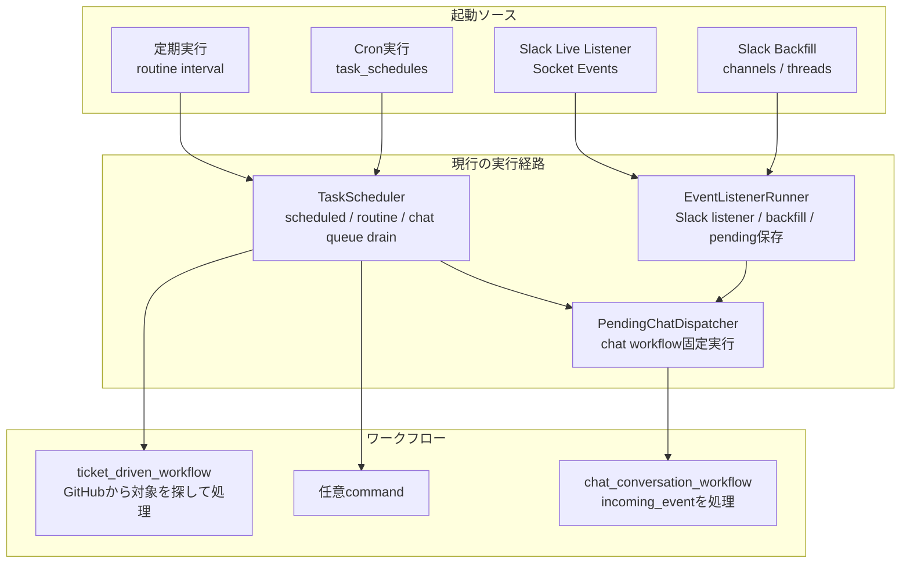
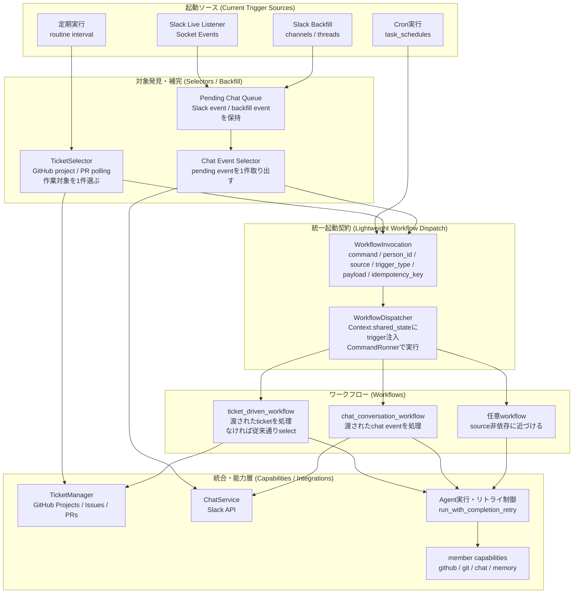
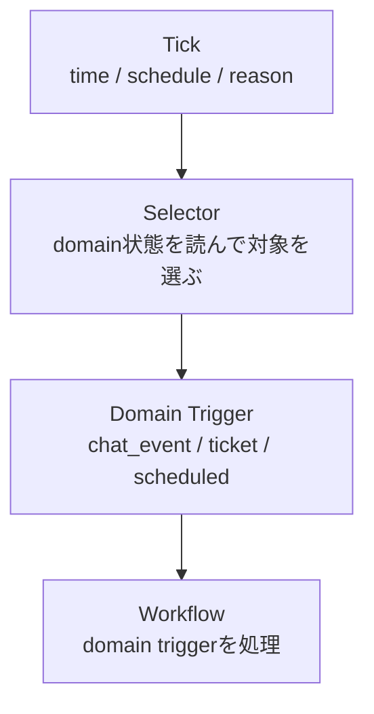

# Workflow Invocation 境界整理 実装方針

この文書は、GuildBotics の workflow 起動まわりを保守しやすくするための設計メモ兼実装計画である。

現在の GuildBotics は、GitHub ticket workflow と Slack chat workflow の起動経路が非対称になっている。

- `ticket_driven_workflow` は scheduler の routine から定期実行され、workflow 内で GitHub Project / issue / PR を polling して作業対象を探す。
- `chat_conversation_workflow` は Slack event listener / backfill が pending queue に保存した chat event を、scheduler worker が取り出して workflow に渡す。

この違い自体は UX / 運用上は妥当である。特に GitHub は Slack Socket Mode のようにローカル process から公式な socket listener を張る仕組みがなく、基本的なリアルタイム通知は public HTTPS endpoint へ delivery される webhook である。GuildBotics はローカル起動を大前提にするため、GitHub webhook 対応を急がない。

一方で、実装の責務境界としては次の課題がある。

- workflow 本体が「起動 source」「対象発見」「実処理」を混在して持っている。
- chat と ticket で、workflow に渡される入力の形と責務範囲が揃っていない。
- `TaskScheduler` が scheduled / routine / chat queue drain をそれぞれ別の形で扱っている。
- Slack backfill は重要な信頼性機構だが、GitHub polling / reconcile へ応用しやすい名前と境界になっていない。

この文書の方針は、汎用 plugin architecture を一気に作ることではない。現状の運用に必要な範囲で、workflow 直前の起動契約だけを軽く揃える。

## 目的

目的は次の通り。

- workflow 実行直前の入力契約を `WorkflowInvocation` として明示する。
- ticket / chat の workflow 起動経路を、完全ではないが同じ形へ近づける。
- GitHub は webhook 前提にせず、routine polling / reconcile を第一級の発見経路として扱う。
- Slack live event と Slack backfill event を同じ chat invocation 経路へ流す。
- person 単位の直列実行は維持し、同じ member workspace で agent が並列実行されない性質を壊さない。
- 既存の `CommandRunner` / command discovery / `Context.shared_state` の仕組みを活かす。

## 非目的

今回やらないことは次の通り。

- GitHub webhook receiver を実装しない。
- GitHub webhook / Slack / cron / routine をすべて同格の plugin registry にしない。
- source adapter / selector / hydrator / queue / dispatcher を最初から完全分離しない。
- workflow payload をすべて単一 schema に統一しない。
- 設定ファイルに汎用 routing DSL を導入しない。
- `chat_conversation_workflow` と `ticket_driven_workflow` の agent 委譲方針を変更しない。

## 現行実装の読み始めポイント

実装者は最初に次のファイルを読む。

- `guildbotics/drivers/task_scheduler.py`
  - active member ごとの worker thread を起動する。
  - scheduled command、routine command、pending chat queue drain を同じ worker 内で直列実行している。
- `guildbotics/drivers/pending_chat_dispatcher.py`
  - pending chat event を取り出し、`workflows/chat_conversation_workflow` を固定で実行する。
  - `Context.shared_state["incoming_event"]` に chat event を注入している。
- `guildbotics/drivers/event_listener_runner.py`
  - Slack Socket Mode event と Slack backfill を受け取り、pending chat event として state store に保存する。
  - Slack subscription 解決、backfill cursor、Slack listener 作成が同居している。
- `guildbotics/runtime/event_listener.py`
  - `IncomingChatEvent` と `EventListener` 抽象がある。
  - 現状は chat event に強く寄っており、汎用 workflow trigger ではない。
- `guildbotics/templates/commands/workflows/chat_conversation_workflow.py`
  - incoming chat event を読み、skip 判定、thread state 更新、agent 起動、completion / evidence 検証を行う。
- `guildbotics/templates/commands/workflows/ticket_driven_workflow.py`
  - GitHub ticket manager から作業対象を探し、ticket / PR を agent に渡す。
- `guildbotics/integrations/ticket_manager.py`
  - ticket 抽象。GitHub Project / issue / PR の実体は `github_ticket_manager.py`。
- `guildbotics/integrations/chat_service.py`
  - chat 抽象。Slack の実体は `integrations/slack/` 配下。
- `tests/guildbotics/drivers/test_task_scheduler.py`
- `tests/guildbotics/drivers/test_pending_chat_dispatcher.py`
- `tests/guildbotics/drivers/test_event_listener_runner.py`
- `tests/guildbotics/templates/commands/workflows/test_chat_conversation_workflow.py`
- `tests/guildbotics/templates/commands/workflows/test_ticket_driven_workflow.py`

## 現行構造

現行構造を簡略化すると次の通り。



現行の良い点は、最終的な command 実行が `CommandRunner` に集約されていることと、member ごとの worker thread で直列実行されていることである。この性質は維持する。

現行の弱い点は、workflow 直前の入力契約が揃っていないことである。

- ticket は `context.task` と `ticket_manager.get_task_to_work_on()` に依存する。
- chat は `Context.shared_state["incoming_event"]` に依存する。
- cron / scheduled command は payload を持たず、単に command string を実行する。
- routine は default routine として ticket workflow を起動するが、実際の対象選定は workflow 内で行う。

## 採用する中間アーキテクチャ

今回採用するのは、軽量な `WorkflowInvocation` と `WorkflowDispatcher` を中心にした中間案である。



この図の意図は、source adapter framework を完成させることではない。今の構造を大きく壊さず、workflow 直前の入口だけ揃えることである。

## 重要な設計判断

### GitHub webhook は今は主経路にしない

GuildBotics はローカル起動が大前提である。

GitHub の公式なリアルタイム通知は基本的に webhook であり、GitHub から public HTTPS endpoint に delivery される。Slack Socket Mode のように、ローカル process が outbound socket を張って公式 event stream を受ける設計ではない。

そのため、GitHub webhook 対応を今の主経路にしない。将来 cloud relay / webhook receiver を追加する場合でも、それは追加 source として `WorkflowInvocation` を作るだけにする。

現在は次を優先する。

- GitHub Project / issue / PR polling を `TicketSelector` として明示する。
- polling / reconcile を GitHub 側の第一級の発見経路として扱う。
- webhook がなくても保守性が上がる責務分離に留める。

### Tick と domain event を混同しない

Periodic / cron は、Slack / GitHub のような rich domain event を最初から持たない。多くの場合、単に「起動時刻になった」という tick である。

したがって、Periodic / cron が workflow payload を直接作れるとは限らない。

- routine tick は `TicketSelector` を起動し、GitHub の現在状態を読んで ticket payload を作る。
- cron due は、設定された command が payload 不要ならそのまま invocation を作る。
- cron due が scheduled post のような domain workflow なら、別 selector が必要になる。

この考え方により、情報量の差を無理に隠さない。



### Backfill は listener と同じ domain event 発見経路として扱う

Slack backfill は、live event の代替ではなく、live listener と同じ chat event を発見する別経路と見なす。

```text
Slack live event
  -> pending chat queue
  -> ChatSelector
  -> WorkflowInvocation(chat_conversation_workflow)

Slack backfill event
  -> pending chat queue
  -> ChatSelector
  -> WorkflowInvocation(chat_conversation_workflow)
```

GitHub でも同じ考え方が必要になる。

```text
GitHub polling / backfill / reconcile
  -> TicketSelector
  -> WorkflowInvocation(ticket_driven_workflow)
```

GitHub webhook を使わない場合でも、backfill / reconcile の考え方は重要である。

- runtime 停止中に issue / PR / Project が変わる。
- GitHub API 一時失敗や rate limit で前回取得できない。
- Project item、issue、PR、review thread の状態が複数 surface に分散している。
- workflow 起動条件は「最後に処理した状態との差分」で判断する方が安全である。

ただし、今回の第一段階で GitHub backfill scanner を大きく新設する必要はない。まずは `ticket_driven_workflow` 内にある対象発見責務を `TicketSelector` として切り出し、将来 cursor / reconcile を足せる場所を作る。

なお、Slack の pending queue は live / backfill の出自を保持しない。これは設計上の不変条件とする。Chat workflow は live と backfill を区別せず、`WorkflowInvocation.source` は queue から取り出されたことを表す `"event_queue"` になる。

### idempotency は二段で考える

重複は正常系として起きる。

- Slack live event と Slack backfill が同じ message を拾う。
- GitHub polling が同じ issue / PR 状態を複数回見る。
- 将来 webhook を足すと、webhook と polling が同じ変更を拾う。
- worker restart 後に pending queue が再処理される。

そのため、重複排除は次の二段で考える。

1. source / selector 固有の cursor / processed state
2. `WorkflowInvocation.idempotency_key`

第一段階では、既存の chat processed event id を維持しつつ、`WorkflowInvocation` に optional な `idempotency_key` を持たせる。GitHub 側は最初は `ticket:<person_id>:<ticket_url>:<trigger_reason>` 程度でもよい。厳密な version key は後続改善でよい。

`idempotency_key` は第一段階では前方互換のための placeholder であり、共通 dispatcher がこの key を読んで dedup するとは限らない。実際の重複排除は当面、chat の `processed_event_ids`、ticket の lane / comment / run evidence など既存の domain state で担保する。

## 新設または整理する概念

### WorkflowInvocation

workflow 起動直前の共通 envelope とする。

推奨する配置:

- `guildbotics/runtime/workflow_invocation.py`

想定 model:

```python
from __future__ import annotations

from dataclasses import dataclass, field
from typing import Any, Literal

WorkflowSource = Literal[
    "routine",
    "scheduled",
    "event_queue",
    "manual",
]

WorkflowTriggerType = Literal[
    "ticket",
    "chat",
    "scheduled",
    "generic",
]


@dataclass(frozen=True, slots=True)
class WorkflowInvocation:
    command: str
    person_id: str
    source: WorkflowSource
    trigger_type: WorkflowTriggerType
    payload: dict[str, Any] = field(default_factory=dict)
    idempotency_key: str = ""
```

最初から型を細かく分けすぎない。payload は domain-specific dict とし、workflow ごとの読み取り helper で検証する。

`source` は workflow が queue から呼ばれた経路を表す。Slack backfill のような履歴補完は pending queue に入る前の発見経路であり、現行 `PendingChatEvent` には live / backfill の出自が保存されないため、chat invocation の `source` は `"event_queue"` とする。

`scheduled` と `manual` は前方互換のために定義する。第一段階では cron / scheduled command は既存 `run_command()` 据え置きでもよく、manual invocation も未配線でよい。これらは後続フェーズで dispatcher 経由に寄せる余地を表す値である。

### shared_state key

既存の `INCOMING_CHAT_EVENT_KEY = "incoming_event"` は chat 専用である。

新しく汎用 key を追加する。

```python
WORKFLOW_INVOCATION_KEY = "workflow_invocation"
```

dispatcher は `context.shared_state[WORKFLOW_INVOCATION_KEY]` に invocation を入れる。

互換性のため、chat workflow には当面 `INCOMING_CHAT_EVENT_KEY` も入れてよい。移行後に chat workflow が `WORKFLOW_INVOCATION_KEY` から読むようになれば、chat 専用注入を削除できる。

### WorkflowDispatcher

`WorkflowInvocation` を受け取り、person context を clone し、shared state に trigger を注入して `CommandRunner` を実行する境界。

推奨する配置:

- `guildbotics/drivers/workflow_dispatcher.py`

責務:

- `base_context.clone_for(person)` を行う。
- invocation を `Context.shared_state` に入れる。
- 必要な後方互換 key を追加する。
- `CommandRunner(context, invocation.command, [])` を実行する。
- context を close する。
- trace scope / attributes を現行挙動から劣化させない。

`Context.update()` は `shared_state` だけでなく `pipe` も上書きするため、dispatcher は `context.shared_state[KEY] = value` の直接代入で trigger を注入する。`pipe` は command 間の標準入出力的な受け渡しに使われるため、dispatcher が勝手に変更してはならない。

`PendingChatDispatcher._run_workflow()` が現在持っている処理の汎用化から始める。

### TicketSelector

GitHub Project / issue / PR から、ある person が今処理すべき ticket を 1 件選び、ticket workflow 用 invocation を作る。

推奨する配置:

- `guildbotics/drivers/ticket_selector.py`

第一段階の責務:

- `context.get_ticket_manager().get_task_to_work_on()` を呼ぶ。
- task がなければ `None` を返す。
- task があれば `WorkflowInvocation(command="workflows/ticket_driven_workflow", trigger_type="ticket", payload=...)` を返す。

payload 例:

```python
{
    "task": task.model_dump(),
    "ticket_url": ticket_url,
    "pull_request_url": task.pull_request_url or "",
    "trigger_reason": task.trigger_reason or "",
}
```

注意:

- `ticket_driven_workflow` が task adoption 時に `context.update_task(task)` する必要があるため、payload から `Task` を復元できるようにする。
- `Task` が Pydantic model なら `model_dump()` / constructor で roundtrip する。
- ticket URL は workflow 内で再取得してもよいが、selector が取った URL を渡す方が trace / idempotency を作りやすい。
- selector が `Task` object を直接返し、dispatcher が clone 後に `context.update_task(task)` する設計も可能である。しかし、第一段階では `WorkflowInvocation` の payload に `task.model_dump()` 全量を入れる。理由は、chat / ticket / 将来 source で「workflow 入力は invocation payload」という契約を揃え、trace / idempotency / 将来の queue persistence に接続しやすくするためである。

### Trace scope / attributes

`WorkflowDispatcher` に実行境界を集約しても、現行の観測性を落としてはならない。

現行の trace scope は次の通り。

| 現行経路 | scope | 主な属性 |
|---|---|---|
| scheduled command | `scheduled` | `person_id`, `command`, `service_run_id` |
| routine command | `routine` | `person_id`, `command`, `service_run_id` |
| pending chat event | `event_listener` | `event.provider`, `slack.channel`, `slack.thread_ts`, `slack.ts`, `event_id`, `service_run_id` |
| ticket workflow 内部 | workflow 内 `set_attributes()` | `github.repo`, `github.kind`, `github.url`, `github.number` |

dispatcher 導入後の対応は次の通り。

| `WorkflowInvocation.source` | `trigger_type` | trace scope | 属性の作成者 |
|---|---|---|---|
| `scheduled` | `generic` / `scheduled` | `scheduled` | `TaskScheduler` または `WorkflowDispatcher` |
| `routine` | `ticket` / `generic` | `routine` | `TaskScheduler` または `WorkflowDispatcher` |
| `event_queue` | `chat` | `event_listener` | `WorkflowDispatcher` |
| `manual` | 任意 | `manual` または既存 caller の scope | caller |

`WorkflowDispatcher` は、少なくとも chat invocation について現行 `PendingChatDispatcher` と同じ属性を payload から導出する。

```text
event.provider = payload.service_name
slack.channel = payload.channel_id
slack.thread_ts = payload.event.thread_ts
slack.ts = payload.event.message_ts
event_id = payload.event.event_id
```

ticket の `github.*` 属性は第一段階では `ticket_driven_workflow` 内の既存 `_ticket_trace_attributes()` / `set_attributes()` を維持してよい。将来、ticket payload から dispatcher 側で導出する場合も、既存属性名を変えない。

### ChatSelector

pending chat queue から、ある person が今処理すべき chat event を 1 件または複数件取り出し、chat workflow 用 invocation を作る。

第一段階では `PendingChatDispatcher` を大きく壊さず、内部で `WorkflowInvocation` を作って `WorkflowDispatcher` に渡す形でよい。

将来的には名前を `PendingChatSelector` に寄せてもよい。

責務:

- pending channels を列挙する。
- pending events を時刻順に並べる。
- processed event は除外して queue から消す。
- 未処理 event について `WorkflowInvocation(command="workflows/chat_conversation_workflow", trigger_type="chat", payload=...)` を作る。
- workflow 成功後に processed として mark し、pending queue から消す。
- workflow 失敗時は pending queue に残す。

payload は現行 `IncomingChatEvent.to_shared_state()` をそのまま使える。

## 実装方針

### Phase 1: WorkflowInvocation と WorkflowDispatcher を追加する

目的は、既存挙動を変えずに新しい境界を導入すること。

作業:

1. `guildbotics/runtime/workflow_invocation.py` を追加する。
2. `WorkflowInvocation` と `WORKFLOW_INVOCATION_KEY` を定義する。
3. `guildbotics/drivers/workflow_dispatcher.py` を追加する。
4. `WorkflowDispatcher.dispatch(invocation, person)` を実装する。
5. `PendingChatDispatcher._run_workflow()` を `WorkflowDispatcher` 経由に置き換える。
6. chat workflow には既存互換として `INCOMING_CHAT_EVENT_KEY` も注入する。

この phase では、`ticket_driven_workflow` はまだ変更しなくてよい。

テスト:

- `PendingChatDispatcher` が `WorkflowInvocation` を作り、dispatcher が `CommandRunner` を呼ぶこと。
- `Context.shared_state` に `WORKFLOW_INVOCATION_KEY` と `INCOMING_CHAT_EVENT_KEY` が入ること。
- workflow 失敗時に pending event が残ること。
- workflow 成功時に processed mark と pending remove が行われること。

### Phase 2: ticket_driven_workflow が invocation payload を読む

目的は、ticket workflow を「渡された ticket を処理する」形へ近づけること。

作業:

1. `ticket_driven_workflow.main()` の冒頭で `WORKFLOW_INVOCATION_KEY` を読む。
2. `trigger_type == "ticket"` かつ payload に task がある場合は、その task を `Task(**payload["task"])` で復元し、`context.update_task(task)` する。
3. payload に task がない場合は従来通り `ticket_manager.get_task_to_work_on()` へ fallback する。
4. fallback はしばらく残す。manual run や既存 command 実行が壊れないようにする。

この phase ではまだ scheduler を `TicketSelector` 経由にしない。workflow が payload を読めない状態で selector 配線だけを先に有効化すると、1 tick の中で `get_task_to_work_on()` が selector と workflow から二重実行される。

`get_task_to_work_on()` は単なる読み取りではない。関連 PR が merged の場合に ticket を `DONE` へ移動するなどの副作用があり、GitHub API / GraphQL / REST 呼び出しも重い。そのため selector 配線は、workflow 側 payload reader が入った後に行う。

テスト:

- invocation payload の task を処理し、`get_task_to_work_on()` を呼ばないこと。
- invocation payload がない場合は従来通り `get_task_to_work_on()` を呼ぶこと。
- pull_request_url / trigger_reason / prepare_command の既存テストが通ること。
- error comment の挙動が変わらないこと。

### Phase 3: TicketSelector を追加し scheduler へ配線する

目的は、ticket workflow から対象発見責務を外へ出す接続点を作ること。

作業:

1. `guildbotics/drivers/ticket_selector.py` を追加する。
2. `TicketSelector.select(person)` または `select_one(context)` を実装する。
3. `TaskScheduler` の routine 実行で、routine command が `workflows/ticket_driven_workflow` の場合は `TicketSelector` 経由で invocation を作る。
4. task がなければ workflow を起動しない。
5. task があれば `WorkflowDispatcher` で `ticket_driven_workflow` を実行する。

この phase の完了後、routine 経由では selector が対象発見し、workflow は処理中心になる。

挙動保存:

- task がない場合は「正常に確認したが対象なし」と扱う。`consecutive_errors` は成功時と同じくリセットし、`next_routine_time` も通常の routine 実行後と同じように前進させる。
- `TicketSelector` 自体が例外を投げた場合は routine command failure と扱う。`consecutive_errors` を増やし、上限に達すれば worker loop を停止する。
- selector 例外時は ticket が特定できないため、GitHub ticket へ error comment を投稿しない。現行でも `get_task_to_work_on()` は `ticket_driven_workflow.main()` の error comment 用 `try` ブロックより前にあり、選定失敗は scheduler 側の command error として扱われる。この性質を維持する。

注意:

- 最初から全 routine command を selector 化しない。default ticket routine だけを対象にしてよい。
- person ごとの `routine_commands` で明示的に別 command が設定されている場合は、従来通り command string を実行する。
- `TaskScheduler` の command execution semantics を変えすぎない。

テスト:

- ticket がない場合に `ticket_driven_workflow` が起動されないこと。
- ticket がない場合も routine 成功扱いになり、`consecutive_errors` がリセットされ、`next_routine_time` が前進すること。
- ticket がある場合に invocation 経由で起動されること。
- selector 例外が routine error として計数され、ticket comment を投稿しないこと。
- existing routine interval の挙動が壊れないこと。
- `consecutive_error_limit` の扱いが既存と同等であること。

### Phase 4: TaskScheduler の内部構造を少し整理する

目的は、scheduled / routine / event queue の扱いを読みやすくすること。

作業候補:

- `_process_tasks_list()` 内の scheduled、routine、event queue drain のブロックを小さな private method に分ける。
- command string 実行と invocation 実行の helper を分ける。
- `run_command(context, command, source)` と `WorkflowDispatcher.dispatch(invocation)` のログ / trace attributes を揃える。

この phase は挙動変更を最小にする。大きな scheduler rewrite はしない。

テスト:

- 既存 `test_task_scheduler.py` を維持する。
- event queue enabled / disabled の lifecycle tests を維持する。
- routine / scheduled の source flag が変わらないこと。

## データ契約

### WorkflowInvocation 共通項目

| 項目              | 意味                                                                       |
| ----------------- | -------------------------------------------------------------------------- |
| `command`         | 実行する workflow / command 名。例: `workflows/chat_conversation_workflow` |
| `person_id`       | 実行対象 member                                                            |
| `source`          | `routine` / `scheduled` / `event_queue` / `manual`                         |
| `trigger_type`    | `ticket` / `chat` / `scheduled` / `generic`                                |
| `payload`         | workflow ごとの domain-specific payload                                    |
| `idempotency_key` | 重複排除用の stable key。最初は optional                                   |

### Chat payload

第一段階では `IncomingChatEvent.to_shared_state()` と同じ形を使う。

```python
{
    "service_name": "slack",
    "channel_id": "C123",
    "event": {
        "event_id": "...",
        "channel_id": "C123",
        "message_ts": "...",
        "thread_ts": "...",
        "author_id": "...",
        "text": "...",
        "mentions": ["U..."],
        "is_edit_or_delete": False,
        "is_bot_message": False,
        "is_thread_reply": False,
    },
    "chat_participation": "strict",
}
```

`idempotency_key` の例:

```text
slack:message:<channel_id>:<event_id>
```

### Ticket payload

第一段階では `Task` を中心にする。`task` は手書きの部分 dict ではなく、`task.model_dump()` の全量を入れる。workflow 側では `Task(**payload["task"])` で復元する。

```python
{
    "task": task.model_dump(),
    "ticket_url": "https://github.com/owner/repo/issues/123",
    "pull_request_url": "",
    "trigger_reason": "...",
}
```

`Task` には `comments`、`owner`、`priority`、`created_at`、`due_date`、`repository`、`assignee`、`pull_request_url`、`number`、`url`、`trigger_reason` などのフィールドがある。部分 dict を手書きすると情報欠落しやすいため禁止する。

`idempotency_key` の初期例:

```text
github:ticket:<person_id>:<ticket_url>:<pull_request_url>:<trigger_reason>
```

将来的には `updated_at`、PR review thread id、Project item field version などを入れて厳密化する。

## 既存挙動との関係

### chat workflow

現状の `chat_conversation_workflow` は `INCOMING_CHAT_EVENT_KEY` から event を読む。

移行初期は dispatcher が次の両方を入れる。

- `WORKFLOW_INVOCATION_KEY`
- `INCOMING_CHAT_EVENT_KEY`

その後、chat workflow 側に helper を追加する。

```text
1. WORKFLOW_INVOCATION_KEY の chat payload を読む
2. なければ INCOMING_CHAT_EVENT_KEY を読む
```

これにより、既存テストを壊さず段階移行できる。

### ticket workflow

現状の `ticket_driven_workflow` は `ticket_manager.get_task_to_work_on()` を呼ぶ。

移行後は次の順にする。

```text
1. WORKFLOW_INVOCATION_KEY の ticket payload に task があれば使う
2. なければ従来通り ticket_manager.get_task_to_work_on() を呼ぶ
```

fallback は manual command 実行や旧経路の安全弁としてしばらく残す。

### scheduled / cron command

`task_schedules` は現時点では任意 command string 実行の仕組みである。無理に payload 化しない。

ただし内部的には、将来のために command string から `WorkflowInvocation(trigger_type="generic")` を作って dispatcher へ渡すことは可能である。第一段階では挙動変更リスクを避けるため、cron は既存 `run_command()` のままでもよい。

既知の残存非対称として、`workflows/chat/chat_scheduled_post_workflow.py` は workflow 内部で独自に cron due 判定を行っている。この計画の第一段階では統一対象にしない。scheduled post は incoming chat / ticket routine とは UX と責務が異なるため、次フェーズで専用 selector 化を検討する。

## 実装上の注意

### Context.clone_for() と dispatcher の task 注入

`Context.clone_for()` は新しい `Context` を作り、`self.task` と `self.pipe` は引き継ぐ。一方で `shared_state` は空になる。そのため invocation injection は clone 後に行う。

また、`WorkflowDispatcher.dispatch()` は原則として scheduler が持つ base context から `clone_for(person)` する。したがって、`TicketSelector` が selector 用 context に `update_task()` しても、その後 dispatcher が base context から再 clone すると selector 側の task 更新は失われる。

このため、ticket selector が選んだ `Task` は `WorkflowInvocation.payload["task"]` に `task.model_dump()` 全量で入れ、dispatcher / workflow 側で clone 後に復元できるようにする。これは shared_state が空になるからだけではなく、dispatcher が base context から実行用 context を作り直すためである。

### person 単位の直列性を壊さない

現状は各 active member ごとに `TaskScheduler` の worker thread があり、routine / scheduled / chat event が同じ worker 内で順番に実行される。

この性質は重要である。同じ member workspace で複数 agent が同時に動くと、git worktree、conversation file、task-run evidence、Slack/GitHub side effect が競合しやすい。

したがって `WorkflowDispatcher` は新しい thread pool や async task 並列実行を導入しない。呼び出し元 worker の中で同期的に command を完了させる。

### workflow は raw source を知らない

workflow は可能な限り raw source を見ない。

- chat workflow は Slack live / Slack backfill の違いを知らない。
- ticket workflow は routine polling / 将来 webhook の違いを知らない。
- workflow は `trigger_type` と domain payload を読む。

ただし `source` は diagnostics / trace / idempotency のために残す。

### 過剰な抽象化を避ける

第一段階では、次のような一般化は避ける。

- `SourceAdapter` base class
- `SelectorRegistry`
- `WorkflowRoutingConfig`
- `PayloadHydrator` plugin
- GitHub webhook event schema

これらは source が増えて実際に重複が見えた時に追加する。

## テスト方針

この変更は挙動境界に触るため、テストは必須である。

### Unit test

- `WorkflowInvocation` の serialization helper を作る場合は roundtrip を検証する。
- `WorkflowDispatcher` が person context を clone し、shared state を注入し、`CommandRunner` を呼ぶことを検証する。
- `TicketSelector` が task あり / なしを正しく invocation / `None` に変換することを検証する。
- `PendingChatDispatcher` が pending event を invocation に変換することを検証する。

### Workflow test

- `chat_conversation_workflow` が `WORKFLOW_INVOCATION_KEY` 経由で event を読めること。
- 既存 `INCOMING_CHAT_EVENT_KEY` fallback が残ること。
- `ticket_driven_workflow` が invocation payload の task を使うこと。
- invocation payload がない場合の従来 fallback が残ること。

### Scheduler test

- routine interval の既存挙動が変わらないこと。
- default ticket routine が selector 経由で起動されること。
- task がない場合に無駄に ticket workflow を起動しないこと。
- chat queue drain の success / failure / retry が変わらないこと。
- source enable flags (`scheduled` / `routine` / `event_queue`) が lifecycle API で従来通り効くこと。

### Integration-ish test

外部 GitHub / Slack へ実通信しない。既存の stub / fake manager / fake chat service を使う。

- pending chat event -> workflow invocation -> real chat workflow -> RunStore evidence -> processed mark
- ticket selector -> workflow invocation -> ticket workflow -> TaskRunStore completion

## 推奨実装順

1. `WorkflowInvocation` を追加する。
2. `WorkflowDispatcher` を追加する。
3. `PendingChatDispatcher` を dispatcher 経由にする。
4. chat workflow に `WORKFLOW_INVOCATION_KEY` reader を追加する。
5. ticket workflow に invocation payload reader を追加する。
6. `TicketSelector` を追加する。
7. `TaskScheduler` の default ticket routine を `TicketSelector` 経由にする。
8. scheduler 内部の private method 分割を行う。
9. docs / README / tests を更新する。

## 完了条件

この設計の第一段階は、次を満たせば完了とする。

- chat pending event が `WorkflowInvocation` 経由で `chat_conversation_workflow` に渡る。
- ticket routine が `TicketSelector` で対象を選び、`WorkflowInvocation` 経由で `ticket_driven_workflow` に渡る。
- ticket workflow は payload があればそれを処理し、なければ従来通り polling fallback する。
- scheduled command / custom routine command の既存挙動が壊れていない。
- person 単位の直列実行が維持されている。
- Slack live event と Slack backfill event は workflow から区別されない。
- GitHub webhook は実装していないが、将来 source として invocation を作れば同じ dispatcher に流せる。

## 将来拡張

第一段階の後に、必要になったら次を検討する。

- GitHub polling cursor / reconcile state の導入。
- GitHub project item / issue / PR / review thread ごとの idempotency key 強化。
- `PendingChatDispatcher` を `ChatSelector` と `ChatInvocationQueue` に分離。
- `EventListenerRunner` から Slack backfill scanner を分離。
- `WorkflowInvocation` の persistence queue 化。
- persistence queue 化する場合、`Task` payload は `created_at` / `due_date` の `datetime` や `comments` の `Message` を含むため、`model_dump(mode="json")` など JSON roundtrip 可能な serialization を使う。
- cloud relay / webhook receiver を optional source として追加。
- UI diagnostics に invocation source / trigger_type / idempotency_key を表示。

## 判断まとめ

保守性の観点では、今すぐ完全な汎用 event architecture を作るのは過剰である。GuildBotics はローカル起動が前提であり、GitHub webhook 対応も今は主目的ではない。

一方で、現状の chat / ticket workflow は起動境界が非対称で、今後の変更時に責務がさらに混ざりやすい。

そのため、最初に導入すべきなのは大きな source adapter framework ではなく、軽量な `WorkflowInvocation` と `WorkflowDispatcher`、そして `TicketSelector` / chat pending dispatch の整理である。

この中間設計により、現在の実用性を維持しながら、workflow 本体を source 非依存に近づけられる。
